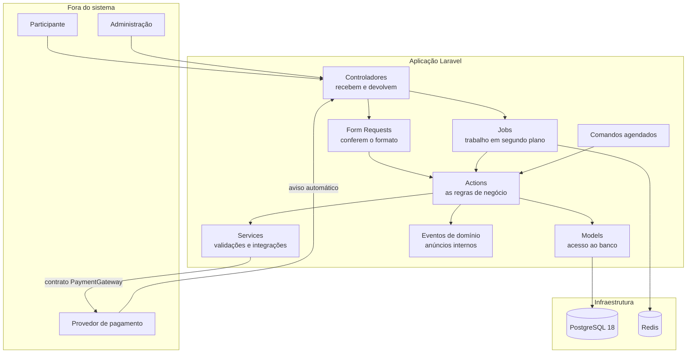
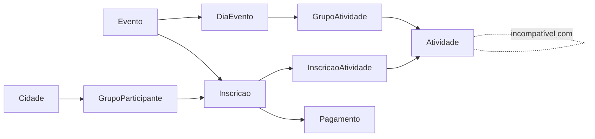
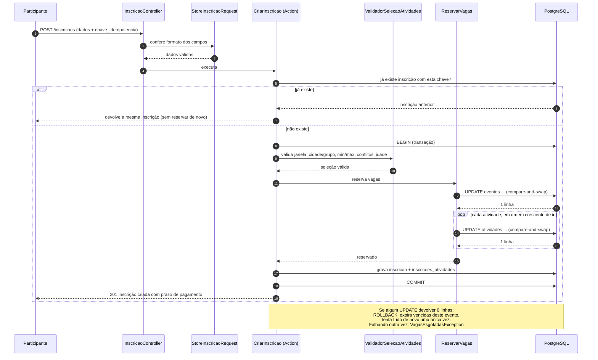
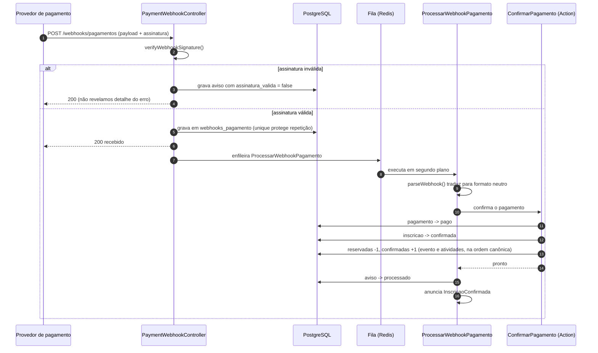
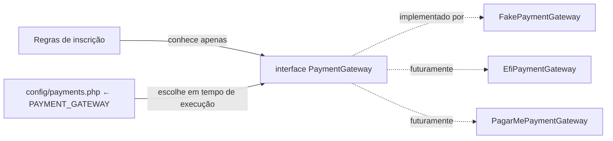

# Arquitetura

> **Versão:** 1.0 · **Data:** 2026-08-20
> Escrito para ser entendido também por quem não programa. Termos técnicos são explicados na primeira vez que aparecem e estão reunidos no glossário do `PRD.md`.

---

## 1. Visão em uma página

A plataforma é uma aplicação web construída em **Laravel 12** (framework PHP), com banco de dados **PostgreSQL 18**, **Redis** para filas e cache, e interface futura em **Vue 3 + Inertia**. Ela recebe inscrições, reserva vagas, cobra por Pix e confirma automaticamente.



---

## 2. Convenção de idioma (regra transversal)

Decisão do dono do produto: **o domínio fala português; a estrutura do framework fala inglês**.

| Camada | Idioma | Exemplo |
|--------|--------|---------|
| Tabelas e colunas | **português, sem acento nem cedilha** | `inscricoes`, `nome_completo`, `situacao`, `valor_centavos` |
| Models e relacionamentos | **português** | `app/Models/Inscricao.php`, `$inscricao->atividades` |
| Enums e os valores gravados no banco | **português** | `SituacaoInscricao::AguardandoPagamento` grava `aguardando_pagamento` |
| Actions, Services, Exceptions e Events de domínio | **português** | `CriarInscricao`, `ValidadorSelecaoAtividades`, `VagasEsgotadasException` |
| Estrutura do Laravel (pastas e sufixos) | **inglês** | `app/Http/Controllers/InscricaoController.php` com método `store`, `app/Jobs/`, `app/Providers/` |
| Tabelas do framework e carimbos de tempo | **inglês, intocados** | `users`, `sessions`, `jobs`, `cache`, `created_at`, `updated_at` |
| Contrato e DTOs do meio de pagamento | **inglês** | `PaymentGateway`, `CreatePaymentData` |
| Documentação em `docs/` | **português acessível** | frases curtas, jargão explicado |
| Nomes dos arquivos de documentação | **inglês** | `PRD.md`, `ARCHITECTURE.md` |

**Por que sem acento no banco.** O PostgreSQL aceita uma coluna chamada `descrição`, mas a partir daí exige aspas duplas em **toda** consulta que a mencione. Isso quebra ferramentas de migração, clientes SQL e geradores de código. É dívida técnica silenciosa. Por isso: `descricao`.

**Por que o contrato de pagamento fica em inglês.** Ele é a fronteira com serviços externos, cujas APIs são todas em inglês (`amount`, `payer`, `qr_code`). Traduzir só na nossa metade criaria um vaivém de tradução a cada campo. A fronteira fala a língua de quem está do outro lado.

---

## 3. Camadas e responsabilidades

| Camada | Pasta | Responsabilidade | O que **não** faz |
|--------|-------|------------------|-------------------|
| Controlador | `app/Http/Controllers` | Recebe a requisição, chama uma Action, devolve a resposta | Não contém regra de negócio |
| Form Request | `app/Http/Requests` | Confere formato e obrigatoriedade dos campos, com mensagens escritas para o participante | Não consulta capacidade nem conflito |
| Action | `app/Actions` | Executa **uma** operação de negócio do início ao fim, dentro de uma transação | Não formata resposta HTTP |
| Service | `app/Services` | Lógica reutilizável e integrações (validador de seleção, provedores de pagamento) | Não abre transação por conta própria |
| DTO | `app/DTOs` | Pacote de dados imutável que atravessa fronteiras | Não tem regra dentro |
| Model | `app/Models` | Acesso ao banco, relacionamentos, conversões de tipo e filtros comuns | Não orquestra regra de negócio complexa |
| Enum | `app/Enums` | Lista fechada de situações, com texto amigável | — |
| Job | `app/Jobs` | Trabalho em segundo plano (processar aviso do provedor) | Não é chamado direto pelo controlador sem fila |
| Command | `app/Console/Commands` | Rotinas agendadas (expirar, reconciliar) | Não duplica regra: chama a Action |
| Event | `app/Events` | Anúncio interno de que algo aconteceu | Não altera nada |

**Por que Actions e não Repositories.** O Eloquent (a camada de acesso a dados do Laravel) já é uma abstração sobre o banco. Criar um repositório em cima dele seria uma abstração sobre a abstração, sem ganho real: mais arquivos, mesma capacidade. A escolha é orientada pelo princípio de não criar camada "para o futuro".

### 3.1 Organização de pastas

```text
app/
├── Actions/
│   ├── Inscricoes/      CriarInscricao, ReservarVagas, LiberarVagas, ExpirarInscricoesVencidas
│   └── Pagamentos/      CriarPagamentoDaInscricao, ConfirmarPagamento, CancelarPagamento
├── Console/Commands/    ExpirarInscricoesVencidas, ReconciliarPagamentosPendentes
├── Contracts/Payments/  PaymentGateway
├── DTOs/
│   ├── Inscricoes/      DadosNovaInscricao
│   └── Payments/        CreatePaymentData, PaymentResult, ...
├── Enums/               SituacaoEvento, SituacaoInscricao, SituacaoPagamento, ...
├── Events/              InscricaoCriada, InscricaoConfirmada, InscricaoExpirada
├── Exceptions/Inscricoes/
├── Http/
│   ├── Controllers/     InscricaoController, Webhooks/PaymentWebhookController
│   ├── Middleware/      GarantirAmbienteDeSimulacao
│   └── Requests/        StoreInscricaoRequest
├── Jobs/                ProcessarWebhookPagamento
├── Models/              Evento, DiaEvento, GrupoAtividade, Atividade, ...
├── Providers/           PaymentServiceProvider
└── Services/
    ├── Inscricoes/      ValidadorSelecaoAtividades
    └── Payments/Fake/   FakePaymentGateway
```

---

## 4. Modelo de domínio



**Duas palavras parecidas, dois conceitos diferentes:**

- **`grupos_atividades`** — conjunto de atividades de um dia com a mesma regra de escolha ("Modalidades esportivas: escolha de 1 a 2").
- **`grupos_participantes`** — grupo de pessoas ligado a uma cidade ("Grupo Centro — São Paulo/SP").

O rascunho original chamava os dois de "grupo". Separar os nomes evita a confusão mais provável do projeto.

**Análise crítica do modelo sugerido no briefing e mudanças aplicadas:**

| Sugestão original | Decisão | Motivo |
|-------------------|---------|--------|
| `TermAcceptance` como tabela | Vira dois campos em `inscricoes` | Um aceite por inscrição. Tabela separada seria uma linha por inscrição, sem ganho. Se surgir mais de um termo, promovemos |
| `Checkin` no MVP | Pós-MVP, apenas documentado | Credenciamento não é necessário para o fluxo de inscrição e pagamento |
| Estado `paid` na inscrição | Removido | Explicado na seção 16 do PRD |
| `Group` genérico | Renomeado para `grupos_participantes` | Evita colisão com grupos de atividades |
| Nomes em inglês | Traduzidos para português | Convenção de idioma da seção 2 |

---

## 5. Estratégia de concorrência

Esta é a decisão arquitetural mais importante do projeto.

### 5.1 O problema

Resta 1 vaga. Duas pessoas clicam ao mesmo tempo. Se o código fizer "consultar quantas vagas sobraram" e depois "gravar a inscrição", as duas consultas veem 1 e as duas gravam. O evento fica com uma pessoa a mais do que cabe. Isso se chama **overbooking**.

### 5.2 A solução: contador atômico (compare-and-swap)

Cada `evento` e cada `atividade` guardam dois números: `vagas_reservadas` e `vagas_confirmadas`. Para pegar uma vaga, executamos **um único comando** que confere e soma na mesma operação:

```sql
-- 1) o evento, sempre primeiro
UPDATE eventos
   SET vagas_reservadas = vagas_reservadas + 1
 WHERE id = :evento_id
   AND (capacidade IS NULL OR vagas_reservadas + vagas_confirmadas < capacidade);

-- 2) depois cada atividade, SEMPRE em ordem crescente de id
UPDATE atividades
   SET vagas_reservadas = vagas_reservadas + 1
 WHERE id = :atividade_id
   AND (capacidade IS NULL OR vagas_reservadas + vagas_confirmadas < capacidade);
```

O PostgreSQL garante que dois comandos desses **nunca** atualizam a mesma linha ao mesmo tempo: o segundo espera o primeiro terminar e então reavalia a condição `WHERE` com os números já atualizados. Quem chega depois recebe **"0 linhas alteradas"** — e é exatamente assim que o código descobre que esgotou.

```php
$linhasAfetadas = DB::update(/* ... */);

if ($linhasAfetadas === 0) {
    // não havia mais vaga
}
```

**Por que não `lockForUpdate()` na linha do evento.** Travar a linha do evento também funciona, mas transforma o evento inteiro em uma porta única: todas as inscrições passam uma por vez, e a fila cresce com a procura. O contador atômico dá a mesma garantia sem transformar o evento em gargalo — a espera existe apenas no instante do `UPDATE`, não durante toda a transação. **Trava pessimista na linha do evento está proibida neste projeto** como mecanismo primário de reserva.

### 5.3 Ordem canônica de aquisição

> **Sempre: evento primeiro, depois as atividades em ordem crescente de `id`.** Em todos os caminhos que mexem em contador — criação, confirmação, expiração e cancelamento.

Se a inscrição A pegasse as atividades 7 e depois 3, e a inscrição B pegasse 3 e depois 7, cada uma poderia ficar esperando a vaga que a outra segura. Isso é um **deadlock** — "abraço mortal" —, e o banco resolveria matando uma das transações. Ordem fixa torna esse cenário impossível.

### 5.4 Varredura sob demanda (just-in-time)

Um evento pode **parecer** lotado só porque várias reservas venceram e a rotina automática ainda não rodou. Se simplesmente recusássemos, perderíamos inscrições por vaga presa.

Quando qualquer reserva falha, a Action:

1. executa a expiração de inscrições vencidas **apenas daquele evento**;
2. tenta a transação inteira **mais uma vez** (exatamente uma retentativa);
3. se falhar de novo, aí sim está esgotado de verdade.

Uma retentativa só, e não um laço, porque um laço sob concorrência alta viraria espera indefinida. Uma tentativa extra cobre o caso real (vaga presa) sem criar risco novo.

**Por que não uma tabela separada de disponibilidade.** Ela seria uma segunda fonte da verdade e poderia discordar dos contadores. Os contadores nas próprias linhas do evento e da atividade são a única fonte.

### 5.5 Transições de contador

| Quando | Efeito |
|--------|--------|
| Inscrição criada | `vagas_reservadas += 1` (evento e cada atividade) |
| Pagamento confirmado | `vagas_reservadas -= 1` e `vagas_confirmadas += 1` |
| Inscrição expirada | `vagas_reservadas -= 1` |
| Cancelamento de inscrição aguardando pagamento | `vagas_reservadas -= 1` |
| Cancelamento de inscrição já confirmada | `vagas_confirmadas -= 1` |

Todas idempotentes: só acontecem junto com a mudança de situação, e a mudança de situação só acontece uma vez, porque o `UPDATE` de situação também é condicionado à situação anterior.

### 5.6 Última barreira: o banco de dados

```sql
CHECK (capacidade IS NULL OR vagas_reservadas + vagas_confirmadas <= capacidade)
CHECK (vagas_reservadas >= 0 AND vagas_confirmadas >= 0)
```

Se algum caminho de código um dia errar a contabilidade, o banco recusa a gravação. Antes um erro visível do que venda a mais silenciosa.

### 5.7 Sequência completa da criação de inscrição



### 5.8 Como a concorrência é testada

Dois testes obrigatórios:

1. **Determinístico** — força a condição de 0 linhas alteradas e verifica que a exceção correta é lançada e que nada foi gravado pela metade.
2. **Paralelo de verdade** — vários processos independentes disputam a última vaga ao mesmo tempo. Ao final, exatamente um consegue e `vagas_reservadas + vagas_confirmadas <= capacidade`.

---

## 6. Idempotência

**Idempotente** é a operação que pode ser repetida sem mudar o resultado. Três pontos do sistema precisam disso:

| Ponto | Como garantimos |
|-------|-----------------|
| Envio duplicado do formulário | O formulário gera uma `chave_idempotencia`. Existe uma regra de unicidade `(evento_id, chave_idempotencia)` no banco. Se a chave repetir, devolvemos a inscrição já criada, sem reservar de novo |
| Aviso do provedor repetido | Regra de unicidade `(gateway, id_evento_externo)` na tabela de avisos. O segundo aviso idêntico é registrado como ignorado e não altera contador |
| Rotinas agendadas | Expiração, reconciliação e lembrete de prazo atualizam apenas registros na situação de origem esperada. Rodar duas vezes seguidas não muda nada na segunda |
| E-mail enviado duas vezes | Regra de unicidade `(inscricao_id, tipo, canal)` na tabela `comunicacoes_enviadas`. O registro é gravado antes do envio; se o banco recusar, alguém já mandou e o trabalho encerra em silêncio (ver 9.2) |

---

## 7. Ciclo do webhook (aviso automático do provedor)

**Webhook** é a chamada que o provedor de pagamento faz ao nosso servidor para avisar que algo mudou.

Princípio: **receber rápido, processar depois**. O provedor espera uma resposta em poucos segundos; se demorarmos, ele considera falha e reenvia. Por isso guardamos o aviso e respondemos "recebido" antes de qualquer processamento.



**Por que respondemos 200 mesmo com assinatura inválida.** Responder 401 informa a quem está tentando forjar avisos que ele acertou o endereço mas errou a assinatura. Guardamos o aviso marcado como inválido, não produzimos nenhum efeito, e respondemos de forma neutra.

**Por que `parseWebhook` e não `handleWebhook`.** O rascunho sugeria `handleWebhook`, o que colocaria o provedor no comando de alterar nossas inscrições. `parseWebhook` apenas **traduz** o payload do provedor em um resultado neutro; quem decide o que fazer é a Action da aplicação. A regra fica de um lado só da fronteira.

---

## 8. Abstração do meio de pagamento



```php
interface PaymentGateway
{
    public function createPayment(CreatePaymentData $data): PaymentResult;
    public function getPayment(string $externalId): PaymentStatusResult;
    public function cancelPayment(string $externalId): void;
    public function refundPayment(string $externalId, ?int $amountCents = null): RefundResult;
    public function verifyWebhookSignature(WebhookRequestData $request): bool;
    public function parseWebhook(WebhookRequestData $request): WebhookResult;
}
```

Regras que sustentam essa fronteira:

- **Nenhum Model Eloquent atravessa a fronteira.** Só DTOs `readonly` (pacotes de dados imutáveis). Assim o provedor nunca consegue alterar o banco por um caminho lateral.
- **Nenhuma referência a provedor concreto dentro do domínio.** O domínio conhece apenas a interface. As palavras `FakePaymentGateway`, `Efi` ou `PagarMe` não aparecem em Action, Model ou Service de inscrição.
- **A escolha vem de configuração**, resolvida no contêiner de serviços do Laravel:

```php
$this->app->singleton(PaymentGateway::class, fn () => match (config('payments.default')) {
    // 'efi' => new EfiPaymentGateway(...),   // fase 8
    default => new FakePaymentGateway(...),
});
```

- **Nenhuma taxa comercial no código.** Taxas mudam; ficam apenas documentadas em `PAYMENTS.md`, com a data da consulta.

### 8.1 Provedor simulado

O `FakePaymentGateway` gera um código Pix fictício e permite simular pagamento, expiração, falha, estorno e envio do aviso automático. Os endereços de simulação ficam em `routes/dev.php` e só existem quando **as duas** condições valem:

1. o ambiente é `local` ou `testing`; **e**
2. a configuração `payments.fake.simulation_enabled` está ligada.

Fora disso, respondem "não encontrado" (404). Existe teste automatizado que prova esse bloqueio.

---

## 9. Trabalho em segundo plano

| Rotina | Quando roda | O que faz |
|--------|-------------|-----------|
| `ProcessarWebhookPagamento` (job) | Assim que um aviso é recebido | Traduz o aviso e aplica o efeito no pagamento e na inscrição |
| `inscricoes:expirar-vencidas` (comando) | A cada minuto | Expira inscrições com prazo vencido e devolve as vagas |
| `pagamentos:reconciliar` (comando) | A cada 5 minutos | Consulta o provedor para pagamentos pendentes e confirma o que já foi pago |
| `inscricoes:lembrar-prazo` (comando) | A cada 15 minutos | Avisa quem está a menos de 24 horas do fim do prazo de pagamento |
| Envio de e-mail (ouvintes e mensagens) | Assim que o domínio anuncia um fato | Monta e entrega os cinco e-mails do participante, na fila `emails` |

A expiração processa em lotes com `chunkById` (percorre por faixas de identificador), para funcionar bem mesmo com muitos registros.

### 9.1 O trabalhador da fila — sem ele, nenhum e-mail sai

Nenhum e-mail é enviado durante o pedido da pessoa. O sistema apenas **deixa o
trabalho na fila** e responde. Quem tira o trabalho da fila e entrega de fato é
um processo à parte, o **trabalhador** (*worker*).

Isso é deliberado: um servidor de e-mail lento pode levar segundos para
responder, e nenhuma inscrição pode esperar por isso. Mas tem uma consequência
que precisa ser dita sem rodeio: **enquanto ninguém subir o trabalhador, os
e-mails ficam parados na fila e não chegam a ninguém.** O sistema não avisa,
não dá erro e não reclama — a fila simplesmente cresce.

Em desenvolvimento, com o Sail de pé, o comando é este:

```bash
./vendor/bin/sail artisan queue:work redis --queue=emails
```

Sem o Sail (PHP no próprio computador):

```bash
php artisan queue:work redis --queue=emails
```

Em produção, o trabalhador precisa ser um serviço supervisionado (`supervisord`,
`systemd` ou equivalente), que sobe junto com o servidor e volta sozinho se
cair. O agendador (`php artisan schedule:work` ou a entrada de `cron`) é outro
processo e continua sendo necessário: é ele que dispara a expiração, a
reconciliação e o lembrete de prazo.

**Quando um e-mail não é entregue:** o trabalhador tenta 3 vezes, esperando
1 minuto, 5 minutos e 15 minutos entre as tentativas — servidor de e-mail fora
do ar costuma ser problema de minutos. Se as três falharem, o trabalho vai para
a tabela `failed_jobs`, com o erro completo, e **nada acontece com a inscrição,
a vaga ou o pagamento**. O prejuízo máximo de uma falha de e-mail é um e-mail
que não chegou.

```bash
php artisan queue:failed         # o que falhou e por quê
php artisan queue:retry all      # tentar de novo depois de resolver a causa
```

### 9.2 A mesma mensagem nunca chega duas vezes

Antes de enviar, o sistema grava uma linha em `comunicacoes_enviadas` com
`(inscricao, tipo de mensagem, canal)`. Existe uma **regra de unicidade no
banco** sobre essas três colunas, e é ela — não uma verificação no código — que
impede a segunda cópia.

A diferença importa: dois trabalhadores rodando ao mesmo tempo podem pegar o
mesmo trabalho e passar juntos por qualquer "já mandei?" escrito em PHP. O
banco, não: o segundo esbarra na regra e desiste em silêncio. A gravação e o
envio acontecem na mesma transação, então um envio que falha não deixa registro
para trás e a próxima tentativa encontra o caminho livre.

A coluna `canal` guarda hoje sempre `email`. Ela existe para que um segundo
meio de aviso (WhatsApp, por exemplo) entre um dia sem migração e sem reescrever
a regra de "uma vez só".

---

## 10. Tempo e fuso horário

- A aplicação opera em `America/Sao_Paulo` (`APP_TIMEZONE`).
- Todas as datas e horas de domínio usam `timestamptz`, o tipo do PostgreSQL que guarda o instante com o fuso embutido.
- O banco opera internamente em UTC.

Assim, comparar "esta atividade começa antes daquela terminar" funciona mesmo entre dias diferentes e mesmo com mudança de horário de verão. As colunas de data pura (`data_inicio`, `data`, `data_nascimento`) usam `date`, porque nelas o horário não tem significado.

---

## 11. Segurança aplicada na arquitetura

| Preocupação | Medida |
|-------------|--------|
| Confirmação de pagamento forjada | Só o aviso autenticado do provedor ou a consulta server-to-server confirmam |
| Aviso repetido | Unicidade no banco + processamento idempotente |
| Dado sensível legível | CPF guardado cifrado; comparação por impressão digital com segredo do servidor |
| Segredo em log | Chaves ficam em variáveis de ambiente; nada de segredo em registro de log |
| Enumeração de inscrições | Identificadores públicos ULID, não sequenciais |
| Endereços de simulação em produção | Middleware que exige ambiente e configuração, respondendo 404 |
| Regra burlada pelo navegador | Toda regra revalidada no servidor dentro da transação |

---

## 12. Testes

Ferramenta: **Pest 4**. Banco de teste: PostgreSQL real, o mesmo motor de produção — testes de restrição, unicidade parcial e concorrência não teriam valor em outro banco.

| Camada | O que testamos |
|--------|----------------|
| Domínio do evento | Relacionamentos, filtros e o fato de que as restrições do banco realmente recusam dados inválidos |
| Inscrição | As 13 regras de negócio, cada uma com o seu teste |
| Concorrência | Um teste determinístico e um com processos paralelos disputando a última vaga |
| Pagamento | Criação da cobrança, confirmação, aviso repetido, expiração, reconciliação e bloqueio do provedor simulado |

O mapeamento entre os testes exigidos no briefing e os arquivos criados está em `BUSINESS_RULES.md`.
