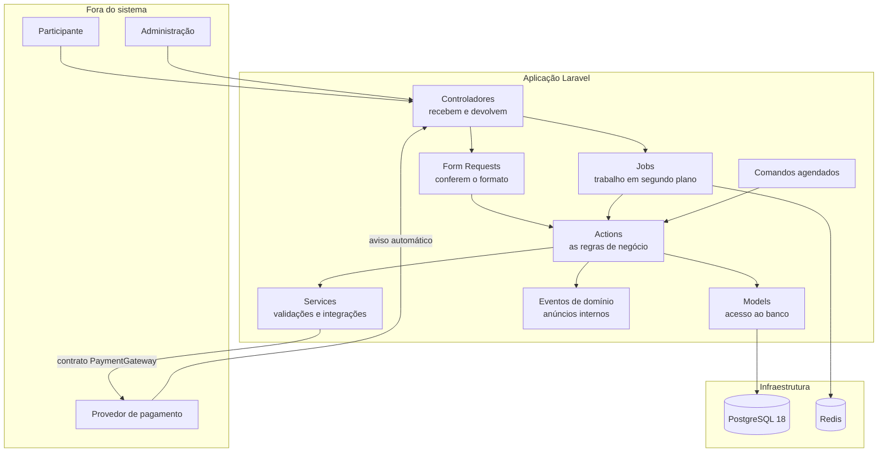
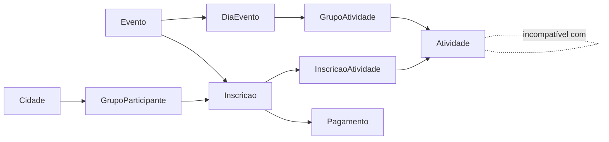
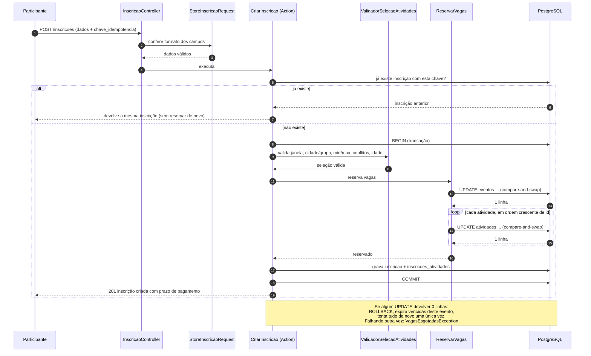
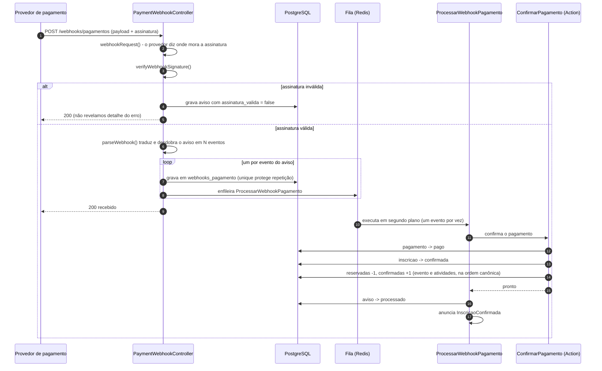
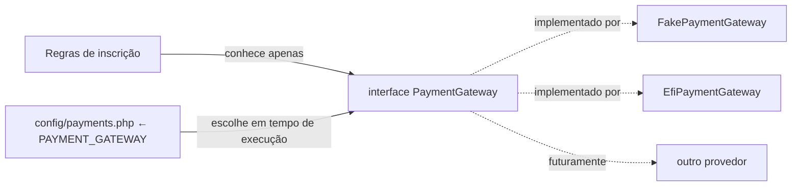
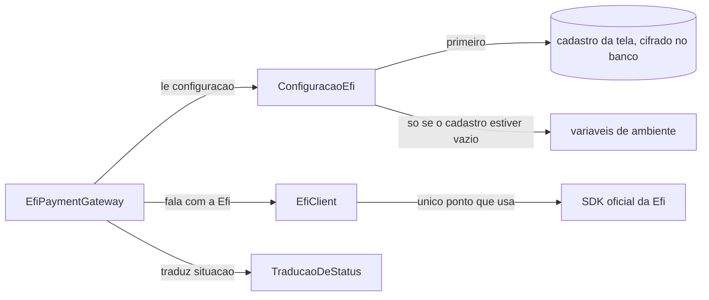

# Arquitetura

> **Versão:** 1.5 · **Data:** 2026-08-27 (seção 14 nova: de onde vêm os componentes de interface — não há pacote a instalar, o código é do repositório — e as duas armadilhas do `components.json` que só mordem quem for acrescentar um componente novo. Versão 1.4: seção 13 nova: como o sistema é publicado — uma imagem Docker, três containers da mesma imagem, o que muda atrás de um proxy reverso e onde a lista de IP do aviso da Efí vive. A §9.1 deixou de dizer que o trabalhador da fila não roda: agora ele é um container próprio)
> Escrito para ser entendido também por quem não programa. Termos técnicos são explicados na primeira vez que aparecem e estão reunidos no glossário do `PRD.md`.

---

## 1. Visão em uma página

A plataforma é uma aplicação web construída em **Laravel 12** (framework PHP), com banco de dados **PostgreSQL 18**, **Redis** para filas e cache, e interface futura em **Vue 3 + Inertia**. Ela recebe inscrições, reserva vagas, cobra por Pix e confirma automaticamente.



---

## 2. Convenção de idioma (regra transversal)

Decisão do dono do produto: **o domínio fala português; a estrutura do framework fala inglês**.

| Camada | Idioma | Exemplo |
|--------|--------|---------|
| Tabelas e colunas | **português, sem acento nem cedilha** | `inscricoes`, `nome_completo`, `situacao`, `valor_centavos` |
| Models e relacionamentos | **português** | `app/Models/Inscricao.php`, `$inscricao->atividades` |
| Enums e os valores gravados no banco | **português** | `SituacaoInscricao::AguardandoPagamento` grava `aguardando_pagamento` |
| Actions, Services, Exceptions e Events de domínio | **português** | `CriarInscricao`, `ValidadorSelecaoAtividades`, `VagasEsgotadasException` |
| Estrutura do Laravel (pastas e sufixos) | **inglês** | `app/Http/Controllers/InscricaoController.php` com método `store`, `app/Jobs/`, `app/Providers/` |
| Tabelas do framework e carimbos de tempo | **inglês, intocados** | `users`, `sessions`, `jobs`, `cache`, `created_at`, `updated_at` |
| Contrato e DTOs do meio de pagamento | **inglês** | `PaymentGateway`, `CreatePaymentData` |
| Documentação em `docs/` | **português acessível** | frases curtas, jargão explicado |
| Nomes dos arquivos de documentação | **inglês** | `PRD.md`, `ARCHITECTURE.md` |

**Por que sem acento no banco.** O PostgreSQL aceita uma coluna chamada `descrição`, mas a partir daí exige aspas duplas em **toda** consulta que a mencione. Isso quebra ferramentas de migração, clientes SQL e geradores de código. É dívida técnica silenciosa. Por isso: `descricao`.

**Por que o contrato de pagamento fica em inglês.** Ele é a fronteira com serviços externos, cujas APIs são todas em inglês (`amount`, `payer`, `qr_code`). Traduzir só na nossa metade criaria um vaivém de tradução a cada campo. A fronteira fala a língua de quem está do outro lado.

---

## 3. Camadas e responsabilidades

| Camada | Pasta | Responsabilidade | O que **não** faz |
|--------|-------|------------------|-------------------|
| Controlador | `app/Http/Controllers` | Recebe a requisição, chama uma Action, devolve a resposta | Não contém regra de negócio |
| Form Request | `app/Http/Requests` | Confere formato e obrigatoriedade dos campos, com mensagens escritas para o participante | Não consulta capacidade nem conflito |
| Action | `app/Actions` | Executa **uma** operação de negócio do início ao fim, dentro de uma transação | Não formata resposta HTTP |
| Service | `app/Services` | Lógica reutilizável e integrações (validador de seleção, provedores de pagamento) | Não abre transação por conta própria |
| DTO | `app/DTOs` | Pacote de dados imutável que atravessa fronteiras | Não tem regra dentro |
| Model | `app/Models` | Acesso ao banco, relacionamentos, conversões de tipo e filtros comuns | Não orquestra regra de negócio complexa |
| Enum | `app/Enums` | Lista fechada de situações, com texto amigável | — |
| Job | `app/Jobs` | Trabalho em segundo plano (processar aviso do provedor) | Não é chamado direto pelo controlador sem fila |
| Command | `app/Console/Commands` | Rotinas agendadas (expirar, reconciliar) | Não duplica regra: chama a Action |
| Event | `app/Events` | Anúncio interno de que algo aconteceu | Não altera nada |

**Por que Actions e não Repositories.** O Eloquent (a camada de acesso a dados do Laravel) já é uma abstração sobre o banco. Criar um repositório em cima dele seria uma abstração sobre a abstração, sem ganho real: mais arquivos, mesma capacidade. A escolha é orientada pelo princípio de não criar camada "para o futuro".

### 3.1 Organização de pastas

```text
app/
├── Actions/
│   ├── Inscricoes/      CriarInscricao, ReservarVagas, LiberarVagas, ExpirarInscricoesVencidas
│   └── Pagamentos/      CriarPagamentoDaInscricao, ConfirmarPagamento, CancelarPagamento
├── Console/Commands/    ExpirarInscricoesVencidas, ReconciliarPagamentosPendentes
├── Contracts/Payments/  PaymentGateway
├── DTOs/
│   ├── Inscricoes/      DadosNovaInscricao
│   └── Payments/        CreatePaymentData, PaymentResult, ...
├── Enums/               SituacaoEvento, SituacaoInscricao, SituacaoPagamento, ...
├── Events/              InscricaoCriada, InscricaoConfirmada, InscricaoExpirada
├── Exceptions/Inscricoes/
├── Http/
│   ├── Controllers/     InscricaoController, Webhooks/PaymentWebhookController
│   ├── Middleware/      GarantirAmbienteDeSimulacao
│   └── Requests/        StoreInscricaoRequest
├── Jobs/                ProcessarWebhookPagamento
├── Models/              Evento, DiaEvento, GrupoAtividade, Atividade, ...
├── Providers/           PaymentServiceProvider
└── Services/
    ├── Inscricoes/      ValidadorSelecaoAtividades
    └── Payments/Fake/   FakePaymentGateway
```

---

## 4. Modelo de domínio



**Duas palavras parecidas, dois conceitos diferentes:**

- **`grupos_atividades`** — conjunto de atividades de um dia com a mesma regra de escolha ("Modalidades esportivas: escolha de 1 a 2").
- **`grupos_participantes`** — grupo de pessoas ligado a uma cidade ("Grupo Centro — São Paulo/SP").

O rascunho original chamava os dois de "grupo". Separar os nomes evita a confusão mais provável do projeto.

**Análise crítica do modelo sugerido no briefing e mudanças aplicadas:**

| Sugestão original | Decisão | Motivo |
|-------------------|---------|--------|
| `TermAcceptance` como tabela | Vira dois campos em `inscricoes` | Um aceite por inscrição. Tabela separada seria uma linha por inscrição, sem ganho. Se surgir mais de um termo, promovemos |
| `Checkin` no MVP | Pós-MVP, apenas documentado | Credenciamento não é necessário para o fluxo de inscrição e pagamento |
| Estado `paid` na inscrição | Removido | Explicado na seção 16 do PRD |
| `Group` genérico | Renomeado para `grupos_participantes` | Evita colisão com grupos de atividades |
| Nomes em inglês | Traduzidos para português | Convenção de idioma da seção 2 |

---

## 5. Estratégia de concorrência

Esta é a decisão arquitetural mais importante do projeto.

### 5.1 O problema

Resta 1 vaga. Duas pessoas clicam ao mesmo tempo. Se o código fizer "consultar quantas vagas sobraram" e depois "gravar a inscrição", as duas consultas veem 1 e as duas gravam. O evento fica com uma pessoa a mais do que cabe. Isso se chama **overbooking**.

### 5.2 A solução: contador atômico (compare-and-swap)

Cada `evento` e cada `atividade` guardam dois números: `vagas_reservadas` e `vagas_confirmadas`. Para pegar uma vaga, executamos **um único comando** que confere e soma na mesma operação:

```sql
-- 1) o evento, sempre primeiro
UPDATE eventos
   SET vagas_reservadas = vagas_reservadas + 1
 WHERE id = :evento_id
   AND (capacidade IS NULL OR vagas_reservadas + vagas_confirmadas < capacidade);

-- 2) depois cada atividade, SEMPRE em ordem crescente de id
UPDATE atividades
   SET vagas_reservadas = vagas_reservadas + 1
 WHERE id = :atividade_id
   AND (capacidade IS NULL OR vagas_reservadas + vagas_confirmadas < capacidade);
```

O PostgreSQL garante que dois comandos desses **nunca** atualizam a mesma linha ao mesmo tempo: o segundo espera o primeiro terminar e então reavalia a condição `WHERE` com os números já atualizados. Quem chega depois recebe **"0 linhas alteradas"** — e é exatamente assim que o código descobre que esgotou.

```php
$linhasAfetadas = DB::update(/* ... */);

if ($linhasAfetadas === 0) {
    // não havia mais vaga
}
```

**Por que não `lockForUpdate()` na linha do evento.** Travar a linha do evento também funciona, mas transforma o evento inteiro em uma porta única: todas as inscrições passam uma por vez, e a fila cresce com a procura. O contador atômico dá a mesma garantia sem transformar o evento em gargalo — a espera existe apenas no instante do `UPDATE`, não durante toda a transação. **Trava pessimista na linha do evento está proibida neste projeto** como mecanismo primário de reserva.

### 5.3 Ordem canônica de aquisição

> **Sempre: evento primeiro, depois as atividades em ordem crescente de `id`.** Em todos os caminhos que mexem em contador — criação, confirmação, expiração e cancelamento.

Se a inscrição A pegasse as atividades 7 e depois 3, e a inscrição B pegasse 3 e depois 7, cada uma poderia ficar esperando a vaga que a outra segura. Isso é um **deadlock** — "abraço mortal" —, e o banco resolveria matando uma das transações. Ordem fixa torna esse cenário impossível.

### 5.4 Varredura sob demanda (just-in-time)

Um evento pode **parecer** lotado só porque várias reservas venceram e a rotina automática ainda não rodou. Se simplesmente recusássemos, perderíamos inscrições por vaga presa.

Quando qualquer reserva falha, a Action:

1. executa a expiração de inscrições vencidas **apenas daquele evento**;
2. tenta a transação inteira **mais uma vez** (exatamente uma retentativa);
3. se falhar de novo, aí sim está esgotado de verdade.

Uma retentativa só, e não um laço, porque um laço sob concorrência alta viraria espera indefinida. Uma tentativa extra cobre o caso real (vaga presa) sem criar risco novo.

**Por que não uma tabela separada de disponibilidade.** Ela seria uma segunda fonte da verdade e poderia discordar dos contadores. Os contadores nas próprias linhas do evento e da atividade são a única fonte.

### 5.5 Transições de contador

| Quando | Efeito |
|--------|--------|
| Inscrição criada | `vagas_reservadas += 1` (evento e cada atividade) |
| Pagamento confirmado | `vagas_reservadas -= 1` e `vagas_confirmadas += 1` |
| Inscrição expirada | `vagas_reservadas -= 1` |
| Cancelamento de inscrição aguardando pagamento | `vagas_reservadas -= 1` |
| Cancelamento de inscrição já confirmada | `vagas_confirmadas -= 1` |

Todas idempotentes: só acontecem junto com a mudança de situação, e a mudança de situação só acontece uma vez, porque o `UPDATE` de situação também é condicionado à situação anterior.

### 5.6 Última barreira: o banco de dados

```sql
CHECK (capacidade IS NULL OR vagas_reservadas + vagas_confirmadas <= capacidade)
CHECK (vagas_reservadas >= 0 AND vagas_confirmadas >= 0)
```

Se algum caminho de código um dia errar a contabilidade, o banco recusa a gravação. Antes um erro visível do que venda a mais silenciosa.

### 5.7 Sequência completa da criação de inscrição



### 5.8 Como a concorrência é testada

Dois testes obrigatórios:

1. **Determinístico** — força a condição de 0 linhas alteradas e verifica que a exceção correta é lançada e que nada foi gravado pela metade.
2. **Paralelo de verdade** — vários processos independentes disputam a última vaga ao mesmo tempo. Ao final, exatamente um consegue e `vagas_reservadas + vagas_confirmadas <= capacidade`.

---

## 6. Idempotência

**Idempotente** é a operação que pode ser repetida sem mudar o resultado. Três pontos do sistema precisam disso:

| Ponto | Como garantimos |
|-------|-----------------|
| Envio duplicado do formulário | O formulário gera uma `chave_idempotencia`. Existe uma regra de unicidade `(evento_id, chave_idempotencia)` no banco. Se a chave repetir, devolvemos a inscrição já criada, sem reservar de novo |
| Aviso do provedor repetido | Regra de unicidade `(gateway, id_evento_externo)` na tabela de avisos. O segundo aviso idêntico é registrado como ignorado e não altera contador |
| Rotinas agendadas | Expiração, reconciliação e lembrete de prazo atualizam apenas registros na situação de origem esperada. Rodar duas vezes seguidas não muda nada na segunda |
| E-mail enviado duas vezes | Regra de unicidade `(inscricao_id, tipo, canal)` na tabela `comunicacoes_enviadas`. O registro é gravado antes do envio; se o banco recusar, alguém já mandou e o trabalho encerra em silêncio (ver 9.2) |

---

## 7. Ciclo do webhook (aviso automático do provedor)

**Webhook** é a chamada que o provedor de pagamento faz ao nosso servidor para avisar que algo mudou.

Princípio: **receber rápido, processar depois**. O provedor espera uma resposta em poucos segundos; se demorarmos, ele considera falha e reenvia. Por isso guardamos o aviso e respondemos "recebido" antes de qualquer processamento.



**Um aviso pode trazer vários pagamentos.** A Efí notifica com uma **lista**: um único POST pode carregar dois, três, dez pagamentos. Por isso o controller **desdobra** o aviso em um registro e um trabalho por pagamento, cada um guardando só o seu pedaço do conteúdo. Tratar o aviso como um evento só perderia os demais **em silêncio** — ninguém reclamaria, e as pessoas ficariam pagas e sem vaga. O trabalho em segundo plano continua processando **um** evento por vez, com a idempotência de três camadas intacta.

**Quando a falha é nossa, respondemos erro de propósito.** Assinatura inválida recebe 200 (ver abaixo). Mas banco fora do ar, ou qualquer erro inesperado do nosso lado, **propaga** e vira 5xx. A diferença importa: a Efí reentrega o aviso até nove vezes ao longo de cerca de cinco horas quando não recebe uma resposta de sucesso. Responder 200 numa falha nossa jogaria fora, de graça, a única chance de receber o aviso de novo.

**Por que respondemos 200 mesmo com assinatura inválida.** Responder 401 informa a quem está tentando forjar avisos que ele acertou o endereço mas errou a assinatura. Guardamos o aviso marcado como inválido, não produzimos nenhum efeito, e respondemos de forma neutra.

**Por que `parseWebhook` e não `handleWebhook`.** O rascunho sugeria `handleWebhook`, o que colocaria o provedor no comando de alterar nossas inscrições. `parseWebhook` apenas **traduz** o payload do provedor em um resultado neutro; quem decide o que fazer é a Action da aplicação. A regra fica de um lado só da fronteira.

**Por que o controller não sabe onde fica a assinatura.** Até a Fase 8a ele sabia, e citava o provedor simulado pelo nome para descobrir o cabeçalho. A Efí manda a assinatura **no endereço**, não em cabeçalho — e o acoplamento apareceu. Hoje quem recorta a requisição é o próprio provedor, por `webhookRequest()`. O controller recebe, entrega e não sabe onde a assinatura viajava.

---

## 8. Abstração do meio de pagamento



```php
interface PaymentGateway
{
    public function createPayment(CreatePaymentData $data): PaymentResult;
    public function getPayment(string $externalId): PaymentStatusResult;
    public function cancelPayment(string $externalId): void;
    public function refundPayment(string $externalId, ?int $amountCents = null): RefundResult;
    public function webhookRequest(Request $request): WebhookRequestData;
    public function verifyWebhookSignature(WebhookRequestData $request): bool;
    /** @return list<WebhookResult> */
    public function parseWebhook(WebhookRequestData $request): array;
}
```

Regras que sustentam essa fronteira:

- **Nenhum Model Eloquent atravessa a fronteira.** Só DTOs `readonly` (pacotes de dados imutáveis). Assim o provedor nunca consegue alterar o banco por um caminho lateral.
- **Nenhuma referência a provedor concreto dentro do domínio.** O domínio conhece apenas a interface. As palavras `FakePaymentGateway`, `Efi` ou `PagarMe` não aparecem em Action, Model ou Service de inscrição.
- **A escolha vem de configuração**, resolvida no contêiner de serviços do Laravel:

```php
$this->app->singleton(PaymentGateway::class, fn () => match ($escolhido) {
    'fake' => new FakePaymentGateway(...),
    'efi'  => new EfiPaymentGateway(...),
});
```

Um valor desconhecido em `PAYMENT_GATEWAY` **não** cai no simulado por descuido: o provedor reclama. Cobrar de mentira achando que se está cobrando de verdade seria o pior desfecho possível — todo mundo com inscrição confirmada e nenhum centavo na conta.

- **Nenhuma taxa comercial no código.** Taxas mudam; ficam apenas documentadas em `PAYMENTS.md`, com a data da consulta.

### 8.1 Provedor simulado

O `FakePaymentGateway` gera um código Pix fictício e permite simular pagamento, expiração, falha, estorno e envio do aviso automático. Os endereços de simulação ficam em `routes/dev.php` e só existem quando **as duas** condições valem:

1. o ambiente é `local` ou `testing`; **e**
2. a configuração `payments.fake.simulation_enabled` está ligada.

Fora disso, respondem "não encontrado" (404). Existe teste automatizado que prova esse bloqueio.

---

### 8.2 A Efí — o provedor real (fase 8a)

`EfiPaymentGateway` cumpre o mesmo contrato do simulado. Ele vive em `app/Services/Payments/Efi/` junto com três companheiros, e **nada fora dessa pasta** sabe o nome do fornecedor — exceto o braço `'efi'` no `PaymentServiceProvider` e o comando de diagnóstico.



**Duas fronteiras dentro da fronteira**, e cada uma existe por um motivo concreto:

- **`ConfiguracaoEfi` é o único lugar que lê configuração da Efí.** Credencial, certificado, chave Pix, segredo do aviso e ambiente — tudo passa por ela. Se o gateway, o cliente ou o comando lessem configuração por conta própria, trocar a fonte exigiria reescrever os quatro. Existe teste automatizado que percorre `app/` inteiro e falha se um segundo arquivo aparecer lendo esse bloco de configuração. **A fase 8b cobrou essa aposta**: a fonte mudou do arquivo de ambiente para o banco e **um único arquivo do provedor foi alterado** — este. `EfiPaymentGateway`, `EfiClient` e `TraducaoDeStatus` não mudaram uma linha.
- **`EfiClient` é o único lugar que instancia o SDK.** Isso vale por si (se o SDK sair um dia, muda um arquivo), mas o motivo imediato é a suíte: o SDK usa cliente HTTP próprio, que as ferramentas de teste do Laravel **não** interceptam. Sem esse embrulho, provar a emissão de cobrança exigiria credencial, certificado e rede — a suíte deixaria de rodar no computador de quem desenvolve.

**O que o gateway não faz:** ele não toca em `Inscricao` nem em `Pagamento`. Ele traduz — de centavos para texto decimal na ida, do vocabulário da Efí para o do domínio na volta. Quem decide o efeito continua sendo a Action da aplicação.

---

### 8.3 O que a Efí exige do servidor (roteiro de implantação)

Nada nesta seção é código, e nada disso pode ser garantido por teste. São as condições que precisam estar certas no ambiente antes de o sistema cobrar de verdade. **Enquanto elas não estiverem, `PAYMENT_GATEWAY` deve continuar em `fake`.**

> **Para executar:** o passo a passo desta seção, na ordem real e já dentro do stack de produção, está nas seções **7 e 8 de `docs/DEPLOY.md`** — inclusive os **cinco escopos** que a aplicação da Efí precisa ter marcados (`cob.write`, `cob.read`, `pix.read`, `webhook.write`, `webhook.read`). A falta de `cob.write` já custou uma sessão inteira de diagnóstico neste projeto: a autenticação funciona, o token é emitido, o "Testar conexão" passa — e a emissão da cobrança falha com um erro genérico de autorização.

#### 8.3.1 O certificado da aplicação (mTLS)

A Efí não aceita apenas usuário e senha: **as duas pontas se identificam por certificado**. O painel da Efí entrega um certificado por ambiente; ele é convertido para o formato que o cliente HTTP lê.

Desde a fase 8b, **o caminho normal é enviar esse arquivo pela tela** (§8.4): o conteúdo vai cifrado para o banco e o sistema o escreve em disco, com permissão restrita, só na hora de usar. Colocar o arquivo no servidor à mão e apontar `EFI_CERT_PATH` continua funcionando, e é a reserva para quem ainda não cadastrou nada.

Regras que não admitem exceção:

- **O arquivo nunca entra no repositório.** O `.gitignore` cobre a pasta de certificados, mas isso é a segunda linha de defesa, não a primeira.
- **Permissão restrita**: legível apenas pelo usuário que roda a aplicação. Quem lê o arquivo pode cobrar em nome do evento.
- **Um certificado por ambiente.** Homologação e produção têm certificados e credenciais diferentes. Misturá-los é emitir cobrança de teste contra dinheiro de verdade — e o sistema não tem como perceber sozinho.
- **Vencimento tem data.** O certificado expira. No dia em que expirar, toda cobrança nova para de funcionar de uma vez. Anote a data e crie um lembrete com folga de semanas.

Se o arquivo estiver ausente ou ilegível, o provedor **recusa operar** com erro claro, em vez de tentar e falhar no meio de uma inscrição. Falhar cedo é a única forma segura de falhar aqui.

#### 8.3.2 O endereço que recebe o aviso (webhook)

A Efí chama nosso servidor quando o Pix cai. Para essa chamada acontecer:

- **HTTPS válido e público.** Não serve certificado autoassinado nem endereço interno: a Efí precisa alcançar o servidor pela internet e confiar no certificado dele.
- **A cadeia de certificados da Efí instalada no servidor web.** Quando a Efí nos chama, ela também se identifica por certificado. O servidor web precisa ter a cadeia da Efí instalada para reconhecê-lo. Sem ela, ou o aviso é recusado, ou — pior — é aceito sem verificação nenhuma.
- **A verificação do certificado do cliente configurada como opcional no servidor web**, e não obrigatória, com o resultado repassado à aplicação. Obrigatória, o servidor web derruba a conexão antes de a aplicação ver o pedido; e é a aplicação quem sabe responder com a delicadeza que a decisão D-18 exige.

> **Por que "opcional" e não "obrigatória".** Parece o contrário do seguro, e não é. A aplicação **já** confere a assinatura do aviso e recusa o que não bate. Deixar o servidor web cortar a conexão apenas troca uma recusa educada por uma porta batida — e, no caminho, tira da aplicação a chance de registrar a tentativa. Segurança que apaga o rastro da tentativa é meia segurança.

#### 8.3.3 Registrar o aviso na Efí

O endereço precisa ser cadastrado uma vez, no painel ou pela API da Efí, **terminando em `?ignorar=`**. Esse detalhe existe porque a Efí acrescenta `/pix` ao fim do endereço registrado quando vai notificar; o `?ignorar=` faz o sufixo cair na parte descartável do endereço.

Como o comportamento é documentado das duas formas, **a aplicação aceita as duas**: a rota do aviso responde tanto no caminho configurado quanto no mesmo caminho com `/pix` no fim. Custa uma linha; descobrir o engano custaria pagamentos perdidos em silêncio.

Junto com o endereço vai o parâmetro de assinatura (`?hmac=`), cujo valor é o mesmo de `EFI_WEBHOOK_HMAC`. **Sem esse valor configurado, todo aviso é recusado** — de novo, a falha para o lado seguro.

Registrar o endereço é **tarefa de implantação**, como manter o trabalhador da fila de pé (§9.1). Não acontece sozinho quando o código sobe, e nada no sistema avisa que faltou: as cobranças serão criadas normalmente e nenhuma será confirmada. O sinal de que faltou é a reconciliação (§9) confirmando **todos** os pagamentos cinco minutos depois — ela é a rede de segurança, não o caminho normal.

#### 8.3.4 A ordem de ligar

1. Credenciais e certificado do ambiente **de homologação** cadastrados na tela **Credenciais de pagamento** (§8.4) — ou, na falta dela, no ambiente da aplicação.
2. **Testar conexão** na própria tela, que percorre os mesmos passos do `php artisan efi:diagnostico` — certificado que abre e não venceu, e token aceito pela Efí — dizendo qual falhou. O comando de terminal continua existindo e vai um passo além: emite uma cobrança de teste.
3. Endereço do aviso registrado na Efí de homologação, copiado pronto da própria tela, já com o `?hmac=` e o `?ignorar=`.
4. **Usar este ambiente** em homologação, e uma inscrição inteira à mão, do formulário ao e-mail de confirmação.
5. Só então repetir de 1 a 4 com as credenciais de produção — e a troca para produção, que a tela só aceita depois de a palavra de confirmação ser digitada.

---

### 8.4 Onde a configuração da Efí mora (fase 8b)

Até a fase 8a, a credencial da Efí vivia no arquivo de ambiente do servidor. Isso obriga quem administra o evento a pedir ajuda técnica para trocar uma chave, e um arquivo de ambiente não entra no backup do banco: um redeploy ou um contêiner recriado leva a configuração junto.

Desde a fase 8b existe a tela **Credenciais de pagamento** (`/admin/pagamentos/credenciais`), e a regra de precedência é uma só:

> **O cadastro da tela vence. O arquivo de ambiente é a reserva** — usado apenas quando não há nenhum ambiente ativo cadastrado (decisão **DA-26**). Sem essa reserva, a suíte de testes e a máquina de quem desenvolve precisariam de um banco semeado com segredo para rodar qualquer coisa.

**A precedência não se mistura.** Quando há cadastro ativo, ele responde por tudo — credencial, certificado, chave Pix e segredo do aviso. O arquivo de ambiente **não completa o que falta no cadastro**: um cadastro pela metade falha dizendo o que falta, em vez de cobrar com meia credencial da tela e meia do servidor.

**Dois ambientes, um ativo** (decisão **DA-27**). Homologação e produção são dois cadastros independentes, e um indicador diz qual o sistema está usando. Quem garante que só existe um ativo é o **PostgreSQL**, por índice único parcial (`WHERE ativo = true`) — não uma verificação em PHP, que duas requisições simultâneas furam.

**O que protege a tela**, ponto a ponto:

| Risco | O que o sistema faz |
|---|---|
| Alguém com acesso ao banco lê a credencial | Os cinco campos sigilosos vão **cifrados** para o banco, pelo mesmo mecanismo que já protege o CPF (**D-08**). Na linha crua não há nada legível |
| A tela devolve o segredo para o navegador | **Nenhum valor guardado volta** — nem mascarado. A tela recebe apenas "existe um valor guardado". Por isso **campo em branco mantém o que está lá**, e nunca apaga |
| Quem não deveria abre a tela | Permissão própria, `pagamentos.credenciais`, **exclusiva do administrador**. O organizador recebe 403 e não vê o item no menu |
| A troca some sem deixar rastro | Toda alteração e toda troca de ambiente viram registro em `logs_auditoria` (**D-77/D-78**), com **quais campos** mudaram — jamais os valores |
| Alguém liga produção sem querer | A virada exige **digitar uma palavra de confirmação**, e a exigência é cobrada no servidor, não só na tela |
| O certificado vaza pelo repositório | Ele nunca é gravado em pasta versionada: o conteúdo mora cifrado no banco (**DA-25**) e é materializado em `storage/certificados`, com permissão `0600`, apenas na hora do uso. O `.gitignore` cobre a pasta e as extensões `.p12`, `.pem` e `.pfx` |
| A credencial troca e o sistema segue usando a antiga | Salvar **joga fora o token guardado** dos dois ambientes. Sem isso, a credencial antiga continuaria valendo por até uma hora |

O arquivo materializado do certificado é **cache, não fonte da verdade**: pode ser apagado a qualquer momento, e o sistema o reescreve na chamada seguinte.

---

## 9. Trabalho em segundo plano

| Rotina | Quando roda | O que faz |
|--------|-------------|-----------|
| `ProcessarWebhookPagamento` (job) | Assim que um aviso é recebido | Traduz o aviso e aplica o efeito no pagamento e na inscrição |
| `inscricoes:expirar-vencidas` (comando) | A cada minuto | Expira inscrições com prazo vencido e devolve as vagas |
| `pagamentos:reconciliar` (comando) | A cada 5 minutos | Consulta o provedor para pagamentos pendentes e confirma o que já foi pago |
| `inscricoes:lembrar-prazo` (comando) | A cada 15 minutos | Avisa quem está a menos de 24 horas do fim do prazo de pagamento |
| Envio de e-mail (ouvintes e mensagens) | Assim que o domínio anuncia um fato | Monta e entrega os cinco e-mails do participante, na fila `emails` |

A expiração processa em lotes com `chunkById` (percorre por faixas de identificador), para funcionar bem mesmo com muitos registros.

### 9.1 O trabalhador da fila — sem ele, nenhum e-mail sai

Nenhum e-mail é enviado durante o pedido da pessoa. O sistema apenas **deixa o
trabalho na fila** e responde. Quem tira o trabalho da fila e entrega de fato é
um processo à parte, o **trabalhador** (*worker*).

Isso é deliberado: um servidor de e-mail lento pode levar segundos para
responder, e nenhuma inscrição pode esperar por isso. Mas tem uma consequência
que precisa ser dita sem rodeio: **enquanto ninguém subir o trabalhador, os
e-mails ficam parados na fila e não chegam a ninguém.** O sistema não avisa,
não dá erro e não reclama — a fila simplesmente cresce.

Em desenvolvimento, com o Sail de pé, o comando é este:

```bash
./vendor/bin/sail artisan queue:work redis --queue=emails
```

Sem o Sail (PHP no próprio computador):

```bash
php artisan queue:work redis --queue=emails
```

**Em produção, o trabalhador é um container próprio, e isso deixou de ser tarefa
de alguém lembrar.** O stack de `docker/compose.portainer.yaml` sobe três
processos da mesma imagem — `app`, `worker` e `scheduler` —, e o `worker` roda
exatamente `queue:work redis --queue=emails`, com `restart: unless-stopped`: se
o processo cair, o Docker o levanta de novo. O agendador é o terceiro container,
rodando `schedule:work`; é ele que dispara a expiração, a reconciliação e o
lembrete de prazo, e **ele nunca pode ter duas réplicas**, porque duas rodadas do
mesmo agendamento são dois lembretes para a mesma pessoa.

O desenho está na **§13 deste documento**, e o roteiro para executá-lo — publicar
a imagem, criar o stack e conferir que os e-mails saíram de verdade — está em
**`docs/DEPLOY.md`**. Fora desse arranjo, o trabalhador continua precisando ser um
serviço supervisionado (`supervisord`, `systemd` ou equivalente).

**Quando um e-mail não é entregue:** o trabalhador tenta 3 vezes, esperando
1 minuto, 5 minutos e 15 minutos entre as tentativas — servidor de e-mail fora
do ar costuma ser problema de minutos. Se as três falharem, o trabalho vai para
a tabela `failed_jobs`, com o erro completo, e **nada acontece com a inscrição,
a vaga ou o pagamento**. O prejuízo máximo de uma falha de e-mail é um e-mail
que não chegou.

```bash
php artisan queue:failed         # o que falhou e por quê
php artisan queue:retry all      # tentar de novo depois de resolver a causa
```

### 9.2 A mesma mensagem nunca chega duas vezes

Antes de enviar, o sistema grava uma linha em `comunicacoes_enviadas` com
`(inscricao, tipo de mensagem, canal)`. Existe uma **regra de unicidade no
banco** sobre essas três colunas, e é ela — não uma verificação no código — que
impede a segunda cópia.

A diferença importa: dois trabalhadores rodando ao mesmo tempo podem pegar o
mesmo trabalho e passar juntos por qualquer "já mandei?" escrito em PHP. O
banco, não: o segundo esbarra na regra e desiste em silêncio. A gravação e o
envio acontecem na mesma transação, então um envio que falha não deixa registro
para trás e a próxima tentativa encontra o caminho livre.

A coluna `canal` guarda hoje sempre `email`. Ela existe para que um segundo
meio de aviso (WhatsApp, por exemplo) entre um dia sem migração e sem reescrever
a regra de "uma vez só".

---

## 10. Tempo e fuso horário

- A aplicação opera em `America/Sao_Paulo` (`APP_TIMEZONE`).
- Todas as datas e horas de domínio usam `timestamptz`, o tipo do PostgreSQL que guarda o instante com o fuso embutido.
- O banco opera internamente em UTC.

Assim, comparar "esta atividade começa antes daquela terminar" funciona mesmo entre dias diferentes e mesmo com mudança de horário de verão. As colunas de data pura (`data_inicio`, `data`, `data_nascimento`) usam `date`, porque nelas o horário não tem significado.

---

## 11. Segurança aplicada na arquitetura

| Preocupação | Medida |
|-------------|--------|
| Confirmação de pagamento forjada | Só o aviso autenticado do provedor ou a consulta server-to-server confirmam |
| Aviso repetido | Unicidade no banco + processamento idempotente |
| Dado sensível legível | CPF guardado cifrado; comparação por impressão digital com segredo do servidor |
| Segredo em log | Chaves ficam em variáveis de ambiente; nada de segredo em registro de log |
| Enumeração de inscrições | Identificadores públicos ULID, não sequenciais |
| Endereços de simulação em produção | Middleware que exige ambiente e configuração, respondendo 404 |
| Regra burlada pelo navegador | Toda regra revalidada no servidor dentro da transação |
| Insistência numa porta pública | Limite de requisições por endereço de internet em inscrição, login, webhook e recuperação de acesso (§11.1) |
| Script injetado numa tela | Cabeçalhos de segurança em toda resposta, com CSP por número de uso único (§11.2) |
| Rastro de quem fez o quê | `logs_auditoria`, que o model recusa alterar ou apagar (§11.3) |
| Mensagem de erro revelando o sistema | `APP_DEBUG=false` obrigatório em produção (§11.4) |

### 11.1 Limites de requisição

Porta pública sem limite é porta que um programa consegue bater milhares de vezes por
minuto. Cada limite é contado por **endereço de internet (IP)** — não há nada melhor
disponível numa porta que não exige login, e pedir login para se inscrever seria inverter o
produto para resolver um problema de infraestrutura. Os números ficam em
`config/inscricoes.php`, cada um com a conta que o justifica escrita ao lado.

| Porta | Limite | Observação |
|-------|--------|------------|
| `POST /inscricoes` | **dois ao mesmo tempo**: um por minuto (folgado) e um por hora (apertado) | O do minuto não pune a família que sai pela mesma conexão; o da hora é o que segura um programa automatizado. A recusa é uma frase **em português**, não a página crua do framework |
| `POST /login` | por IP, **por cima** do limite por e-mail que o Laravel já traz | Sem ele, quem varre uma lista de e-mails diferentes do mesmo lugar nunca esbarraria em limite nenhum |
| `POST /webhooks/pagamentos` | alto, por IP | Quem chama é um servidor; várias confirmações juntas são dia movimentado, não ataque. A recusa por excesso acontece **antes** de o aviso ser lido, então continua sem contar nada sobre a assinatura: aviso com assinatura inválida segue recebendo 200 |
| `POST /acesso` | já existia, contado dentro do controller | Fica no controller de propósito, para preservar a resposta neutra: a tela responde sempre a mesma frase, no mesmo tempo, exista ou não inscrição para aquele e-mail |

### 11.2 Cabeçalhos de segurança e a CSP

Cabeçalho de segurança é instrução dada ao navegador da pessoa, obedecida **antes** de
qualquer código nosso rodar: "não adivinhe o tipo deste arquivo", "não deixe ninguém
colocar esta página dentro de um quadro", "só execute script que veio daqui". São baratos
de ligar e caros de esquecer — a maioria dos ataques que eles impedem só aparece depois que
a aplicação está na internet.

O middleware `CabecalhosDeSeguranca` é registrado **globalmente**, e não no grupo `web`: a
rota do webhook fica fora desse grupo de propósito, e cabeçalho que depende de a rota estar
no grupo certo é cabeçalho que um dia vai faltar justamente na rota esquecida.

| Cabeçalho | Valor | Quando |
|-----------|-------|--------|
| `X-Content-Type-Options` | `nosniff` | sempre |
| `X-Frame-Options` | `DENY` | sempre |
| `Referrer-Policy` | `strict-origin-when-cross-origin` | sempre |
| `X-Permitted-Cross-Domain-Policies` | `none` | sempre |
| `Strict-Transport-Security` | um ano, com subdomínios | **só em HTTPS** — mandá-lo em desenvolvimento faria o navegador guardar por um ano que o endereço é sempre seguro, e quem desenvolve passaria dias sem abrir o próprio ambiente |
| `Content-Security-Policy` | ver abaixo | **só em resposta HTML** — num CSV baixado ou num JSON de webhook ela não protege nada |

A **Content-Security-Policy** é a peça central: ela diz de onde o navegador pode carregar
cada coisa e, se um dia alguém conseguir injetar um `<script>` numa tela, é ela que impede
o script de rodar. Os scripts legítimos são liberados por **número de uso único (nonce)**
sorteado a cada resposta, que vai no cabeçalho e nas poucas tags de script que o servidor
escreve na página — a tabela de rotas do Ziggy e os arquivos do Vite. Script injetado por
terceiro não tem como adivinhar o número da vez. **Não existe `unsafe-inline` em
`script-src`**, e é esse o ponto de toda a defesa.

**Uma concessão, escrita para ninguém confundir com descuido:** `style-src` **tem**
`'unsafe-inline'`. A interface é Vue com Tailwind, e componente Vue escreve `style="..."`
direto no elemento (barra de progresso, altura calculada, cor de estado); sem essa
permissão, as telas quebrariam visualmente em produção. CSS injetado permite disfarce
visual, o que é ruim; JavaScript injetado permite roubar sessão e enviar formulário no
lugar da pessoa, o que é muito pior. A defesa fica onde o estrago é maior.

Dois pontos que costumam assustar e não são problema: o **QR Code do Pix** é SVG que chega
pronto do servidor e é inserido no HTML — SVG embutido não é script, e a CSP não o bloqueia;
e os **dados do Inertia** viajam num atributo `data-page` do HTML, não num `<script>`, e
atributo não é script. Em `local`, enquanto o servidor do Vite estiver no ar, o endereço
dele entra na política — a exceção some sozinha em qualquer outro caso.

CSP é o tipo de mudança que funciona na máquina de quem desenvolve e quebra depois do
deploy. Por isso ela é verificada **em navegador de verdade**, em
`tests/e2e/seguranca-csp.spec.ts`: a tela de pagamento tem que mostrar o QR Code e a
recuperação de acesso tem que continuar funcionando, com a CSP ligada.

### 11.3 O rastro das ações administrativas

Toda ação administrativa que mexe em vaga, dinheiro ou cadastro grava uma linha em
`logs_auditoria`: quem fez, o quê, sobre qual registro, com qual motivo, de qual endereço e
quando. O model **recusa `update` e `delete`**, sempre, lançando exceção — registro que
pode ser corrigido depois não prova nada. A gravação nunca derruba a ação: se o log falhar,
o erro vai para o log da aplicação e a ação segue, porque auditoria é testemunha, não
porteiro. E o campo `dados` guarda **o nome do campo que mudou, nunca o conteúdo sensível**.

### 11.4 O que precisa estar certo no servidor

Estas coisas não são código e não têm como ser garantidas por teste — precisam estar certas
no ambiente onde o sistema roda. **O stack da §13 resolve as três primeiras por desenho**;
elas continuam listadas aqui porque quem publicar fora dele precisa resolvê-las à mão.

- **`APP_DEBUG=false` em produção.** Com `true`, qualquer erro devolve à pessoa a pilha de
  chamadas, o caminho dos arquivos no servidor e as variáveis de ambiente da requisição —
  inclusive segredos. O `.env.example` traz `true` porque é arquivo de desenvolvimento;
  em produção esse valor tem que mudar, junto com `APP_ENV=production`.
  No `docker/compose.portainer.yaml` os dois vão **fixos**, e não como variável do stack:
  ninguém liga depuração em produção por engano de digitação.
- **HTTPS de verdade**, porque o `Strict-Transport-Security` só sai em resposta segura — e porque a Efí não chama endereço sem certificado válido (§8.3.2). Atrás de um proxy reverso isso exige mais um cuidado, tratado na §13.2: sem confiar nos cabeçalhos do proxy, o framework julga que toda requisição é `http` e **as URLs assinadas do participante param de validar**.
- **O trabalhador da fila de pé** (§9.1), sem o qual nenhum e-mail sai. No stack ele é o container `worker`, com reinício automático.
- **O certificado da Efí no lugar certo, com permissão restrita, e o endereço do aviso registrado** (§8.3). Sem o certificado, nenhuma cobrança nasce; sem o endereço registrado, nenhuma se confirma sozinha — e nada no sistema avisa que faltou. **Nem o certificado nem o endereço são criados pela implantação**: são passos manuais, descritos na ordem certa em `docs/DEPLOY.md`.

---

## 12. Testes

Ferramenta: **Pest 4**. Banco de teste: PostgreSQL real, o mesmo motor de produção — testes de restrição, unicidade parcial e concorrência não teriam valor em outro banco.

| Camada | O que testamos |
|--------|----------------|
| Domínio do evento | Relacionamentos, filtros e o fato de que as restrições do banco realmente recusam dados inválidos |
| Inscrição | As 13 regras de negócio, cada uma com o seu teste |
| Concorrência | Um teste determinístico e um com processos paralelos disputando a última vaga |
| Pagamento | Criação da cobrança, confirmação, aviso repetido, expiração, reconciliação e bloqueio do provedor simulado |
| Fronteira com a Efí | Formato do identificador, conversão de centavos, nova tentativa no identificador repetido, tradução de erro, assinatura no endereço, aviso com dois pagamentos e o identificador da transferência guardado — tudo **sem credencial, sem certificado e sem rede** |

O mapeamento entre os testes exigidos no briefing e os arquivos criados está em `BUSINESS_RULES.md`.

---

## 13. Implantação

> **O passo a passo está em `docs/DEPLOY.md`.** Esta seção explica o desenho e o
> porquê de cada decisão; o roteiro para executar — publicar a imagem, criar o
> stack, criar o primeiro administrador, cadastrar a credencial da Efí e
> registrar o aviso — está lá, escrito para quem não acompanhou a construção.

### 13.1 Uma imagem, três processos

O sistema é publicado como **uma imagem Docker** (`Dockerfile`, três estágios:
assets do Vite → `vendor` sem dependências de desenvolvimento → FrankenPHP com
PHP 8.4), publicada no GHCR por GitHub Actions a cada push na `main`
(decisão **DA-31**). O Portainer sobe o `docker/compose.portainer.yaml` atrás de
um Traefik que já existe no servidor (**DA-33**).

Dessa única imagem saem **três containers** (**DA-32**), distinguidos pela
variável `CONTAINER_ROLE` e pelo comando:

| Container | Comando | Por que existe separado |
|---|---|---|
| `app` | `frankenphp run` | Atende as pessoas. É o único que o Traefik alcança |
| `worker` | `queue:work redis --queue=emails` | Entrega os e-mails (§9.1). Enfileirar é barato; entregar demora, e nenhuma inscrição pode esperar por um servidor de e-mail lento |
| `scheduler` | `schedule:work` | Expira inscrição vencida, lembra do prazo e reconcilia pagamento (§9). **Uma réplica, sempre** |

Mais `pgsql` (PostgreSQL 18) e `redis` (fila e cache), ambos dentro do stack, em
rede interna, **sem publicar porta no host** (**DA-30**). O único caminho de fora
para dentro passa pelo Traefik e para no `app`.

Separar em três containers, em vez de um só com supervisor, tem uma consequência
prática que compensa a aparente complexidade: **cada processo cai e reinicia
sozinho, sem derrubar os outros**, e o log de cada um é o log de uma coisa só.

### 13.2 O que muda quando existe um proxy na frente

O Traefik termina o TLS e conversa com o container em **HTTP simples**, pela rede
interna. Sem configuração, o framework acredita nisso e passa a tratar toda
requisição como `http`. O estrago aparece longe da causa, e é grave:

1. **As URLs assinadas param de validar.** É assim que o participante acessa a
   inscrição, vê a linha do tempo e pede a segunda via do Pix. O link é gerado
   com `https` — quem gera é o trabalhador da fila, a partir de `APP_URL` — e
   conferido numa requisição que o framework lê como `http`. A assinatura cobre a
   URL inteira, esquema incluído: não bate, e **a pessoa recebe 403 no link que
   acabou de chegar por e-mail**.
2. **O `Strict-Transport-Security` não é emitido**, porque `CabecalhosDeSeguranca`
   só o manda em resposta segura (§11.2).
3. Todo `url()` e `route()` gerado numa requisição sai com esquema errado.

Por isso `bootstrap/app.php` configura `trustProxies` com os quatro cabeçalhos
`X-Forwarded-*`. Confiar em `'*'` é seguro **aqui** por um motivo concreto: nada
além do Traefik alcança o container, porque a porta 80 não é publicada no host. E
o IP do Traefik não é fixo — muda a cada recriação do container dele —, então uma
lista de IP daria falso negativo justamente em dia de manutenção, que é o pior
momento possível para o site quebrar.

Isso é provado por teste (`tests/Feature/Producao/AtrasDeProxyTest.php`), e não
por confiança: uma URL assinada gerada em linha de comando é conferida numa
requisição com `X-Forwarded-Proto: https`, e o HSTS é exigido na resposta.

### 13.3 O que o container faz sozinho ao subir

`docker/entrypoint.sh` é o único lugar onde o papel do container vira
comportamento. Em qualquer papel ele espera o **banco** e o **Redis** ficarem
disponíveis — o Redis não é enfeite: fila e cache moram nele, e subir antes dele
faria a primeira inscrição responder erro 500 por um motivo que não lembra em
nada a causa — e roda `storage:link`, `package:discover` e `php artisan optimize`.

**Só no papel `web`** ele aplica `migrate --force` e, em seguida,
`db:seed --class=PapeisSeeder --force`.

As duas restrições têm motivo:

- **Migrations em um papel só**, porque os três containers sobem ao mesmo tempo e
  três processos migrando o mesmo banco é corrida garantida.
- **O seeder de papéis roda a cada boot**, e isso é intencional. Ele é idempotente
  por desenho (**D-50**), e é ele que grava no banco as permissões que nasceram no
  código. Sem esse passo, uma tela nova **não aparece para ninguém**: o item some
  do menu e o acesso direto responde 403, sem erro nenhum no log. Não é hipótese —
  aconteceu na fase 8b, em desenvolvimento, com a permissão `pagamentos.credenciais`.

### 13.4 O aviso da Efí atrás do Traefik

A rota do aviso responde em **dois caminhos** — `/webhooks/pagamentos` e
`/webhooks/pagamentos/pix` (§8.3.3). No stack, um **router próprio do Traefik**
cobre os dois de uma vez, com `PathPrefix`, e tem **prioridade explícita maior**
que o router do site: sem isso, a regra genérica de `Host` — que casa com tudo no
domínio — poderia capturar o aviso antes.

Sobre esse router, e **só sobre ele**, há um middleware de **lista de IP**
(`ipallowlist`) que deixa passar apenas o endereço de onde a Efí notifica. A
inscrição pública continua aberta a qualquer pessoa, de qualquer lugar.

**O mTLS de verdade ficou fora** (decisão **DA-28**). A Efí recomenda exigir o
certificado do cliente na borda; aqui a defesa é dupla e diferente: o **HMAC** que
a aplicação confere em todo aviso (§7) mais a **lista de IP**. É um desvio
consciente da recomendação da Efí, registrado como tal para que ninguém o
descubra por acaso.

### 13.5 E-mail em produção

Em produção o e-mail sai pela **Resend**, por API HTTPS (decisão **DA-29**), e não
por SMTP. O motivo é bem concreto: as portas 25 e 587 costumam vir bloqueadas em
servidor de nuvem, e a falha seria **silenciosa** — o trabalho ficaria na fila e
ninguém receberia nada, que é exatamente o modo de falhar que este sistema mais
tenta evitar.

Em desenvolvimento nada muda: o e-mail continua parando no Mailpit.

---

## 14. Interface: componentes e as duas armadilhas do `components.json`

As telas são **Vue 3 + Inertia + TypeScript**, com **Tailwind** e um conjunto de
componentes de interface (botão, etiqueta, aviso, caixa, campo, menu...) em
`resources/js/components/ui/`. São 23 componentes, e todos eles são **código
deste repositório**, versionados no git como qualquer outro arquivo.

Isso costuma surpreender quem procura o pacote no `package.json` e não acha:
**não existe pacote `shadcn` para instalar.** A ferramenta shadcn é um gerador —
ela **copia o código-fonte** do componente para dentro do projeto, e a partir daí
o componente é seu, para editar à vontade. O que aparece no `package.json` são as
bibliotecas sobre as quais esses componentes são construídos:

| Pacote | Para que serve |
|---|---|
| `radix-vue` | as primitivas sem estilo: comportamento de menu, diálogo, seleção |
| `class-variance-authority` | as variantes de um componente (`variant`, `size`) |
| `tailwind-merge` + `clsx` | o utilitário `cn()`, que resolve conflito entre classes |
| `lucide-vue-next` | os ícones |

O arquivo `components.json` na raiz guarda a configuração desse gerador. **Ele
tem duas inconsistências conhecidas**, e as duas só aparecem no dia em que
alguém tentar acrescentar um componente novo — anos depois, provavelmente sem
ninguém por perto que se lembre disto.

### 14.1 O alias aponta para `Components`, com maiúscula; o diretório é minúsculo

`components.json` declara `resources/js/Components`. O diretório de verdade,
como o git o registra, é `resources/js/components`.

No macOS e no Windows isso passa despercebido, porque o sistema de arquivos não
distingue maiúscula de minúscula. **No Linux distingue** — e é Linux que roda
dentro da imagem Docker e no servidor. O gerador criaria um segundo diretório,
`Components/`, ao lado do que já existe, e o componente novo simplesmente não
seria encontrado pelos imports.

Nada disso afeta o que já está pronto: os imports usam o alias `@/*` do
`tsconfig.json`, que aponta para `resources/js/*` e resolve corretamente.

**Antes de gerar qualquer componente novo, corrija o `components.json` para
minúsculo.**

### 14.2 Os componentes são da geração `radix-vue`, não `reka-ui`

Os 23 componentes existentes importam de **`radix-vue`**. A versão atual da
ferramenta shadcn gera componentes que importam de **`reka-ui`** — é o mesmo
projeto de primitivas, renomeado na versão 2.

Quem rodar o gerador hoje recebe um componente da geração nova, que **não
conversa** com os 23 antigos: o projeto passaria a carregar duas bibliotecas de
primitivas ao mesmo tempo, com dois conjuntos de comportamento para a mesma
coisa.

Há dois caminhos honestos, e nenhum deles é "rodar o gerador e ver no que dá":

1. **Para um componente pontual:** copiar o código do site da ferramenta e
   trocar o import de `reka-ui` para `radix-vue`. Funciona porque a interface
   das primitivas mudou pouco entre as duas versões.
2. **Para muitos componentes:** migrar o projeto inteiro de `radix-vue` para
   `reka-ui` como tarefa própria, com a suíte de ponta a ponta como rede de
   proteção. Não é trabalho de acompanhamento de uma tela nova.
