# Modelo de dados

> **Versão:** 1.0 · **Data:** 2026-08-20 · **Banco:** PostgreSQL 18
> Este documento descreve cada tabela, cada coluna e o motivo de cada decisão. Escrito para ser lido também por quem não programa.

---

## 1. Convenções gerais

| Convenção | Regra | Motivo |
|-----------|-------|--------|
| Idioma | Tabelas e colunas em **português** | O domínio é discutido em português |
| Acentos | **Nunca** acento ou cedilha em nome de tabela ou coluna | O PostgreSQL passaria a exigir aspas duplas em toda consulta |
| Dinheiro | Sempre `bigint` em **centavos**, com sufixo `_centavos` | Número decimal aproximado (`float`) erra centavos em soma |
| Data e hora | `timestamptz` para instantes, `date` para datas puras | `timestamptz` guarda o fuso embutido e sobrevive ao horário de verão |
| Identificador público | `ulid` na coluna `codigo_publico` | Não sequencial: ninguém adivinha o próximo |
| Carimbos de tempo | `created_at` e `updated_at` **em inglês, intocados** | Convenção do framework; renomear quebraria comportamento automático |
| Tabelas do framework | `users`, `sessions`, `jobs`, `cache` **intocadas** | Idem |
| Chave primária | `id` `bigserial` | Simples, rápido em índice e em junção |
| Situações | Coluna `situacao` do tipo texto, com valores em português, controlada por Enum na aplicação | Enum nativo do PostgreSQL dificulta acrescentar valor novo |

**Por que `id` numérico e `codigo_publico` separado.** O `id` é interno, rápido e ordenável — e é ele que define a ordem de reserva que evita travamento. O `codigo_publico` é o que aparece em link e e-mail. Se usássemos só o número, qualquer pessoa trocaria `/inscricoes/41` por `/inscricoes/42` e veria a inscrição de outra pessoa.

---

## 2. ERD (diagrama de entidade e relacionamento)

```mermaid
erDiagram
    cidades ||--o{ grupos_participantes : "tem"
    grupos_participantes ||--o{ inscricoes : "agrupa"

    eventos ||--o{ dias_evento : "tem"
    dias_evento ||--o{ grupos_atividades : "tem"
    grupos_atividades ||--o{ atividades : "tem"
    atividades ||--o{ conflitos_atividades : "atividade_a"
    atividades ||--o{ conflitos_atividades : "atividade_b"

    eventos ||--o{ inscricoes : "recebe"
    inscricoes ||--o{ inscricoes_atividades : "escolhe"
    atividades ||--o{ inscricoes_atividades : "escolhida em"
    inscricoes ||--o{ pagamentos : "cobra"

    cidades {
        bigserial id PK
        varchar nome
        char_2 uf
        boolean ativo
        timestamptz created_at
        timestamptz updated_at
    }

    grupos_participantes {
        bigserial id PK
        bigint cidade_id FK
        varchar nome
        boolean ativo
        timestamptz created_at
        timestamptz updated_at
    }

    eventos {
        bigserial id PK
        char_26 codigo_publico UK
        varchar nome
        varchar slug UK
        text descricao
        varchar banner_caminho
        date data_inicio
        date data_fim
        timestamptz inscricoes_abrem_em
        timestamptz inscricoes_fecham_em
        integer capacidade
        bigint valor_centavos
        char_3 moeda
        integer prazo_pagamento_minutos
        varchar situacao
        text regulamento
        varchar versao_termos
        varchar contato_email
        varchar contato_telefone
        jsonb configuracoes
        integer vagas_reservadas
        integer vagas_confirmadas
        timestamptz created_at
        timestamptz updated_at
    }

    dias_evento {
        bigserial id PK
        bigint evento_id FK
        varchar nome
        text descricao
        date data
        smallint posicao
        boolean ativo
        timestamptz created_at
        timestamptz updated_at
    }

    grupos_atividades {
        bigserial id PK
        bigint dia_evento_id FK
        varchar nome
        text descricao
        boolean obrigatorio
        smallint min_selecoes
        smallint max_selecoes
        smallint posicao
        boolean ativo
        timestamptz created_at
        timestamptz updated_at
    }

    atividades {
        bigserial id PK
        bigint grupo_atividade_id FK
        varchar nome
        text descricao
        timestamptz comeca_em
        timestamptz termina_em
        integer capacidade
        smallint idade_minima
        smallint idade_maxima
        smallint posicao
        boolean ativo
        jsonb configuracoes
        integer vagas_reservadas
        integer vagas_confirmadas
        timestamptz created_at
        timestamptz updated_at
    }

    conflitos_atividades {
        bigserial id PK
        bigint atividade_a_id FK
        bigint atividade_b_id FK
        varchar motivo
        timestamptz created_at
        timestamptz updated_at
    }

    inscricoes {
        bigserial id PK
        char_26 codigo_publico UK
        bigint evento_id FK
        bigint grupo_participante_id FK
        varchar nome_completo
        varchar email
        varchar telefone
        text documento
        char_64 documento_hash
        date data_nascimento
        varchar situacao
        bigint valor_centavos
        varchar versao_termos
        timestamptz termos_aceitos_em
        uuid chave_idempotencia
        timestamptz prazo_pagamento
        timestamptz confirmada_em
        timestamptz expirada_em
        timestamptz cancelada_em
        varchar motivo_cancelamento
        timestamptz created_at
        timestamptz updated_at
    }

    inscricoes_atividades {
        bigserial id PK
        bigint inscricao_id FK
        bigint atividade_id FK
        timestamptz created_at
        timestamptz updated_at
    }

    pagamentos {
        bigserial id PK
        char_26 codigo_publico UK
        bigint inscricao_id FK
        varchar gateway
        varchar id_externo
        varchar metodo
        bigint valor_centavos
        varchar situacao
        text pix_copia_e_cola
        timestamptz expira_em
        timestamptz pago_em
        timestamptz cancelado_em
        timestamptz estornado_em
        bigint valor_estornado_centavos
        jsonb metadados
        timestamptz created_at
        timestamptz updated_at
    }

    webhooks_pagamento {
        bigserial id PK
        varchar gateway
        varchar id_evento_externo
        varchar tipo_evento
        jsonb payload
        boolean assinatura_valida
        timestamptz recebido_em
        timestamptz processado_em
        varchar situacao
        text erro
        timestamptz created_at
        timestamptz updated_at
    }
```

> `webhooks_pagamento` não tem ligação obrigatória com `pagamentos`: ela guarda o aviso **cru**, exatamente como chegou, antes mesmo de saber a qual pagamento ele se refere. A ligação é feita durante o processamento, pelo `id_externo`.

---

## 3. Dicionário de dados

### 3.1 `cidades` → Model `Cidade`

Catálogo de cidades. Global, não pertence a nenhum evento.

| Coluna | Tipo | Nulo | Padrão | Descrição |
|--------|------|------|--------|-----------|
| `id` | bigserial | não | — | Identificador interno |
| `nome` | varchar(120) | não | — | Nome da cidade |
| `uf` | char(2) | não | — | Sigla do estado |
| `ativo` | boolean | não | `true` | Se aparece para escolha |
| `created_at` / `updated_at` | timestamptz | sim | — | Carimbos do framework |

**Índices e restrições:** `unique(nome, uf)`.
**Por quê:** existe "São José do Rio Preto/SP" e "São José/SC". A dupla nome + estado é o que identifica de fato.

### 3.2 `grupos_participantes` → Model `GrupoParticipante`

Grupo de pessoas dentro de uma cidade. **Não confundir com `grupos_atividades`.**

| Coluna | Tipo | Nulo | Padrão | Descrição |
|--------|------|------|--------|-----------|
| `id` | bigserial | não | — | Identificador interno |
| `cidade_id` | bigint FK → `cidades` | não | — | Cidade a que pertence (exclusão restrita) |
| `nome` | varchar(120) | não | — | Nome do grupo |
| `ativo` | boolean | não | `true` | Se aparece para escolha |
| `created_at` / `updated_at` | timestamptz | sim | — | — |

**Índices e restrições:** `unique(cidade_id, nome)`, `index(cidade_id, ativo)`.
**Por quê:** o índice composto atende exatamente à consulta "quais grupos ativos desta cidade", feita toda vez que o participante escolhe a cidade. A chave estrangeira é `restrict`: apagar uma cidade com grupos seria perder o vínculo de inscrições existentes.

### 3.3 `eventos` → Model `Evento`

| Coluna | Tipo | Nulo | Padrão | Descrição |
|--------|------|------|--------|-----------|
| `id` | bigserial | não | — | Identificador interno |
| `codigo_publico` | char(26) ULID | não | — | Identificador público não sequencial |
| `nome` | varchar(160) | não | — | Nome do evento |
| `slug` | varchar(160) | não | — | Trecho do endereço, ex.: `copa-ccc-2026` |
| `descricao` | text | sim | — | Descrição longa |
| `banner_caminho` | varchar(255) | sim | — | Caminho da imagem de capa |
| `data_inicio` | date | não | — | Primeiro dia do evento |
| `data_fim` | date | não | — | Último dia do evento |
| `inscricoes_abrem_em` | timestamptz | não | — | Início do período de inscrição |
| `inscricoes_fecham_em` | timestamptz | não | — | Fim do período de inscrição |
| `capacidade` | integer | sim | `null` | Vagas totais. **Nulo = sem limite** |
| `valor_centavos` | bigint | não | — | Valor da inscrição em centavos |
| `moeda` | char(3) | não | `'BRL'` | Moeda no padrão ISO 4217 |
| `prazo_pagamento_minutos` | integer | não | `1440` | Prazo para pagar (1440 = 24 horas) |
| `situacao` | varchar(40) | não | `'rascunho'` | Situação do evento (Enum `SituacaoEvento`) |
| `regulamento` | text | não | — | Texto aceito pelo participante |
| `versao_termos` | varchar(40) | não | — | Versão do regulamento, ex.: `2026.1` |
| `contato_email` | varchar(160) | não | — | E-mail de contato da organização |
| `contato_telefone` | varchar(40) | sim | — | Telefone de contato |
| `configuracoes` | jsonb | não | `'{}'` | Configurações extras sem virar coluna nova |
| `vagas_reservadas` | integer | não | `0` | Quantas vagas estão presas aguardando pagamento |
| `vagas_confirmadas` | integer | não | `0` | Quantas vagas já foram pagas |
| `created_at` / `updated_at` | timestamptz | sim | — | — |

**Índices e restrições:**

- `unique(codigo_publico)`, `unique(slug)`
- `index(situacao, inscricoes_abrem_em, inscricoes_fecham_em)` — usado pela consulta "eventos com inscrições abertas agora"
- `CHECK eventos_capacidade_check`: `capacidade IS NULL OR vagas_reservadas + vagas_confirmadas <= capacidade`
- `CHECK eventos_vagas_nao_negativas_check`: `vagas_reservadas >= 0 AND vagas_confirmadas >= 0`
- `CHECK eventos_periodo_check`: `data_fim >= data_inicio`
- `CHECK eventos_inscricoes_periodo_check`: `inscricoes_fecham_em > inscricoes_abrem_em`

**Por quê:**

- **`capacidade` nula significa sem limite.** Zero significaria "nenhuma vaga", que é o oposto. Nulo é a forma correta de dizer "não se aplica".
- **Contadores dentro da própria linha do evento.** É o que permite o comando único que confere e reserva ao mesmo tempo (`ARCHITECTURE.md`, seção 5).
- **Os dois `CHECK` de capacidade são a última barreira.** Se um erro de programação errar a conta, o banco recusa em vez de permitir venda a mais silenciosa.
- **`prazo_pagamento_minutos` em minutos, não em horas.** Permite prazos curtos (30 minutos) em eventos de altíssima procura, sem precisar de número quebrado.
- **`configuracoes` em jsonb** absorve preferências pontuais ("mostrar contador regressivo") sem exigir uma migração para cada uma. O que vira regra de negócio, porém, ganha coluna própria: regra escondida em JSON não pode ser garantida pelo banco.

### 3.4 `dias_evento` → Model `DiaEvento`

| Coluna | Tipo | Nulo | Padrão | Descrição |
|--------|------|------|--------|-----------|
| `id` | bigserial | não | — | — |
| `evento_id` | bigint FK → `eventos` (cascade) | não | — | Evento a que pertence |
| `nome` | varchar(120) | não | — | Ex.: "Dia 1 — Esportes" |
| `descricao` | text | sim | — | — |
| `data` | date | não | — | Data do dia |
| `posicao` | smallint | não | `1` | Ordem de exibição |
| `ativo` | boolean | não | `true` | — |
| `created_at` / `updated_at` | timestamptz | sim | — | — |

**Índices e restrições:** `unique(evento_id, posicao)`, `index(evento_id, ativo)`.
**Por quê:** posição única por evento impede dois "Dia 1" com ordem ambígua na tela. Excluir o evento apaga os dias (cascade), porque um dia não existe sem o evento — e ainda não há inscrição envolvida nesse caminho.

### 3.5 `grupos_atividades` → Model `GrupoAtividade`

Conjunto de atividades de um dia que compartilham a mesma regra de escolha.

| Coluna | Tipo | Nulo | Padrão | Descrição |
|--------|------|------|--------|-----------|
| `id` | bigserial | não | — | — |
| `dia_evento_id` | bigint FK → `dias_evento` (cascade) | não | — | Dia a que pertence |
| `nome` | varchar(120) | não | — | Ex.: "Modalidades esportivas" |
| `descricao` | text | sim | — | — |
| `obrigatorio` | boolean | não | `false` | Se o participante é obrigado a escolher neste grupo |
| `min_selecoes` | smallint | não | `0` | Mínimo de escolhas |
| `max_selecoes` | smallint | sim | `null` | Máximo de escolhas. **Nulo = sem limite** |
| `posicao` | smallint | não | `1` | Ordem de exibição |
| `ativo` | boolean | não | `true` | — |
| `created_at` / `updated_at` | timestamptz | sim | — | — |

**Índices e restrições:**

- `index(dia_evento_id, ativo)`
- `CHECK grupos_atividades_min_check`: `min_selecoes >= 0`
- `CHECK grupos_atividades_max_check`: `max_selecoes IS NULL OR max_selecoes >= min_selecoes`
- `CHECK grupos_atividades_obrigatorio_check`: `NOT obrigatorio OR min_selecoes >= 1`

**Por quê:** a terceira restrição impede a configuração contraditória "grupo obrigatório com mínimo zero", que na prática não obriga nada. Como é uma armadilha fácil de cair no cadastro, o banco recusa.

### 3.6 `atividades` → Model `Atividade`

| Coluna | Tipo | Nulo | Padrão | Descrição |
|--------|------|------|--------|-----------|
| `id` | bigserial | não | — | Também define a ordem de reserva de vaga |
| `grupo_atividade_id` | bigint FK → `grupos_atividades` (cascade) | não | — | Grupo a que pertence |
| `nome` | varchar(120) | não | — | Ex.: "Futebol" |
| `descricao` | text | sim | — | — |
| `comeca_em` | timestamptz | não | — | Início |
| `termina_em` | timestamptz | não | — | Término |
| `capacidade` | integer | sim | `null` | Vagas. **Nulo = sem limite** |
| `idade_minima` | smallint | sim | `null` | Idade mínima na data da atividade |
| `idade_maxima` | smallint | sim | `null` | Idade máxima na data da atividade |
| `posicao` | smallint | não | `1` | Ordem de exibição |
| `ativo` | boolean | não | `true` | — |
| `configuracoes` | jsonb | não | `'{}'` | Configurações extras |
| `vagas_reservadas` | integer | não | `0` | Vagas presas aguardando pagamento |
| `vagas_confirmadas` | integer | não | `0` | Vagas já pagas |
| `created_at` / `updated_at` | timestamptz | sim | — | — |

**Índices e restrições:**

- `index(grupo_atividade_id, ativo)`, `index(comeca_em, termina_em)`
- `CHECK atividades_horario_check`: `termina_em > comeca_em`
- `CHECK atividades_capacidade_check`: `capacidade IS NULL OR vagas_reservadas + vagas_confirmadas <= capacidade`
- `CHECK atividades_vagas_nao_negativas_check`: `vagas_reservadas >= 0 AND vagas_confirmadas >= 0`

**Por quê:**

- **`comeca_em` e `termina_em` guardam data e hora completas**, não apenas hora. Uma atividade noturna que termina depois da meia-noite seria impossível de comparar corretamente se guardássemos só a hora.
- **Faixa etária na atividade, não no evento.** Uma trilha pode exigir 16 anos enquanto o futebol aceita qualquer idade. Faixa no evento inteiro não atenderia. Ambas as colunas são opcionais: sem valor, sem restrição.
- **Contadores iguais aos do evento**, pelo mesmo motivo e usados pelo mesmo mecanismo.

### 3.7 `conflitos_atividades` → Model `ConflitoAtividade`

Pares de atividades que não podem ser escolhidas juntas **mesmo sem choque de horário**.

| Coluna | Tipo | Nulo | Padrão | Descrição |
|--------|------|------|--------|-----------|
| `id` | bigserial | não | — | — |
| `atividade_a_id` | bigint FK → `atividades` (cascade) | não | — | Primeira atividade do par |
| `atividade_b_id` | bigint FK → `atividades` (cascade) | não | — | Segunda atividade do par |
| `motivo` | varchar(255) | sim | — | Texto exibido ao participante |
| `created_at` / `updated_at` | timestamptz | sim | — | — |

**Índices e restrições:**

- `unique(atividade_a_id, atividade_b_id)`
- `index(atividade_b_id)`
- `CHECK conflitos_atividades_par_normalizado_check`: `atividade_a_id < atividade_b_id`

**Por quê — a restrição mais importante desta tabela.** Sem ela seria possível gravar o par (7, 3) e também o par (3, 7): duas linhas para o mesmo conflito, e a unicidade não protegeria nada. Exigindo que o menor identificador venha sempre primeiro, cada conflito só pode ser gravado de uma forma, e a unicidade passa a valer de verdade. A aplicação ordena o par antes de gravar e antes de consultar.

### 3.8 `inscricoes` → Model `Inscricao`

| Coluna | Tipo | Nulo | Padrão | Descrição |
|--------|------|------|--------|-----------|
| `id` | bigserial | não | — | — |
| `codigo_publico` | char(26) ULID | não | — | Identificador público não sequencial |
| `evento_id` | bigint FK → `eventos` (restrict) | não | — | Evento da inscrição |
| `grupo_participante_id` | bigint FK → `grupos_participantes` (restrict) | não | — | Grupo do participante |
| `nome_completo` | varchar(160) | não | — | Nome do participante |
| `email` | varchar(160) | não | — | E-mail |
| `telefone` | varchar(40) | não | — | Telefone |
| `documento` | text | não | — | CPF, **guardado cifrado** |
| `documento_hash` | char(64) | não | — | Impressão digital do CPF (SHA-256 com segredo), usada só para duplicidade |
| `data_nascimento` | date | não | — | Usada para verificar faixa etária por atividade |
| `situacao` | varchar(40) | não | `'aguardando_pagamento'` | Situação (Enum `SituacaoInscricao`) |
| `valor_centavos` | bigint | não | — | Valor congelado na criação |
| `versao_termos` | varchar(40) | não | — | Versão do regulamento aceita |
| `termos_aceitos_em` | timestamptz | não | — | Momento do aceite |
| `chave_idempotencia` | uuid | não | — | Código do envio do formulário |
| `prazo_pagamento` | timestamptz | sim | — | Momento limite para pagar |
| `confirmada_em` | timestamptz | sim | — | Quando foi confirmada |
| `expirada_em` | timestamptz | sim | — | Quando expirou |
| `cancelada_em` | timestamptz | sim | — | Quando foi cancelada |
| `motivo_cancelamento` | varchar(255) | sim | — | Motivo do cancelamento |
| `created_at` / `updated_at` | timestamptz | sim | — | — |

**Índices e restrições:**

- `unique(codigo_publico)`
- `unique(evento_id, chave_idempotencia)` — garante que o mesmo envio não vire duas inscrições
- **Unicidade parcial** `inscricoes_email_ativa_unique`:
  `UNIQUE (evento_id, lower(email)) WHERE situacao IN ('aguardando_pagamento','confirmada')`
- **Unicidade parcial** `inscricoes_documento_ativa_unique`:
  `UNIQUE (evento_id, documento_hash) WHERE situacao IN ('aguardando_pagamento','confirmada')`
- `index(situacao, prazo_pagamento)` — usado pela rotina de expiração
- `index(evento_id, situacao)` — usado pelos números do painel

**Por quê:**

- **Unicidade parcial (só vale para algumas linhas).** Precisamos impedir **duas inscrições ativas** com o mesmo e-mail, mas permitir uma nova inscrição depois que a anterior expirou. Uma unicidade comum bloquearia para sempre. A cláusula `WHERE` faz a regra valer apenas enquanto a inscrição está ativa.
- **`lower(email)` no índice.** `Ana@email.com` e `ana@email.com` são a mesma pessoa. Comparar em minúsculas evita a duplicidade mais comum.
- **Duas colunas para o CPF.** `documento` guarda o número cifrado, para que o vazamento do banco não entregue CPFs legíveis. `documento_hash` é uma impressão digital irreversível, gerada com um segredo do servidor, que serve apenas para comparar. Dado cifrado não pode ser usado em índice de unicidade, porque a mesma informação gera textos cifrados diferentes a cada gravação — por isso as duas colunas.
- **`valor_centavos` congelado.** Se o organizador reajustar o preço, quem já se inscreveu continua devendo o valor combinado. Sem essa cópia, a cobrança mudaria sozinha.
- **Chaves estrangeiras `restrict`.** Apagar um evento ou um grupo que tem inscrições é sempre erro. O banco recusa.
- **Não existe coluna `pago`.** Justificado no `PRD.md`, seção 16.1.

### 3.9 `inscricoes_atividades` → Model `InscricaoAtividade`

Ligação entre a inscrição e cada atividade escolhida.

| Coluna | Tipo | Nulo | Padrão | Descrição |
|--------|------|------|--------|-----------|
| `id` | bigserial | não | — | — |
| `inscricao_id` | bigint FK → `inscricoes` (cascade) | não | — | Inscrição |
| `atividade_id` | bigint FK → `atividades` (restrict) | não | — | Atividade escolhida |
| `created_at` / `updated_at` | timestamptz | sim | — | — |

**Índices e restrições:** `unique(inscricao_id, atividade_id)`, `index(atividade_id)`.
**Por quê:** a unicidade impede a mesma atividade escolhida duas vezes na mesma inscrição, o que reservaria duas vagas para uma pessoa só. A exclusão da atividade é `restrict`: apagar uma atividade com inscritos apagaria a escolha de alguém.

**Por que uma tabela com `id` próprio e não uma tabela de ligação simples.** Ter chave própria e carimbos de tempo permite saber **quando** cada escolha foi feita e facilita, no futuro, registrar troca de atividade.

### 3.10 `pagamentos` → Model `Pagamento`

| Coluna | Tipo | Nulo | Padrão | Descrição |
|--------|------|------|--------|-----------|
| `id` | bigserial | não | — | — |
| `codigo_publico` | char(26) ULID | não | — | Identificador público |
| `inscricao_id` | bigint FK → `inscricoes` (restrict) | não | — | Inscrição cobrada |
| `gateway` | varchar(40) | não | — | Qual provedor gerou a cobrança |
| `id_externo` | varchar(120) | sim | — | Identificador da cobrança no provedor |
| `metodo` | varchar(30) | não | `'pix'` | Meio de pagamento (Enum `MetodoPagamento`) |
| `valor_centavos` | bigint | não | — | Valor cobrado |
| `situacao` | varchar(30) | não | `'pendente'` | Situação (Enum `SituacaoPagamento`) |
| `pix_copia_e_cola` | text | sim | — | Código que o participante cola no aplicativo do banco |
| `expira_em` | timestamptz | sim | — | Vencimento da cobrança |
| `pago_em` | timestamptz | sim | — | Momento da confirmação |
| `cancelado_em` | timestamptz | sim | — | — |
| `estornado_em` | timestamptz | sim | — | — |
| `valor_estornado_centavos` | bigint | sim | — | Valor devolvido (pode ser parcial) |
| `metadados` | jsonb | não | `'{}'` | Informações do provedor, **sem dado sensível** |
| `created_at` / `updated_at` | timestamptz | sim | — | — |

**Índices e restrições:**

- `unique(codigo_publico)`
- **Unicidade parcial** `pagamentos_gateway_id_externo_unique`: `UNIQUE (gateway, id_externo) WHERE id_externo IS NOT NULL`
- `index(inscricao_id, situacao)`, `index(situacao, expira_em)` (usado pela reconciliação)

**Por quê:**

- **Unicidade parcial no identificador externo.** Enquanto a cobrança está sendo criada, ainda não temos o identificador do provedor: a coluna fica nula. Uma unicidade comum trataria vários nulos como conflito em alguns bancos e impediria mais de uma cobrança em criação. A cláusula `WHERE id_externo IS NOT NULL` resolve, e ao mesmo tempo garante que o mesmo identificador nunca vire dois pagamentos.
- **`pix_copia_e_cola` como texto.** É um texto longo do padrão Pix. Não é dado sensível: é o que o participante precisa copiar.
- **Nunca guardamos dado de cartão.** Não existe coluna para número de cartão nem para código de segurança, e nunca existirá.
- **Uma inscrição pode ter vários pagamentos.** Uma cobrança cancelada e outra gerada depois são duas linhas. Vale a mais recente com situação `pago`.

### 3.11 `webhooks_pagamento` → Model `WebhookPagamento`

Registro cru de cada aviso recebido do provedor de pagamento.

| Coluna | Tipo | Nulo | Padrão | Descrição |
|--------|------|------|--------|-----------|
| `id` | bigserial | não | — | — |
| `gateway` | varchar(40) | não | — | Provedor que enviou |
| `id_evento_externo` | varchar(120) | sim | — | Identificador do aviso no provedor |
| `tipo_evento` | varchar(80) | sim | — | Tipo do aviso, ex.: `payment.paid` |
| `payload` | jsonb | não | — | Conteúdo recebido |
| `assinatura_valida` | boolean | não | `false` | Se a autenticidade foi confirmada |
| `recebido_em` | timestamptz | não | — | Quando chegou |
| `processado_em` | timestamptz | sim | — | Quando foi processado |
| `situacao` | varchar(30) | não | `'recebido'` | Situação (Enum `SituacaoWebhook`) |
| `erro` | text | sim | — | Mensagem de erro, quando houver |
| `created_at` / `updated_at` | timestamptz | sim | — | — |

**Índices e restrições:**

- **Unicidade parcial** `webhooks_pagamento_evento_unique`: `UNIQUE (gateway, id_evento_externo) WHERE id_evento_externo IS NOT NULL`
- `index(situacao, recebido_em)`

**Por quê:**

- **Guardar o aviso antes de processar** permite responder ao provedor em milissegundos e reprocessar depois se algo falhar. Se processássemos antes de responder, uma lentidão faria o provedor considerar falha e reenviar tudo.
- **A unicidade é a proteção principal contra o aviso repetido.** Se o mesmo identificador chegar de novo, a gravação falha e o sistema sabe, sem consultar nada, que já tratou daquele aviso.
- **O aviso é guardado sem dado sensível desnecessário.** Se o provedor mandar dados que não usamos e que são pessoais, eles são removidos antes de gravar.

---

## 4. Enums (listas fechadas de situação)

Guardados como texto em português. A aplicação controla os valores por Enum do PHP, o que impede erro de digitação.

| Enum | Valores | Onde é usado |
|------|---------|--------------|
| `SituacaoEvento` | `rascunho`, `publicado`, `inscricoes_abertas`, `inscricoes_encerradas`, `finalizado`, `cancelado` | `eventos.situacao` |
| `SituacaoInscricao` | `aguardando_pagamento`, `confirmada`, `expirada`, `cancelada`, `lista_espera` | `inscricoes.situacao` |
| `SituacaoPagamento` | `pendente`, `pago`, `falhou`, `expirado`, `cancelado`, `estornado` | `pagamentos.situacao` |
| `MetodoPagamento` | `pix`, `cartao_credito` | `pagamentos.metodo` |
| `SituacaoWebhook` | `recebido`, `processado`, `ignorado`, `falhou` | `webhooks_pagamento.situacao` |

Todo Enum expõe `rotulo()`, que devolve o texto amigável para exibição ("Aguardando pagamento"). `SituacaoInscricao` expõe também `estaAtiva()`, verdadeiro para `aguardando_pagamento` e `confirmada` — exatamente as duas situações que ocupam vaga e que participam das unicidades parciais.

**Por que texto e não o tipo `enum` do PostgreSQL.** Acrescentar um valor a um `enum` do PostgreSQL é uma alteração de esquema com restrições (não pode ser feita dentro de certas transações). Como a lista de situações vai crescer — `lista_espera` já está prevista —, texto com controle na aplicação é mais flexível e igualmente seguro.

---

## 5. Tabelas planejadas (ainda não criadas)

Documentadas aqui para que o desenho futuro esteja claro. **Não existem migrações para elas nesta entrega.**

### 5.1 `checkins` (credenciamento — pós-MVP)

| Coluna | Tipo | Descrição |
|--------|------|-----------|
| `id` | bigserial | — |
| `inscricao_id` | bigint FK → `inscricoes` | Quem entrou |
| `dia_evento_id` | bigint FK → `dias_evento` | Em qual dia |
| `feito_em` | timestamptz | Momento da entrada |
| `feito_por` | bigint FK → `users` | Quem registrou |
| `created_at` / `updated_at` | timestamptz | — |

`unique(inscricao_id, dia_evento_id)` — uma entrada por pessoa por dia. Como o evento tem vários dias, o check-in não pode ser um campo na inscrição.

### 5.2 `logs_auditoria` (fase 9)

| Coluna | Tipo | Descrição |
|--------|------|-----------|
| `id` | bigserial | — |
| `user_id` | bigint FK → `users` | Quem fez |
| `acao` | varchar(80) | O que fez |
| `tipo_alvo` | varchar(120) | Tipo do registro alterado |
| `alvo_id` | bigint | Identificador do registro |
| `antes` | jsonb | Como estava |
| `depois` | jsonb | Como ficou |
| `endereco_ip` | inet | De onde |
| `created_at` | timestamptz | Quando |

Auditar especialmente: cancelamentos, alterações de pagamento, mudanças de capacidade, confirmação manual e alterações no evento depois de publicado.

### 5.3 Lista de espera (pós-MVP)

O valor `lista_espera` já existe em `SituacaoInscricao`, mas **nenhum caminho do sistema leva a ele nesta entrega**. Quando a funcionalidade entrar, será preciso decidir se ela reaproveita `inscricoes` com esse valor ou ganha tabela própria com posição na fila.

---

## 6. Tabelas do framework (intocadas)

`users`, `password_reset_tokens`, `sessions`, `cache`, `cache_locks`, `jobs`, `job_batches`, `failed_jobs` continuam com os nomes e colunas em inglês que o Laravel cria. Renomeá-las quebraria autenticação, filas e cache — e elas não fazem parte do domínio do evento.
