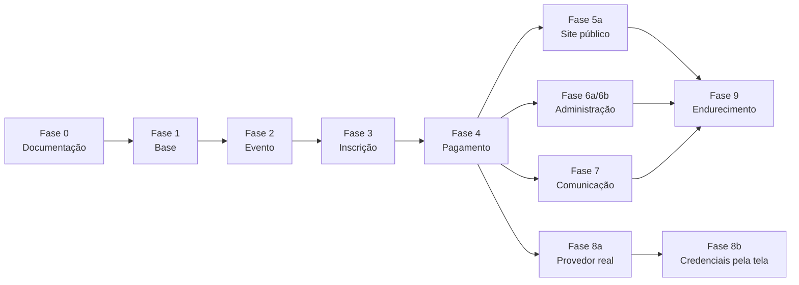

# Plano de implementação

> **Versão:** 1.8 · **Data:** 2026-08-27 · **Revisado ao final da Fase 8b — a última fase de código do plano**
> Divide o trabalho em dez fases. As fases 0 a 4 estão detalhadas porque são o que esta entrega cobre. As fases 5 a 9 estão em alto nível, para que a direção esteja clara sem congelar decisões que ainda vão amadurecer.
>
> **Estado real em 2026-08-27: todo o escopo planejado está entregue.** Não há fase de código pendente. As fases 0 a 4 (núcleo transacional), a **5a** e a **5b** (todo o caminho do participante), a **6a** e a **6b** (todo o lado administrativo), a **7** (os cinco e-mails, o lembrete de prazo e o registro que impede a mensagem repetida), a **8a** (o provedor de pagamento real, a Efí, atrás do mesmo contrato), a **8b** (credenciais e certificado da Efí cadastrados pela tela, cifrados no banco) e a **9** (auditoria append-only, medição de desempenho com 10.000 inscrições, limites de requisição, cabeçalhos de segurança com CSP e teste de carga com 50 processos) estão de pé: **522 testes Pest passando (3.661 asserções)**, **36 cenários Playwright** passando num navegador que imita um celular — **os 32 anteriores sem nenhuma edição**, mais 4 novos da tela de credenciais —, `pint` e `eslint` limpos, `vue-tsc --noEmit` com **zero erros** e `composer audit` sem aviso. ⚠️ **A Efí não foi ligada contra dinheiro de verdade**: não existe ambiente publicado, e o que falta **não é código** — cadastrar as credenciais reais pela tela nova, publicar em HTTPS com a cadeia de certificados da Efí no servidor web (o mTLS do aviso automático) e registrar o endereço do aviso no painel da Efí, com roteiro na seção 8.3 de `docs/ARCHITECTURE.md` e passo a passo na seção 10 de `docs/PAYMENTS.md`. ⚠️ **A revisão de LGPD NÃO foi feita** — retenção, prazo de descarte e anonimização não existem, e dependem da **P-04** e da **P-03**. ⚠️ **Estorno não existe** e depende da **P-02**; a taxa efetiva da Efí não foi confirmada com o comercial (**P-06**). ⚠️ Os e-mails só saem com o **trabalhador da fila** de pé: `php artisan queue:work redis --queue=emails`.

---

## Visão geral

| Fase | Nome | Nesta entrega | Resultado esperado |
|------|------|:-------------:|--------------------|
| 0 | Planejamento e documentação | ✅ | Sete documentos consistentes entre si |
| 1 | Base do projeto | ✅ | Aplicação rodando, banco de pé, autenticação administrativa funcionando |
| 2 | Domínio do evento | ✅ | Evento configurável com dias, grupos, atividades, cidades e grupos de participantes |
| 3 | Inscrição | ✅ | Inscrição válida com reserva de vaga à prova de concorrência |
| 4 | Pagamento simulado | ✅ | Cobrança Pix, aviso automático, expiração e reconciliação |
| 5a | Site público | ✅ | Página do evento, formulário de inscrição em quatro etapas e cobrança Pix |
| 5b | Área do participante | ✅ | Acompanhamento da inscrição por link assinado, histórico da cobrança, segunda via do Pix e recuperação do link por e-mail |
| 6a | Acesso administrativo e painel | ✅ | Papéis e permissões, cadastro público fechado, conta por comando artisan e painel com os números de cada evento |
| 6b | Cadastros e gestão de inscrições | ✅ | Cadastro do evento pela tela, lista de inscrições com filtros e exportação, ficha com o histórico da cobrança, cancelamento administrativo e confirmação manual de pagamento |
| 6 | Administração (6a + 6b) | ✅ | Painel com números e cadastros — concluída nas duas metades |
| 7 | Comunicação | ✅ | Cinco e-mails na fila, lembrete de prazo e nenhuma mensagem repetida |
| 8a | Provedor real (Efí) | ✅ | Cobrança Pix de verdade, aviso automático em lote e confirmação — **sem uma linha alterada em Action, Model ou Enum de domínio**. Fecha a P-01 |
| 8b | Credenciais pela interface | ✅ | Credenciais e certificado da Efí cadastrados **pela tela**, cifrados no banco, dois ambientes independentes e nenhum segredo voltando para o navegador — com **um único arquivo do provedor alterado** (decisão **DA-24** cobrada e paga) |
| 8 | Pagamento real (8a + 8b) | ✅ | Cobrança Pix de verdade e configurável pelo painel — concluída nas duas metades |
| 9 | Endurecimento | ✅ | Auditoria append-only, desempenho medido com 10.000 inscrições, limites e cabeçalhos com CSP, teste de carga. **A LGPD ficou de fora** (decisão D-76): depende da P-04 e da P-03 |

---

## Fase 0 — Planejamento e documentação ✅

**Objetivo:** decidir antes de codar, e deixar registrado o porquê de cada decisão.

| Etapa | Entrega | Situação |
|-------|---------|:--------:|
| 0.1 | `docs/PRD.md` com 24 seções + Glossário; `docs/PROGRESS.md` | ✅ |
| 0.2 | `docs/ARCHITECTURE.md`, `docs/DATABASE.md`, `docs/BUSINESS_RULES.md` | ✅ |
| 0.3 | `docs/PAYMENTS.md`, `docs/IMPLEMENTATION_PLAN.md` e revisão cruzada dos documentos | ✅ |

**Decisões tomadas nesta fase** (detalhadas em `PROGRESS.md`): domínio em português sem acento; inscrição sem estado "pago"; reserva por contador atômico; dinheiro em centavos; CPF cifrado com impressão digital separada; sem tabela de aceite de termos; cidades e grupos como catálogo global.

**Critério de conclusão:** os sete documentos existem, não se contradizem em nomes de tabela, situações e regras de capacidade, e um leigo consegue ler o PRD do começo ao fim.

---

## Fase 1 — Base do projeto ✅

**Objetivo:** ter uma aplicação Laravel 12 rodando com banco, fila e autenticação administrativa, sem nenhuma regra de negócio ainda.

| Etapa | Entrega |
|-------|---------|
| 1.1 | Repositório Git inicializado |
| 1.2 | Projeto Laravel 12 com o kit inicial Vue (Inertia 2 + TypeScript + Tailwind 4) |
| 1.3 | Ambiente em Docker (Laravel Sail) com PostgreSQL 18, Redis e Mailpit |
| 1.4 | `.env` configurado: PostgreSQL, Redis, `APP_TIMEZONE=America/Sao_Paulo`, `PAYMENT_GATEWAY=fake` |
| 1.5 | `config/payments.php` com o provedor padrão e as configurações do provedor simulado |
| 1.6 | Pest e Pint configurados |
| 1.7 | Migrações do kit inicial rodando e autenticação administrativa funcionando |

**O que o kit inicial entrega:** cadastro, login, recuperação de senha, verificação de e-mail e ajustes de perfil. **As tabelas e telas em inglês que ele traz não são traduzidas** — são infraestrutura do framework, não domínio.

**Critério de conclusão:** `php artisan migrate` cria o banco; a suíte de testes do kit inicial passa; é possível autenticar.

---

## Fase 2 — Domínio do evento ✅

**Objetivo:** permitir cadastrar qualquer evento, com qualquer estrutura de dias e atividades, sem mexer no código.

| Etapa | Entrega |
|-------|---------|
| 2.1 | Migrações: `cidades`, `grupos_participantes`, `eventos`, `dias_evento`, `grupos_atividades`, `atividades`, `conflitos_atividades`, com todas as restrições e índices de `DATABASE.md` |
| 2.2 | Enum `SituacaoEvento` com texto amigável |
| 2.3 | Models `Cidade`, `GrupoParticipante`, `Evento`, `DiaEvento`, `GrupoAtividade`, `Atividade`, `ConflitoAtividade`, com relacionamentos e filtros em português |
| 2.4 | Factories para todos os models |
| 2.5 | `CidadeSeeder` e `EventoDemoSeeder` reproduzindo o evento real de dois dias |
| 2.6 | `tests/Feature/Dominio/EventoTest.php` |

**Estrutura do evento de demonstração:**

```text
Copa CCC 2026
├── Dia 1 — Esportes
│   └── Modalidades esportivas   (obrigatório, mínimo 1, máximo 2)
│       ├── Futebol      08:00–10:00
│       ├── Vôlei        09:00–11:00   ← conflita por horário com Futebol
│       ├── Handebol     10:00–12:00   ← encosta em Futebol, sem conflito
│       └── Basquete     14:00–16:00
└── Dia 2 — Trilha
    └── Trilha                    (opcional, máximo 1)
        ├── Trilha leve   07:00–10:00
        └── Trilha longa  07:00–13:00  ← idade mínima 16 anos
```

**Critério de conclusão:** o teste do domínio prova que as restrições do banco realmente recusam dados inválidos — capacidade estourada, contador negativo, data final antes da inicial e par de conflito fora de ordem.

---

## Fase 3 — Inscrição ✅

**Objetivo:** o coração do sistema. Criar uma inscrição válida, com reserva de vaga que resiste a acessos simultâneos.

| Etapa | Entrega |
|-------|---------|
| 3.1 | Migrações `inscricoes` e `inscricoes_atividades`, com as unicidades parciais |
| 3.2 | Enum `SituacaoInscricao` com texto amigável e `estaAtiva()` |
| 3.3 | DTO `DadosNovaInscricao` |
| 3.4 | `ValidadorSelecaoAtividades` — regras RN-03 a RN-08 |
| 3.5 | `ReservarVagas` e `LiberarVagas` — contador atômico na ordem canônica |
| 3.6 | `CriarInscricao` — transação, varredura sob demanda, uma retentativa, tradução de violação de unicidade em erro amigável |
| 3.7 | Exceções `VagasEsgotadasException`, `SelecaoAtividadesInvalidaException`, `InscricaoDuplicadaException` |
| 3.8 | Evento de domínio `InscricaoCriada` |
| 3.9 | `StoreInscricaoRequest` e `InscricaoController@store` |
| 3.10 | Suíte de testes da fase 3, incluindo concorrência com processos paralelos |

**Critério de conclusão:** as 13 regras de `BUSINESS_RULES.md` têm teste passando; o teste paralelo prova que a soma de reservadas e confirmadas nunca passa da capacidade.

---

## Fase 4 — Pagamento simulado ✅

**Objetivo:** fechar o ciclo do dinheiro sem depender de nenhuma instituição financeira.

| Etapa | Entrega |
|-------|---------|
| 4.1 | Migrações `pagamentos` e `webhooks_pagamento` |
| 4.2 | Enums `SituacaoPagamento`, `MetodoPagamento`, `SituacaoWebhook` |
| 4.3 | Contrato `PaymentGateway` e os seis DTOs imutáveis |
| 4.4 | `FakePaymentGateway` completo |
| 4.5 | `PaymentServiceProvider` com escolha por configuração |
| 4.6 | Actions `CriarPagamentoDaInscricao`, `ConfirmarPagamento`, `CancelarPagamento` |
| 4.7 | `PaymentWebhookController` e job `ProcessarWebhookPagamento` |
| 4.8 | `routes/dev.php` com os endereços de simulação bloqueados fora de desenvolvimento |
| 4.9 | Comandos `inscricoes:expirar-vencidas` e `pagamentos:reconciliar`, agendados |
| 4.10 | Eventos `InscricaoConfirmada` e `InscricaoExpirada` |
| 4.11 | Suíte de testes da fase 4 |

Todas as onze etapas foram entregues. Três ajustes de rumo, feitos durante a execução e já refletidos no código:

- O contrato ganhou o método `name()`, além dos seis previstos: as tabelas `pagamentos` e `webhooks_pagamento` precisam saber de qual provedor veio cada registro, e ler isso da configuração dentro do domínio recriaria justamente o acoplamento que o contrato existe para evitar.
- `CancelarPagamento` recebe a situação de destino (`cancelado`, `expirado` ou `falhou`). A mecânica é a mesma nos três casos, e quem chama sabe o motivo.
- O comando de expiração aceita `--evento` (a mesma rotina serve à varredura sob demanda de um evento específico) e o de reconciliação aceita `--margem` e `--lote`.

**Agendamento:** expiração **a cada minuto** — é o menor intervalo possível e é a precisão que a pessoa da fila sente. Reconciliação **a cada cinco minutos**, olhando apenas cobranças a até quinze minutos do vencimento: suficiente para reconhecer o pagamento antes do prazo e educado com o limite de consultas do provedor.

**Critério de conclusão:** é possível, a partir de um banco recém-semeado, criar uma inscrição, gerar a cobrança Pix simulada, simular o pagamento e ver a inscrição confirmada — e também deixar o prazo vencer e ver as vagas voltarem, sem nenhum registro apagado.

**Verificado em 2026-08-20**, nesta ordem, sobre o evento de demonstração (Copa CCC 2026): inscrição criada → evento e as duas atividades escolhidas com 1 vaga reservada cada → cobrança Pix emitida com `expira_em` igual ao `prazo_pagamento` → aviso assinado entregue em `POST /webhooks/pagamentos` (HTTP 200) → inscrição `confirmada`, com evento e atividades passando a 0 reservadas e 1 confirmada. Em seguida, uma segunda inscrição com o prazo vencido → `php artisan inscricoes:expirar-vencidas` devolveu a vaga do evento **e a de cada atividade**, marcou a cobrança como "prazo vencido" e não apagou nenhuma linha (2 inscrições, 2 pagamentos e 4 vínculos permaneceram no banco). A segunda execução do mesmo comando não alterou mais nada.

**O que a Fase 4 não cobre, de propósito:** estorno como fluxo de domínio (o contrato tem `refundPayment()`, mas nenhuma Action o usa — depende da política de reembolso, pendência P-02) e a decisão sobre pagamento reconhecido depois do prazo (pendência P-03; hoje esse aviso é registrado como *ignorado*, e a mudança, se houver, é em um único ponto de `ConfirmarPagamento`).

---

## Fase 5a — Site público ✅

**Objetivo:** dar rosto ao que já funciona por baixo.

| Entrega | Situação |
|---------|:--------:|
| Página `/eventos/{slug}` com nome, descrição, datas, programação por dia, valor, vagas e regulamento | ✅ |
| Evento em rascunho ou cancelado responde 404; inscrições fechadas explicam o motivo no lugar do botão | ✅ |
| Formulário em quatro etapas: dados pessoais, participação, revisão, pagamento | ✅ |
| Atividades com horário, vagas restantes, "Esgotado", "Indisponível — conflito de horário com Futebol" e o contador "2 de 2 selecionadas" | ✅ |
| Tela de pagamento com QR Code, código copia e cola, botão de copiar e contador regressivo | ✅ |
| Volta à cobrança por URL assinada com validade (decisão DA-05, agora tomada) | ✅ |
| Testes de ponta a ponta com Playwright | ✅ 12 cenários |
| Área do participante (linha do tempo, histórico, reenvio do link) | ✅ entregue na Fase 5b |

**Regra que não muda:** tudo que a tela valida é conforto. A regra continua sendo a do servidor — e o 422 dele devolve o participante ao passo do campo com problema, com o campo em foco.

**Acessibilidade:** rótulo de verdade em todo campo, erro ligado por `aria-describedby` e anunciado com `role="alert"`, troca de etapa anunciada em região viva, foco visível em todo controle, alvos de toque de 44 px e nenhuma rolagem horizontal a partir de 320 px. Contraste AA medido nos modos claro e escuro.

---

## Fase 5b — Área do participante ✅

**Objetivo:** deixar o participante acompanhar a própria inscrição depois de fechar o navegador.

| Entrega | Situação |
|---------|:--------:|
| Página `/inscricoes/{código}/acompanhar` por link assinado, com resumo da inscrição | ✅ |
| Linha do tempo com os oito marcos, derivada dos carimbos de tempo que o domínio já grava — sem tabela nova | ✅ |
| Histórico completo da cobrança, sem expor identificador do provedor, dados internos do aviso nem o código Pix fora da tela de pagamento | ✅ |
| Segunda via do Pix sob demanda enquanto o prazo não venceu; vencido, a tela explica em vez de oferecer o botão | ✅ |
| Recuperação do link de acesso por e-mail em `/acesso`, com resposta sempre neutra e link válido por sete dias | ✅ |
| Ligação entre as telas: pagamento → acompanhamento, e página do evento → "já me inscrevi" | ✅ |
| Testes de ponta a ponta com Playwright | ✅ 9 cenários novos, os 12 da Fase 5a intactos |
| Cancelamento da própria inscrição pelo participante | ❌ fora do escopo (decisão D-45) — segue com o dono do produto |

**Regra que não muda:** a área do participante é uma tela de leitura. A única escrita que ela faz é pedir a segunda via do Pix, que chama a Action repetível de sempre. Nenhuma Action, Enum, modelo ou migração foi criada na fase.

**Acessibilidade:** a linha do tempo é uma lista ordenada de verdade, e cada passo diz por escrito em que pé está, sem depender de cor. Os títulos descem um nível de cada vez, o campo de e-mail aponta ao mesmo tempo para a ajuda e para o erro, a mensagem neutra é anunciada com `role="status"`, o foco fica sempre visível, os alvos de toque têm 44 px e nada escapa da largura de uma tela de 320 px.

---

## Fase 6a — Acesso administrativo e painel ✅

**Entregue.** A Fase 6 foi partida em duas: primeiro a fundação do lado de dentro (quem entra e o que pode ver), depois os cadastros e a gestão de inscrições.

| Entrega | Estado |
|---------|:------:|
| Papéis `administrador` e `organizador` e nove permissões em português, com seeder idempotente | ✅ |
| Cadastro público removido; `GET`/`POST /register` respondem 404, provado por teste | ✅ |
| Conta administrativa pelo comando `usuario:criar-administrador`, com senha pedida de forma escondida | ✅ |
| Conta de demonstração travada em ambiente `local`, no mesmo molde da decisão D-29 | ✅ |
| Grupo de rotas `/admin` com autenticação, e-mail confirmado e **permissão obrigatória em cada rota** | ✅ |
| Layout administrativo e navegação real sobre o esqueleto do pacote inicial | ✅ |
| Painel por evento: inscrições por situação, vagas por atividade e dinheiro recebido/pendente/estornado | ✅ |
| Números vindos de consulta agregada; vaga restante lida do contador materializado | ✅ |
| Pendência **P-09** fechada: `vue-tsc --noEmit` com zero erros | ✅ |
| Testes de ponta a ponta com Playwright | ✅ 4 cenários novos, os 21 anteriores intactos |
| Cancelamento administrativo e confirmação manual de pagamento | ❌ adiados para a Fase 6b, de propósito |

**Regra que não muda:** o painel apenas **lê**. Nenhuma Action, Enum, modelo, migração de domínio ou evento foi alterado nesta fase; as únicas migrações novas são as tabelas de papéis e permissões do pacote.

---

## Fase 6b — Cadastros e gestão de inscrições ✅

**Entregue.** Com ela, a **Fase 6 está concluída**: a organização passa a operar o evento inteiro pela tela.

| Entrega | Estado |
|---------|:------:|
| Cadastro de cidades e grupos de participantes, com recusa amigável de apagar registro em uso | ✅ |
| Cadastro de eventos, dias, grupos de atividades, atividades e conflitos, com **cada restrição do banco espelhada em português** antes de o PostgreSQL recusar | ✅ |
| Trava para mudança de estrutura em evento com inscrição ativa — recusa com explicação e caminho alternativo | ✅ |
| Lista de inscrições com filtros combináveis (evento, situação, cidade, grupo, atividade, pagamento e período) e paginação que preserva o filtro | ✅ |
| Busca por nome, e-mail e código público; **CPF não filtra e não busca**, e não aparece na lista | ✅ |
| Exportação em CSV respeitando os filtros da tela, em fluxo com cursor, `;` e BOM UTF-8, sem CPF | ✅ |
| Ficha da inscrição com o histórico completo da cobrança | ✅ |
| **Cancelamento administrativo** (`inscricoes.cancelar`): motivo obrigatório, devolução de vaga na ordem canônica, gravação condicional e teste de concorrência real | ✅ |
| **Confirmação manual de pagamento** (`pagamentos.confirmar-manual`, só do administrador): observação obrigatória, origem manual registrada, nenhum identificador de provedor forjado | ✅ |
| Anúncio de domínio `InscricaoCancelada` disparado — **sem ouvinte**, que é trabalho da Fase 7 | ✅ |
| Testes de ponta a ponta com Playwright | ✅ 3 cenários novos, os 25 anteriores intactos |
| Registro de auditoria das ações administrativas | ❌ adiado para a Fase 9, de propósito |
| E-mails de aviso do cancelamento e da confirmação | ❌ na 6b — **entregues na Fase 7**, sem que uma linha da 6b precisasse mudar |

**Duas decisões que dependem de pendência aberta:** cancelar inscrição já confirmada **não estorna** (a política de reembolso, **P-02**, não existe) e a confirmação manual **recusa** inscrição expirada (a vaga já voltou para a fila — **P-03** segue aberta). As duas são a leitura segura enquanto ninguém decide, e as duas dizem isso na tela em português.

**Nenhuma migração e nenhuma dependência nova.** As duas Actions escrevem em colunas que já existiam desde a Fase 3.

---

## Fase 7 — Comunicação ✅ concluída

- ✅ Ouvintes dos quatro anúncios já disparados pelo domínio: `InscricaoCriada`, `InscricaoConfirmada`, `InscricaoExpirada` e `InscricaoCancelada`. A decisão **D-12** está **encerrada** — eles finalmente têm quem os escute.
- ✅ Cinco e-mails (decisão **D-65**): inscrição recebida com o link de pagamento, lembrete antes do prazo, pagamento confirmado, prazo vencido e cancelamento. Todos em HTML **e** em texto puro, sempre com link assinado e **nunca** com CPF, telefone, impressão digital ou código Pix inteiro (**D-68**).
- ✅ Lembrete de prazo pelo comando agendado `inscricoes:lembrar-prazo` (a cada 15 minutos, janela configurável, padrão de 24 horas — decisão DA-08 cumprida).
- ✅ Tudo na fila `emails`, com 3 tentativas e espera de 1, 5 e 15 minutos; falha definitiva vai para `failed_jobs` sem afetar inscrição, vaga ou pagamento (**D-67**).
- ✅ Tabela `comunicacoes_enviadas` com unicidade `(inscricao_id, tipo, canal)`: é o **banco** que impede a segunda cópia, não uma verificação em PHP (**D-66**).
- ✅ Estrutura pronta para um segundo canal: só a coluna `canal` e o Enum `TipoComunicacao`, sem contrato nem adaptador de WhatsApp (**D-70**).

**Nenhuma regra de inscrição foi alterada nesta fase** — nenhuma Action, nenhum Enum de domínio, nenhum Model de domínio, nenhuma migração existente, e nenhum anúncio mudou de momento. O desenho de eventos de domínio se pagou.

⚠️ **Pendência de infraestrutura, não de código:** nenhum trabalhador de fila roda hoje. Sem `php artisan queue:work redis --queue=emails` de pé (seção 9.1 de `ARCHITECTURE.md`), os e-mails ficam parados na fila.

---

## Fase 8a — Provedor de pagamento real (Efí) ✅ concluída

- ✅ Provedor escolhido: **Efí**, API Pix (decisão **DA-16**). **A pendência P-01 está fechada.**
- ✅ `EfiPaymentGateway` cumprindo o contrato que já existia desde a Fase 4, com o SDK oficial isolado atrás de um embrulho fino — o único ponto do sistema que o instancia (decisão **DA-21**).
- ✅ **Nenhum arquivo de domínio mudou**, e isso foi verificado, não suposto: o `git diff` sobre `app/Actions/`, `app/Models/` e `app/Enums/` volta vazio na fase inteira.
- ✅ Duas mudanças de fronteira, ambas obrigadas pela Efí e ambas sem tocar em regra: o aviso automático passou a ser tratado **em lote** (decisão **DA-17**), porque um único aviso da Efí pode trazer vários pagamentos; e a leitura da assinatura saiu do controller e entrou no provedor, porque a Efí manda a assinatura **no endereço** e não em cabeçalho.
- ✅ Toda a configuração atrás de **um lugar só** (decisão **DA-24**) — é o que torna a Fase 8b barata.
- ✅ **36 testes novos que rodam sem credencial, sem certificado e sem rede**, mais `php artisan efi:diagnostico` para provar à mão contra a homologação (decisão **DA-20**).
- ❌ **Estorno fora de escopo** (decisão **DA-18**): depende da política de reembolso (**P-02**). O `endToEndId` que ele vai exigir **já está sendo guardado**.
- ❌ **Não foi ligado contra dinheiro de verdade** (decisão **DA-19**): não há ambiente publicado. O roteiro do que o servidor precisa está na seção 8.3 de `docs/ARCHITECTURE.md`.

---

## Fase 8b — Credenciais da Efí pela interface ✅ concluída

- ✅ Fonte da configuração trocada do arquivo de ambiente para o **banco, cifrada** — dentro de `ConfiguracaoEfi`, **e só ali**. Isso foi verificado, não suposto: `git diff --stat` sobre `app/Services/Payments/Efi/` na fase inteira mostra **um único arquivo alterado**. `EfiPaymentGateway`, `EfiClient` e `TraducaoDeStatus` não mudaram uma linha, e a suíte da 8a continuou verde **sem edição**. É a decisão **DA-24** cobrada e paga.
- ✅ Tabela `credenciais_pagamento` com os **cinco campos sigilosos cifrados em repouso** (decisão **DA-25**), pelo mesmo mecanismo que já protege o CPF (**D-08**) — inclusive o **conteúdo** do certificado, e não o caminho dele.
- ✅ **Um ambiente ativo por provedor garantido pelo PostgreSQL**, por índice único parcial (`WHERE ativo = true`), e não por verificação em PHP: tentar ativar o segundo devolve `SQLSTATE 23505` (mesma lição da **D-66**).
- ✅ Tela restrita à permissão própria `pagamentos.credenciais`, **exclusiva do administrador** (**D-55**) — quem organiza o evento **recebe 403** e não vê o item no menu.
- ✅ **Nenhum segredo volta para o navegador**, nem mascarado; por consequência, **campo em branco mantém** o valor guardado e nunca apaga. O certificado é materializado em `storage/certificados` com permissão `0600`, só no uso, e é cache descartável.
- ✅ Toda alteração e toda troca de ambiente em `logs_auditoria` (`AcaoAuditada::AlterouCredencialPagamento`), com **quais campos** mudaram e **nunca os valores** — com teste dedicado provando o vazamento zero.
- ✅ Arquivo de ambiente mantido como **reserva** (decisão **DA-26**), usado só quando não há ambiente ativo cadastrado — e **sem completar** o que falta num cadastro pela metade.
- ✅ **34 testes Pest novos** e **4 cenários Playwright novos**; os **32 anteriores continuaram verdes sem edição**.
- ❌ **Rotação automática de credencial e alerta de vencimento de certificado ficaram fora do escopo.** A tela mostra a validade quando o formato permite lê-la, e nada mais.
- ❌ **Nenhum outro provedor além da Efí.** A coluna `gateway` existe para o dia em que houver outro, mas a tela fala de Efí.

**Nenhum arquivo de domínio mudou, e nem o gateway, nem o cliente, nem o comando de diagnóstico.** Era a condição que a decisão DA-24 impunha à Fase 8a, e ela se sustentou.

---

## Fase 9 — Endurecimento ✅ concluída

- ✅ Tabela `logs_auditoria` **append-only** — o model recusa `update` e `delete`, sempre —, sete ações administrativas registradas e a tela de auditoria somente leitura, atrás da permissão `auditoria.ver`.
- ✅ Revisão de desempenho com **10.000 inscrições** no banco: as cinco consultas mais pesadas medidas com o plano de execução do banco. **Nenhum índice novo e nenhum cache** — a medição concluiu que mexer pioraria, e o motivo está escrito em `docs/PERFORMANCE.md`.
- ✅ Revisão de segurança: limite de requisições em inscrição, login e webhook (sem tocar na D-18 nem na D-48); cabeçalhos em toda resposta e **CSP por número de uso único, sem `unsafe-inline` em `script-src`**, provada em navegador; `composer audit` sem aviso e `npm audit` com zero vulnerabilidades.
- ✅ Teste de carga: **50 processos disputando 5 vagas**, capacidade nunca furada, sem impasse, com os tempos registrados.
- ✅ Revisão de superfície: dupla trava das rotas de simulação (D-29) intacta, nenhuma rota administrativa só com login, e `APP_DEBUG=false` para produção documentado em `docs/ARCHITECTURE.md` (§11.4).
- ❌ **Revisão de LGPD — NÃO foi feita.** Política de retenção, prazo de descarte e anonimização não existem neste sistema. Ficou fora da fase **de propósito** (decisão D-76): descarte de dado pessoal é decisão jurídica, e implementá-lo sob um prazo inventado seria o software decidindo por conta própria. Depende da **P-04** e da **P-03**, e vira plano próprio quando forem respondidas.
- ❌ Credenciamento (check-in) e lista de espera continuam **fora do escopo** — nunca foram priorizados.

---

## Ordem de trabalho e dependências



As fases 5, 6, 7 e 8 dependem apenas da fase 4 e podem ser feitas em paralelo por pessoas diferentes. Foi para isso que o domínio foi isolado das telas e do provedor de pagamento.

**O plano original punha a Fase 9 depois da Fase 8, e a ordem real foi outra** — a Fase 9 foi concluída antes, com a Fase 8 ainda parada à espera de decisão comercial. **A Fase 8a mostrou que isso não deixou dívida:** o que a Fase 9 endureceu foi a aplicação (auditoria, desempenho, limites, cabeçalhos e concorrência sob carga), e nada disso precisou ser revisto quando o provedor real entrou — o limite de requisições do aviso automático, a CSP e a auditoria continuaram valendo sem uma linha alterada. O vocabulário de status também não precisou mudar: `SituacaoPagamento::deStatusExterno()` já era neutro o bastante para o da Efí. **A Fase 8 também foi partida em duas**, 8a (o provedor) e 8b (as credenciais pela tela), porque cadastrar credencial pela interface é trabalho de tela e de cifra, não de integração financeira — e misturar os dois faria a fase inteira depender de a tela ficar pronta. **A partição se justificou duas vezes:** a 8a entregou capacidade de cobrar sem esperar a tela, e a 8b provou que a aposta da 8a estava certa — trocar a fonte da configuração custou **um arquivo**, exatamente como a DA-24 previa. É o tipo de retorno que não aparece na fase em que a decisão é tomada, e sim na seguinte.

---

## Rotina antes de cada fase

1. Ler o `PRD.md` e o `PROGRESS.md`.
2. Identificar as dependências da fase.
3. Implementar somente o necessário — nada "para o futuro".
4. Rodar migrações, testes e o verificador de formatação.
5. Corrigir o que falhar.
6. Atualizar o `PROGRESS.md` com o que foi feito, o que foi decidido e o que ficou pendente.
