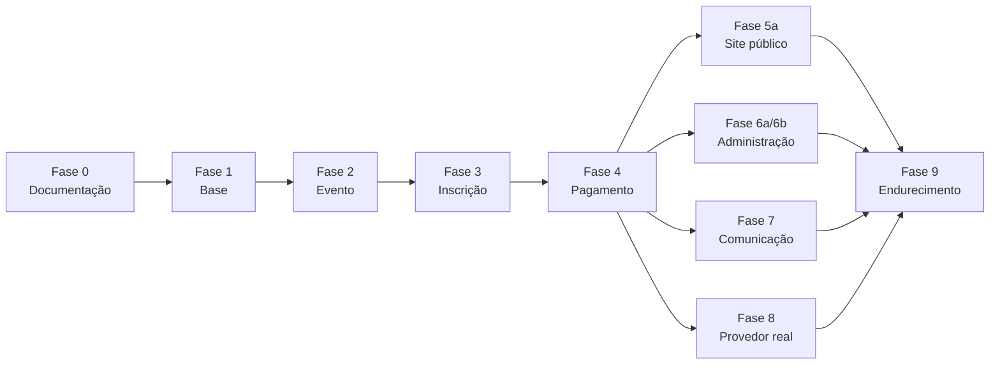

# Plano de implementação

> **Versão:** 1.5 · **Data:** 2026-08-21 · **Revisado ao final da Fase 6b**
> Divide o trabalho em dez fases. As fases 0 a 4 estão detalhadas porque são o que esta entrega cobre. As fases 5 a 9 estão em alto nível, para que a direção esteja clara sem congelar decisões que ainda vão amadurecer.
>
> **Estado real em 2026-08-21:** as fases 0 a 4, a **Fase 5a** (site público, inscrição em quatro etapas e cobrança Pix), a **Fase 5b** (área do participante: acompanhamento, histórico da cobrança, segunda via do Pix e recuperação do link de acesso) e a **Fase 6 inteira** — **6a** (papéis e permissões, cadastro público fechado, conta administrativa por comando e painel de números) e **6b** (cadastros do evento pela tela, lista de inscrições com filtros, exportação em CSV, ficha com o histórico da cobrança, cancelamento administrativo e confirmação manual de pagamento) e a **Fase 7** (os cinco e-mails do participante, o lembrete de prazo agendado e o registro de envio que impede a mensagem repetida) estão **concluídas e verificadas**: 407 testes Pest passando (2036 asserções), 28 cenários Playwright passando num navegador que imita um celular, `pint` e `eslint` limpos e `vue-tsc --noEmit` com **zero erros**. Com isso, o caminho do participante está de pé, a organização opera o evento inteiro pela tela e quem se inscreve é avisado por e-mail em cada passo — sem ninguém abrir o banco de dados. A próxima é a **Fase 9 — Endurecimento**; a **Fase 8** depende de decisões do dono do produto (**P-01** e **P-06**). ⚠️ Os e-mails só saem com o **trabalhador da fila** de pé: `php artisan queue:work redis --queue=emails`.

---

## Visão geral

| Fase | Nome | Nesta entrega | Resultado esperado |
|------|------|:-------------:|--------------------|
| 0 | Planejamento e documentação | ✅ | Sete documentos consistentes entre si |
| 1 | Base do projeto | ✅ | Aplicação rodando, banco de pé, autenticação administrativa funcionando |
| 2 | Domínio do evento | ✅ | Evento configurável com dias, grupos, atividades, cidades e grupos de participantes |
| 3 | Inscrição | ✅ | Inscrição válida com reserva de vaga à prova de concorrência |
| 4 | Pagamento simulado | ✅ | Cobrança Pix, aviso automático, expiração e reconciliação |
| 5a | Site público | ✅ | Página do evento, formulário de inscrição em quatro etapas e cobrança Pix |
| 5b | Área do participante | ✅ | Acompanhamento da inscrição por link assinado, histórico da cobrança, segunda via do Pix e recuperação do link por e-mail |
| 6a | Acesso administrativo e painel | ✅ | Papéis e permissões, cadastro público fechado, conta por comando artisan e painel com os números de cada evento |
| 6b | Cadastros e gestão de inscrições | ✅ | Cadastro do evento pela tela, lista de inscrições com filtros e exportação, ficha com o histórico da cobrança, cancelamento administrativo e confirmação manual de pagamento |
| 6 | Administração | ❌ | Painel com números e cadastros |
| 7 | Comunicação | ❌ | E-mails em fila |
| 8 | Provedor real | ❌ | Pix de verdade em produção |
| 9 | Endurecimento | ❌ | Auditoria, desempenho, revisão de segurança e LGPD |

---

## Fase 0 — Planejamento e documentação ✅

**Objetivo:** decidir antes de codar, e deixar registrado o porquê de cada decisão.

| Etapa | Entrega | Situação |
|-------|---------|:--------:|
| 0.1 | `docs/PRD.md` com 24 seções + Glossário; `docs/PROGRESS.md` | ✅ |
| 0.2 | `docs/ARCHITECTURE.md`, `docs/DATABASE.md`, `docs/BUSINESS_RULES.md` | ✅ |
| 0.3 | `docs/PAYMENTS.md`, `docs/IMPLEMENTATION_PLAN.md` e revisão cruzada dos documentos | ✅ |

**Decisões tomadas nesta fase** (detalhadas em `PROGRESS.md`): domínio em português sem acento; inscrição sem estado "pago"; reserva por contador atômico; dinheiro em centavos; CPF cifrado com impressão digital separada; sem tabela de aceite de termos; cidades e grupos como catálogo global.

**Critério de conclusão:** os sete documentos existem, não se contradizem em nomes de tabela, situações e regras de capacidade, e um leigo consegue ler o PRD do começo ao fim.

---

## Fase 1 — Base do projeto ✅

**Objetivo:** ter uma aplicação Laravel 12 rodando com banco, fila e autenticação administrativa, sem nenhuma regra de negócio ainda.

| Etapa | Entrega |
|-------|---------|
| 1.1 | Repositório Git inicializado |
| 1.2 | Projeto Laravel 12 com o kit inicial Vue (Inertia 2 + TypeScript + Tailwind 4) |
| 1.3 | Ambiente em Docker (Laravel Sail) com PostgreSQL 18, Redis e Mailpit |
| 1.4 | `.env` configurado: PostgreSQL, Redis, `APP_TIMEZONE=America/Sao_Paulo`, `PAYMENT_GATEWAY=fake` |
| 1.5 | `config/payments.php` com o provedor padrão e as configurações do provedor simulado |
| 1.6 | Pest e Pint configurados |
| 1.7 | Migrações do kit inicial rodando e autenticação administrativa funcionando |

**O que o kit inicial entrega:** cadastro, login, recuperação de senha, verificação de e-mail e ajustes de perfil. **As tabelas e telas em inglês que ele traz não são traduzidas** — são infraestrutura do framework, não domínio.

**Critério de conclusão:** `php artisan migrate` cria o banco; a suíte de testes do kit inicial passa; é possível autenticar.

---

## Fase 2 — Domínio do evento ✅

**Objetivo:** permitir cadastrar qualquer evento, com qualquer estrutura de dias e atividades, sem mexer no código.

| Etapa | Entrega |
|-------|---------|
| 2.1 | Migrações: `cidades`, `grupos_participantes`, `eventos`, `dias_evento`, `grupos_atividades`, `atividades`, `conflitos_atividades`, com todas as restrições e índices de `DATABASE.md` |
| 2.2 | Enum `SituacaoEvento` com texto amigável |
| 2.3 | Models `Cidade`, `GrupoParticipante`, `Evento`, `DiaEvento`, `GrupoAtividade`, `Atividade`, `ConflitoAtividade`, com relacionamentos e filtros em português |
| 2.4 | Factories para todos os models |
| 2.5 | `CidadeSeeder` e `EventoDemoSeeder` reproduzindo o evento real de dois dias |
| 2.6 | `tests/Feature/Dominio/EventoTest.php` |

**Estrutura do evento de demonstração:**

```text
Copa CCC 2026
├── Dia 1 — Esportes
│   └── Modalidades esportivas   (obrigatório, mínimo 1, máximo 2)
│       ├── Futebol      08:00–10:00
│       ├── Vôlei        09:00–11:00   ← conflita por horário com Futebol
│       ├── Handebol     10:00–12:00   ← encosta em Futebol, sem conflito
│       └── Basquete     14:00–16:00
└── Dia 2 — Trilha
    └── Trilha                    (opcional, máximo 1)
        ├── Trilha leve   07:00–10:00
        └── Trilha longa  07:00–13:00  ← idade mínima 16 anos
```

**Critério de conclusão:** o teste do domínio prova que as restrições do banco realmente recusam dados inválidos — capacidade estourada, contador negativo, data final antes da inicial e par de conflito fora de ordem.

---

## Fase 3 — Inscrição ✅

**Objetivo:** o coração do sistema. Criar uma inscrição válida, com reserva de vaga que resiste a acessos simultâneos.

| Etapa | Entrega |
|-------|---------|
| 3.1 | Migrações `inscricoes` e `inscricoes_atividades`, com as unicidades parciais |
| 3.2 | Enum `SituacaoInscricao` com texto amigável e `estaAtiva()` |
| 3.3 | DTO `DadosNovaInscricao` |
| 3.4 | `ValidadorSelecaoAtividades` — regras RN-03 a RN-08 |
| 3.5 | `ReservarVagas` e `LiberarVagas` — contador atômico na ordem canônica |
| 3.6 | `CriarInscricao` — transação, varredura sob demanda, uma retentativa, tradução de violação de unicidade em erro amigável |
| 3.7 | Exceções `VagasEsgotadasException`, `SelecaoAtividadesInvalidaException`, `InscricaoDuplicadaException` |
| 3.8 | Evento de domínio `InscricaoCriada` |
| 3.9 | `StoreInscricaoRequest` e `InscricaoController@store` |
| 3.10 | Suíte de testes da fase 3, incluindo concorrência com processos paralelos |

**Critério de conclusão:** as 13 regras de `BUSINESS_RULES.md` têm teste passando; o teste paralelo prova que a soma de reservadas e confirmadas nunca passa da capacidade.

---

## Fase 4 — Pagamento simulado ✅

**Objetivo:** fechar o ciclo do dinheiro sem depender de nenhuma instituição financeira.

| Etapa | Entrega |
|-------|---------|
| 4.1 | Migrações `pagamentos` e `webhooks_pagamento` |
| 4.2 | Enums `SituacaoPagamento`, `MetodoPagamento`, `SituacaoWebhook` |
| 4.3 | Contrato `PaymentGateway` e os seis DTOs imutáveis |
| 4.4 | `FakePaymentGateway` completo |
| 4.5 | `PaymentServiceProvider` com escolha por configuração |
| 4.6 | Actions `CriarPagamentoDaInscricao`, `ConfirmarPagamento`, `CancelarPagamento` |
| 4.7 | `PaymentWebhookController` e job `ProcessarWebhookPagamento` |
| 4.8 | `routes/dev.php` com os endereços de simulação bloqueados fora de desenvolvimento |
| 4.9 | Comandos `inscricoes:expirar-vencidas` e `pagamentos:reconciliar`, agendados |
| 4.10 | Eventos `InscricaoConfirmada` e `InscricaoExpirada` |
| 4.11 | Suíte de testes da fase 4 |

Todas as onze etapas foram entregues. Três ajustes de rumo, feitos durante a execução e já refletidos no código:

- O contrato ganhou o método `name()`, além dos seis previstos: as tabelas `pagamentos` e `webhooks_pagamento` precisam saber de qual provedor veio cada registro, e ler isso da configuração dentro do domínio recriaria justamente o acoplamento que o contrato existe para evitar.
- `CancelarPagamento` recebe a situação de destino (`cancelado`, `expirado` ou `falhou`). A mecânica é a mesma nos três casos, e quem chama sabe o motivo.
- O comando de expiração aceita `--evento` (a mesma rotina serve à varredura sob demanda de um evento específico) e o de reconciliação aceita `--margem` e `--lote`.

**Agendamento:** expiração **a cada minuto** — é o menor intervalo possível e é a precisão que a pessoa da fila sente. Reconciliação **a cada cinco minutos**, olhando apenas cobranças a até quinze minutos do vencimento: suficiente para reconhecer o pagamento antes do prazo e educado com o limite de consultas do provedor.

**Critério de conclusão:** é possível, a partir de um banco recém-semeado, criar uma inscrição, gerar a cobrança Pix simulada, simular o pagamento e ver a inscrição confirmada — e também deixar o prazo vencer e ver as vagas voltarem, sem nenhum registro apagado.

**Verificado em 2026-08-20**, nesta ordem, sobre o evento de demonstração (Copa CCC 2026): inscrição criada → evento e as duas atividades escolhidas com 1 vaga reservada cada → cobrança Pix emitida com `expira_em` igual ao `prazo_pagamento` → aviso assinado entregue em `POST /webhooks/pagamentos` (HTTP 200) → inscrição `confirmada`, com evento e atividades passando a 0 reservadas e 1 confirmada. Em seguida, uma segunda inscrição com o prazo vencido → `php artisan inscricoes:expirar-vencidas` devolveu a vaga do evento **e a de cada atividade**, marcou a cobrança como "prazo vencido" e não apagou nenhuma linha (2 inscrições, 2 pagamentos e 4 vínculos permaneceram no banco). A segunda execução do mesmo comando não alterou mais nada.

**O que a Fase 4 não cobre, de propósito:** estorno como fluxo de domínio (o contrato tem `refundPayment()`, mas nenhuma Action o usa — depende da política de reembolso, pendência P-02) e a decisão sobre pagamento reconhecido depois do prazo (pendência P-03; hoje esse aviso é registrado como *ignorado*, e a mudança, se houver, é em um único ponto de `ConfirmarPagamento`).

---

## Fase 5a — Site público ✅

**Objetivo:** dar rosto ao que já funciona por baixo.

| Entrega | Situação |
|---------|:--------:|
| Página `/eventos/{slug}` com nome, descrição, datas, programação por dia, valor, vagas e regulamento | ✅ |
| Evento em rascunho ou cancelado responde 404; inscrições fechadas explicam o motivo no lugar do botão | ✅ |
| Formulário em quatro etapas: dados pessoais, participação, revisão, pagamento | ✅ |
| Atividades com horário, vagas restantes, "Esgotado", "Indisponível — conflito de horário com Futebol" e o contador "2 de 2 selecionadas" | ✅ |
| Tela de pagamento com QR Code, código copia e cola, botão de copiar e contador regressivo | ✅ |
| Volta à cobrança por URL assinada com validade (decisão DA-05, agora tomada) | ✅ |
| Testes de ponta a ponta com Playwright | ✅ 12 cenários |
| Área do participante (linha do tempo, histórico, reenvio do link) | ✅ entregue na Fase 5b |

**Regra que não muda:** tudo que a tela valida é conforto. A regra continua sendo a do servidor — e o 422 dele devolve o participante ao passo do campo com problema, com o campo em foco.

**Acessibilidade:** rótulo de verdade em todo campo, erro ligado por `aria-describedby` e anunciado com `role="alert"`, troca de etapa anunciada em região viva, foco visível em todo controle, alvos de toque de 44 px e nenhuma rolagem horizontal a partir de 320 px. Contraste AA medido nos modos claro e escuro.

---

## Fase 5b — Área do participante ✅

**Objetivo:** deixar o participante acompanhar a própria inscrição depois de fechar o navegador.

| Entrega | Situação |
|---------|:--------:|
| Página `/inscricoes/{código}/acompanhar` por link assinado, com resumo da inscrição | ✅ |
| Linha do tempo com os oito marcos, derivada dos carimbos de tempo que o domínio já grava — sem tabela nova | ✅ |
| Histórico completo da cobrança, sem expor identificador do provedor, dados internos do aviso nem o código Pix fora da tela de pagamento | ✅ |
| Segunda via do Pix sob demanda enquanto o prazo não venceu; vencido, a tela explica em vez de oferecer o botão | ✅ |
| Recuperação do link de acesso por e-mail em `/acesso`, com resposta sempre neutra e link válido por sete dias | ✅ |
| Ligação entre as telas: pagamento → acompanhamento, e página do evento → "já me inscrevi" | ✅ |
| Testes de ponta a ponta com Playwright | ✅ 9 cenários novos, os 12 da Fase 5a intactos |
| Cancelamento da própria inscrição pelo participante | ❌ fora do escopo (decisão D-45) — segue com o dono do produto |

**Regra que não muda:** a área do participante é uma tela de leitura. A única escrita que ela faz é pedir a segunda via do Pix, que chama a Action repetível de sempre. Nenhuma Action, Enum, modelo ou migração foi criada na fase.

**Acessibilidade:** a linha do tempo é uma lista ordenada de verdade, e cada passo diz por escrito em que pé está, sem depender de cor. Os títulos descem um nível de cada vez, o campo de e-mail aponta ao mesmo tempo para a ajuda e para o erro, a mensagem neutra é anunciada com `role="status"`, o foco fica sempre visível, os alvos de toque têm 44 px e nada escapa da largura de uma tela de 320 px.

---

## Fase 6a — Acesso administrativo e painel ✅

**Entregue.** A Fase 6 foi partida em duas: primeiro a fundação do lado de dentro (quem entra e o que pode ver), depois os cadastros e a gestão de inscrições.

| Entrega | Estado |
|---------|:------:|
| Papéis `administrador` e `organizador` e nove permissões em português, com seeder idempotente | ✅ |
| Cadastro público removido; `GET`/`POST /register` respondem 404, provado por teste | ✅ |
| Conta administrativa pelo comando `usuario:criar-administrador`, com senha pedida de forma escondida | ✅ |
| Conta de demonstração travada em ambiente `local`, no mesmo molde da decisão D-29 | ✅ |
| Grupo de rotas `/admin` com autenticação, e-mail confirmado e **permissão obrigatória em cada rota** | ✅ |
| Layout administrativo e navegação real sobre o esqueleto do pacote inicial | ✅ |
| Painel por evento: inscrições por situação, vagas por atividade e dinheiro recebido/pendente/estornado | ✅ |
| Números vindos de consulta agregada; vaga restante lida do contador materializado | ✅ |
| Pendência **P-09** fechada: `vue-tsc --noEmit` com zero erros | ✅ |
| Testes de ponta a ponta com Playwright | ✅ 4 cenários novos, os 21 anteriores intactos |
| Cancelamento administrativo e confirmação manual de pagamento | ❌ adiados para a Fase 6b, de propósito |

**Regra que não muda:** o painel apenas **lê**. Nenhuma Action, Enum, modelo, migração de domínio ou evento foi alterado nesta fase; as únicas migrações novas são as tabelas de papéis e permissões do pacote.

---

## Fase 6b — Cadastros e gestão de inscrições ✅

**Entregue.** Com ela, a **Fase 6 está concluída**: a organização passa a operar o evento inteiro pela tela.

| Entrega | Estado |
|---------|:------:|
| Cadastro de cidades e grupos de participantes, com recusa amigável de apagar registro em uso | ✅ |
| Cadastro de eventos, dias, grupos de atividades, atividades e conflitos, com **cada restrição do banco espelhada em português** antes de o PostgreSQL recusar | ✅ |
| Trava para mudança de estrutura em evento com inscrição ativa — recusa com explicação e caminho alternativo | ✅ |
| Lista de inscrições com filtros combináveis (evento, situação, cidade, grupo, atividade, pagamento e período) e paginação que preserva o filtro | ✅ |
| Busca por nome, e-mail e código público; **CPF não filtra e não busca**, e não aparece na lista | ✅ |
| Exportação em CSV respeitando os filtros da tela, em fluxo com cursor, `;` e BOM UTF-8, sem CPF | ✅ |
| Ficha da inscrição com o histórico completo da cobrança | ✅ |
| **Cancelamento administrativo** (`inscricoes.cancelar`): motivo obrigatório, devolução de vaga na ordem canônica, gravação condicional e teste de concorrência real | ✅ |
| **Confirmação manual de pagamento** (`pagamentos.confirmar-manual`, só do administrador): observação obrigatória, origem manual registrada, nenhum identificador de provedor forjado | ✅ |
| Anúncio de domínio `InscricaoCancelada` disparado — **sem ouvinte**, que é trabalho da Fase 7 | ✅ |
| Testes de ponta a ponta com Playwright | ✅ 3 cenários novos, os 25 anteriores intactos |
| Registro de auditoria das ações administrativas | ❌ adiado para a Fase 9, de propósito |
| E-mails de aviso do cancelamento e da confirmação | ❌ na 6b — **entregues na Fase 7**, sem que uma linha da 6b precisasse mudar |

**Duas decisões que dependem de pendência aberta:** cancelar inscrição já confirmada **não estorna** (a política de reembolso, **P-02**, não existe) e a confirmação manual **recusa** inscrição expirada (a vaga já voltou para a fila — **P-03** segue aberta). As duas são a leitura segura enquanto ninguém decide, e as duas dizem isso na tela em português.

**Nenhuma migração e nenhuma dependência nova.** As duas Actions escrevem em colunas que já existiam desde a Fase 3.

---

## Fase 7 — Comunicação ✅ concluída

- ✅ Ouvintes dos quatro anúncios já disparados pelo domínio: `InscricaoCriada`, `InscricaoConfirmada`, `InscricaoExpirada` e `InscricaoCancelada`. A decisão **D-12** está **encerrada** — eles finalmente têm quem os escute.
- ✅ Cinco e-mails (decisão **D-65**): inscrição recebida com o link de pagamento, lembrete antes do prazo, pagamento confirmado, prazo vencido e cancelamento. Todos em HTML **e** em texto puro, sempre com link assinado e **nunca** com CPF, telefone, impressão digital ou código Pix inteiro (**D-68**).
- ✅ Lembrete de prazo pelo comando agendado `inscricoes:lembrar-prazo` (a cada 15 minutos, janela configurável, padrão de 24 horas — decisão DA-08 cumprida).
- ✅ Tudo na fila `emails`, com 3 tentativas e espera de 1, 5 e 15 minutos; falha definitiva vai para `failed_jobs` sem afetar inscrição, vaga ou pagamento (**D-67**).
- ✅ Tabela `comunicacoes_enviadas` com unicidade `(inscricao_id, tipo, canal)`: é o **banco** que impede a segunda cópia, não uma verificação em PHP (**D-66**).
- ✅ Estrutura pronta para um segundo canal: só a coluna `canal` e o Enum `TipoComunicacao`, sem contrato nem adaptador de WhatsApp (**D-70**).

**Nenhuma regra de inscrição foi alterada nesta fase** — nenhuma Action, nenhum Enum de domínio, nenhum Model de domínio, nenhuma migração existente, e nenhum anúncio mudou de momento. O desenho de eventos de domínio se pagou.

⚠️ **Pendência de infraestrutura, não de código:** nenhum trabalhador de fila roda hoje. Sem `php artisan queue:work redis --queue=emails` de pé (seção 9.1 de `ARCHITECTURE.md`), os e-mails ficam parados na fila.

---

## Fase 8 — Provedor de pagamento real ❌

- Escolher o provedor com base na matriz de `PAYMENTS.md` e na proposta comercial (decisão DA-01).
- Implementar a classe do provedor cumprindo o contrato existente.
- Cadastrar credenciais e configurar o endereço de aviso no painel do provedor.
- Homologar: cobrança, pagamento, aviso, consulta, cancelamento e estorno.
- Rodar a suíte apontando para o provedor real em homologação.

**Nenhum arquivo de domínio deve mudar.**

---

## Fase 9 — Endurecimento ❌

- Tabela `logs_auditoria` e registro de ações administrativas sensíveis.
- Revisão de desempenho: consultas do painel, índices, cache dos números.
- Revisão de segurança: limite de requisições, cabeçalhos, revisão de dependências.
- Revisão de LGPD: política de retenção e rotina de anonimização (decisão DA-04).
- Testes de carga no caminho de inscrição.
- Credenciamento (check-in) e lista de espera, se o negócio priorizar.

---

## Ordem de trabalho e dependências



As fases 5, 6, 7 e 8 dependem apenas da fase 4 e podem ser feitas em paralelo por pessoas diferentes. Foi para isso que o domínio foi isolado das telas e do provedor de pagamento.

---

## Rotina antes de cada fase

1. Ler o `PRD.md` e o `PROGRESS.md`.
2. Identificar as dependências da fase.
3. Implementar somente o necessário — nada "para o futuro".
4. Rodar migrações, testes e o verificador de formatação.
5. Corrigir o que falhar.
6. Atualizar o `PROGRESS.md` com o que foi feito, o que foi decidido e o que ficou pendente.
