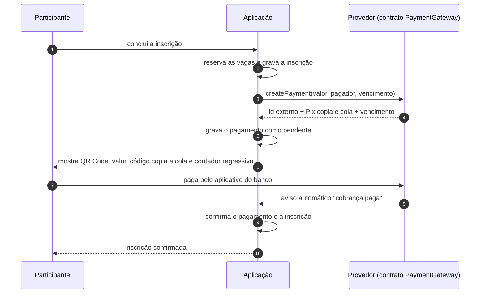
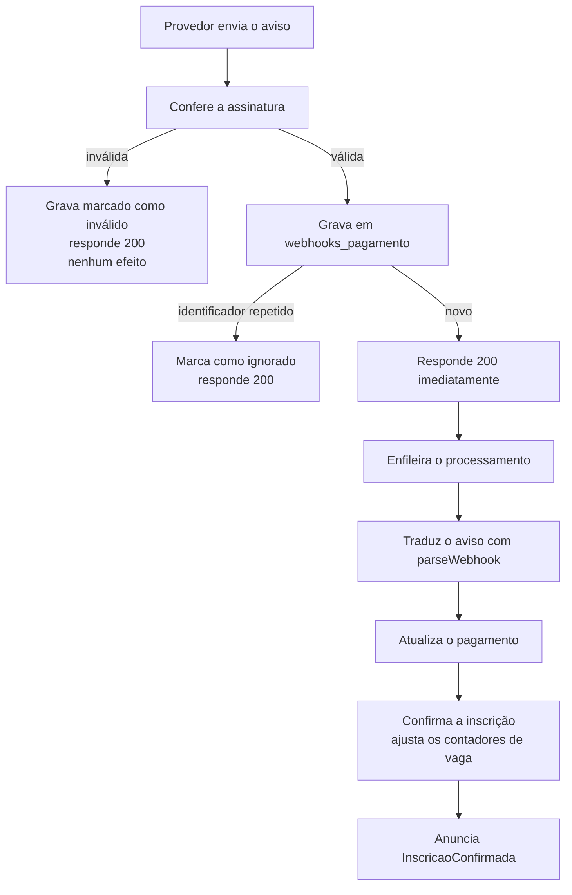

# Pagamentos

> **Versão:** 2.1 · **Data do documento:** 2026-08-27
> Descreve como a plataforma cobra, como ela se mantém independente de fornecedor, como a **Efí** — o provedor escolhido — foi encaixada atrás do mesmo contrato sem que nenhuma regra de inscrição percebesse a troca, e **como configurá-la pela tela do painel** (seção 10).

---

## ⚠️ Aviso sobre taxas

**Taxas comerciais mudam com frequência e quase sempre são negociáveis por volume.**

Por isso, três regras valem neste projeto:

1. **Nenhuma taxa aparece no código.** Nunca. Nem em configuração de aplicação.
2. **Toda taxa neste documento vem com a data da consulta e o endereço consultado.**
3. **O que não foi confirmado em fonte oficial fica escrito como "a validar".** Número comercial inventado é falha grave: leva a decisão de negócio errada.

Antes de fechar contrato, confirme tudo diretamente com o provedor.

---

## 1. Estratégia adotada

**Método inicial:** Pix. Cartão de crédito fica previsto na estrutura, sem implementação nesta entrega.

**Provedor real:** **Efí**, API Pix (decisão **DA-16**, do dono do produto, em 2026-08-27 — fecha a pendência **P-01**). Implementado na fase 8a em `app/Services/Payments/Efi/`.

**Provedor simulado:** `FakePaymentGateway` continua existindo e continua sendo o padrão em desenvolvimento e na suíte. Ele gera cobrança Pix fictícia e permite simular pagamento, expiração, falha, estorno e o envio do aviso automático — é o que permite trabalhar na plataforma inteira sem credencial de instituição financeira.

**A troca entre os dois é uma linha de configuração** (`PAYMENT_GATEWAY`). Isso deixou de ser promessa quando a fase 8a foi escrita: a Efí entrou sem uma linha alterada em Action, Model ou Enum de domínio, e os 32 cenários de ponta a ponta passaram sem edição — a prova de que quem se inscreve não vê diferença.

---

## 2. O contrato

Todo provedor de pagamento precisa cumprir exatamente este conjunto de operações:

```php
interface PaymentGateway
{
    public function name(): string;

    public function createPayment(CreatePaymentData $data): PaymentResult;

    public function getPayment(string $externalId): PaymentStatusResult;

    public function cancelPayment(string $externalId): void;

    public function refundPayment(string $externalId, ?int $amountCents = null): RefundResult;

    public function webhookRequest(Request $request): WebhookRequestData;

    public function verifyWebhookSignature(WebhookRequestData $request): bool;

    /** @return list<WebhookResult> */
    public function parseWebhook(WebhookRequestData $request): array;
}
```

| Operação | O que faz |
|----------|-----------|
| `createPayment` | Cria a cobrança e devolve o identificador externo, o código Pix copia e cola e o vencimento |
| `getPayment` | Consulta a situação atual da cobrança. Usada pela reconciliação |
| `cancelPayment` | Cancela a cobrança. Usada quando a inscrição expira |
| `refundPayment` | Devolve o dinheiro, total ou parcialmente |
| `name` | Diz qual provedor é este. É o valor gravado em `pagamentos.gateway`, para que um pagamento antigo continue sabendo quem o emitiu depois de uma troca de provedor |
| `webhookRequest` | Recorta a requisição recebida no formato que **este** provedor usa — em particular, **onde mora a assinatura dele** |
| `verifyWebhookSignature` | Confere se o aviso recebido veio mesmo do provedor |
| `parseWebhook` | **Traduz** o aviso do provedor para uma **lista** de eventos neutros. Não altera nada |

### 2.1 As decisões deste contrato

**Está em inglês, de propósito.** O resto do domínio deste projeto é escrito em português. Este contrato não, porque é a fronteira com serviços externos cujas APIs são todas em inglês (`amount`, `payer`, `qr_code`). Traduzir só na nossa metade criaria um vaivém de tradução em cada campo. A fronteira fala a língua de quem está do outro lado.

**A assinatura é assunto do provedor, não do controller.** Até a fase 8a, o controller do aviso automático sabia que a assinatura vinha num cabeçalho de nome específico — e citava o **provedor simulado** pelo nome para descobrir qual era. Isso parecia inofensivo enquanto só existia um provedor. A Efí mandou a assinatura **no endereço**, e o vazamento apareceu. Hoje quem recorta a requisição é `webhookRequest()`, do próprio provedor: o controller recebe o aviso, entrega ao provedor, e não sabe nem quer saber onde a assinatura viajava.

**`parseWebhook` devolve uma lista, não um evento.** O aviso da Efí é uma lista de pagamentos, e um único aviso pode trazer vários. Devolver apenas o primeiro perderia dinheiro **em silêncio**, que é a pior forma de perder. O controller desdobra a lista em um registro e um trabalho por evento; o trabalho continua processando **um** evento por vez, com a idempotência intacta.

**`parseWebhook`, não `handleWebhook`.** O rascunho inicial sugeria `handleWebhook`, o que colocaria o provedor no comando de alterar nossas inscrições. Aqui o provedor apenas **traduz**; quem decide o efeito é a Action da aplicação. A regra fica de um lado só da fronteira, e trocar de provedor não muda o que acontece com a inscrição.

**Nenhum Model Eloquent atravessa a fronteira.** Só DTOs `readonly` — pacotes de dados imutáveis. Assim o código do provedor não consegue gravar nada no banco por um caminho lateral, e testar a integração não exige banco de dados.

### 2.2 DTOs

| DTO | Direção | Conteúdo |
|-----|---------|----------|
| `CreatePaymentData` | aplicação → provedor | valor em centavos, moeda, descrição, referência interna, dados do pagador (nome, e-mail, CPF), vencimento, endereço de aviso |
| `PaymentResult` | provedor → aplicação | identificador externo, situação, código Pix copia e cola, imagem do QR Code, vencimento, dados extras |
| `PaymentStatusResult` | provedor → aplicação | identificador externo, situação, valor pago, momento do pagamento |
| `RefundResult` | provedor → aplicação | identificador do estorno, valor estornado, situação |
| `WebhookRequestData` | requisição → provedor | corpo cru, conteúdo já lido, cabeçalhos e a assinatura — que o provedor tanto pode ter tirado de um cabeçalho quanto do endereço |
| `WebhookResult` | provedor → aplicação | tipo do aviso, identificador do aviso, identificador externo do pagamento, situação, valor, momento, e o recorte cru daquele evento |

**Por que o valor sempre em centavos.** `R$ 120,00` vira `12000`. Número decimal aproximado (`float`) soma errado: `0.1 + 0.2` não dá exatamente `0.3` em nenhuma linguagem que use ponto flutuante. Em dinheiro isso vira diferença de centavo em fechamento. Inteiro em centavos elimina a classe inteira de problema.

---

## 3. Como o provedor é escolhido

```env
PAYMENT_GATEWAY=fake
```

```env
PAYMENT_GATEWAY=efi
```

```php
// app/Providers/PaymentServiceProvider.php
$this->app->singleton(PaymentGateway::class, fn () => match ($escolhido) {
    'fake' => new FakePaymentGateway(...),
    'efi'  => new EfiPaymentGateway(...),   // implementado na fase 8a
    // outros provedores entram aqui, um braço cada
});
```

O `match` deixou de ser comentário. Um valor desconhecido em `PAYMENT_GATEWAY` **não** cai silenciosamente no simulado: o provedor reclama, porque cobrar de mentira achando que se está cobrando de verdade é o pior desfecho possível.

Regra inegociável: **as palavras `FakePaymentGateway`, `Efi` ou `PagarMe` não aparecem em nenhuma Action, Model ou Service de inscrição.** O domínio conhece apenas a interface. Isso é o que torna a troca de provedor uma mudança de configuração — e é verificado por teste automatizado, não por boa vontade.

---

## 4. Fluxo Pix



A tela de pagamento (fase 5) mostrará: valor, QR Code, código copia e cola com botão de copiar, prazo, contador regressivo e instruções.

---

## 5. Fluxo do aviso automático (webhook)

**Webhook** é a chamada que o provedor faz ao nosso servidor para avisar que algo mudou.



Três decisões importantes:

- **Guardar antes de processar.** O provedor espera resposta em poucos segundos. Se processássemos antes de responder, uma lentidão faria o provedor considerar falha e reenviar tudo. Guardamos, respondemos "recebido" e processamos em segundo plano.
- **Responder 200 mesmo com assinatura inválida.** Responder 401 informaria a quem tenta forjar avisos que ele acertou o endereço e errou só a assinatura. Guardamos o aviso marcado como inválido, não produzimos efeito nenhum e respondemos de forma neutra.
- **Proteção contra repetição no banco.** A unicidade `(gateway, id_evento_externo)` impede que o mesmo aviso seja processado duas vezes, sem depender de nenhuma verificação em memória.

### 5.1 Quando o aviso nunca chega — reconciliação

Avisos se perdem: instabilidade de rede, deploy no momento errado, falha do provedor. Por isso existe uma segunda frente.

O comando `pagamentos:reconciliar` roda a cada 5 minutos, procura pagamentos `pendente` cujo vencimento está próximo ou já passou, e pergunta ao provedor: "esta cobrança foi paga?". Se foi, aplica **o mesmo** caminho de confirmação usado pelo aviso.

Como as duas frentes são idempotentes, um pagamento confirmado pelas duas ao mesmo tempo é confirmado uma vez só.

---

## 6. Matriz de comparação de provedores

> **A decisão já foi tomada: Efí** (DA-16, 2026-08-27). A matriz fica no documento como registro de **por que** — e para servir de ponto de partida caso um dia seja preciso trocar. A taxa Pix de **1,19% por transação** continua **pendente de confirmação com o comercial da Efí (P-06)**: é o valor público da página de tarifas, não uma proposta escrita. **Nenhuma taxa entra em código ou configuração**, então a P-06 não bloqueou a integração e não bloqueia a operação — ela bloqueia a precificação do evento.

> **Data da consulta: 2026-08-20.** Fonte de cada número indicada na própria célula. Onde não houve fonte oficial acessível na data, está escrito **a validar** — nunca um valor estimado.

### 6.1 Taxas

| Item | Efí | Pagar.me | Mercado Pago | Asaas |
|------|-----|----------|--------------|-------|
| **Pix** | Sim | Sim | Sim | Sim |
| **Taxa Pix (recebimento por API / QR Code dinâmico)** | **1,19% por transação** — consultado em `sejaefi.com.br/tarifas` em 2026-08-20 | **a validar** — a página pública de preços não divulga percentual; a precificação é apresentada como negociada com o comercial | **a validar** — a página pública de custos não expõe o percentual em conteúdo estático; precisa de confirmação direta | **a validar** — a página pública de preços exige autenticação |
| **Observações sobre gratuidade** | Existe isenção mensal para recebimentos pelo aplicativo, mas ela **não vale** para recebimento por chave cadastrada na API nem com webhook (fonte: mesma página, nota de rodapé). Como este projeto recebe por API com webhook, considere a taxa cheia | a validar | a validar | a validar |
| **Cartão de crédito** | Sim | Sim | Sim | Sim |
| **Taxa cartão à vista (venda online)** | **3,49%** — consultado em `sejaefi.com.br/tarifas` em 2026-08-20 | a validar | a validar | a validar |
| **Taxa cartão parcelado** | 2x a 6x: **3,99%**; 7x a 12x: **4,39%** (recebimento parcelado). Antecipação de parcelas: **+1,29% por parcela antecipada** — mesma fonte e data | a validar | a validar | a validar |
| **Prazo de recebimento** | Cartão à vista com valor total antecipado: **até 31 dias**, conforme a mesma página. Pix: liquidação imediata | a validar | a validar | a validar |
| **Tarifas fixas adicionais** | a validar (conferir tarifa de conta, saque e transferência no contrato) | a validar | a validar | a validar |

### 6.2 Recursos técnicos

| Item | Efí | Pagar.me | Mercado Pago | Asaas |
|------|-----|----------|--------------|-------|
| **Webhook** | Sim | Sim | Sim | Sim |
| **API REST documentada** | Sim | Sim | Sim | Sim |
| **SDK PHP oficial** | Sim — `efipay/sdk-php-apis-efi` (~116 mil instalações, consultado no Packagist em 2026-08-20) | Sim — `pagarme/pagarme-php-sdk` (~193 mil) e o pacote anterior `pagarme/pagarme-php` (~1,6 milhão), ambos no namespace oficial | Sim — `mercadopago/dx-php` (~5,8 milhões), namespace oficial | **Não há SDK no namespace oficial.** Existem apenas bibliotecas de terceiros, como `softr/asaas-php-sdk` (~198 mil). Consultado no Packagist em 2026-08-20 |
| **Estorno via API** | a validar | a validar | a validar | a validar |
| **Split de pagamento** | a validar | a validar | a validar | a validar |
| **Checkout transparente** | a validar | a validar | a validar | a validar |
| **Recorrência** | a validar | a validar | a validar | a validar |
| **Qualidade da documentação** | a validar (avaliar na prova de conceito) | a validar | a validar | a validar |
| **Complexidade de integração** | a validar (avaliar na prova de conceito) | a validar | a validar | a validar |

> **Por que tantos "a validar".** Duas das páginas oficiais de preço (Mercado Pago e Asaas) não expõem os valores em conteúdo público estático, e a página do Pagar.me apresenta a precificação como negociada. Registrar um número aproximado ali seria pior do que não registrar nada: alguém decidiria com base em um valor que ninguém confirmou. Os campos de recursos técnicos ficam para a prova de conceito, porque "tem estorno via API" só vale como resposta depois de testado, não depois de lido.

### 6.3 Como preencher as lacunas antes da decisão

1. Solicitar proposta comercial escrita aos quatro provedores, informando o volume estimado do evento.
2. Confirmar por escrito: taxa Pix efetiva por transação, tarifas fixas de conta, prazo de liquidação e política de estorno.
3. Fazer uma prova de conceito de meio dia com os dois finalistas, exercitando: criar cobrança, receber o aviso automático, consultar a cobrança e estornar.
4. Avaliar o ambiente de homologação (existe? é estável? precisa de conta separada?).
5. Registrar a decisão e a data em `PROGRESS.md`.

**Critérios de desempate sugeridos:** confiabilidade do webhook e existência de consulta server-to-server (nós dependemos das duas), qualidade do ambiente de homologação, e SDK oficial mantido.

---

## 7. Provedor simulado (`FakePaymentGateway`)

Serve para desenvolver e testar sem credencial nenhuma. Ele:

- gera um identificador externo fictício e um código Pix copia e cola no formato do padrão Pix, com dados fictícios;
- guarda o estado das cobranças simuladas para responder às consultas;
- permite simular: **pagamento**, **expiração**, **falha**, **estorno** e **envio do aviso automático**;
- assina os avisos simulados com um segredo de teste, para que o caminho de verificação de assinatura seja exercitado de verdade.

### 7.1 Endereços de simulação

Ficam em `routes/dev.php` e só existem quando **as duas** condições valem:

1. o ambiente é `local` ou `testing`; **e**
2. `payments.fake.simulation_enabled` está ligado.

Fora disso respondem **404 (não encontrado)**. Não 403: responder "proibido" confirmaria que o endereço existe.

| Endereço | O que faz |
|----------|-----------|
| `POST /dev/pagamentos/{idExterno}/pagar` | Simula o pagamento e dispara o aviso automático |
| `POST /dev/pagamentos/{idExterno}/expirar` | Simula o vencimento da cobrança |
| `POST /dev/pagamentos/{idExterno}/falhar` | Simula a recusa do pagamento |
| `POST /dev/pagamentos/{idExterno}/estornar` | Simula o estorno |

Existe um teste automatizado que prova o 404 fora dos ambientes permitidos. Sem esse teste, a proteção seria apenas uma intenção.

---

## 8. Segurança de pagamento

O que **nunca** é feito neste projeto:

- guardar número completo de cartão ou código de segurança (não existe coluna para isso e nunca existirá);
- registrar chave, segredo ou credencial em log;
- expor credencial de provedor para o navegador;
- confiar em parâmetro enviado pelo navegador para confirmar pagamento;
- considerar um pagamento concluído porque o navegador voltou para uma página de sucesso.

O que é sempre feito:

- confirmação apenas por aviso autenticado do provedor ou por consulta que o próprio servidor faz;
- verificação da assinatura de todo aviso antes de qualquer efeito;
- credenciais em variáveis de ambiente, fora do código;
- conteúdo do aviso guardado sem dado pessoal desnecessário;
- identificadores públicos não sequenciais em pagamentos e inscrições.

---

## 9. A integração com a Efí (fase 8a)

Tudo o que conhece a Efí mora em **`app/Services/Payments/Efi/`**, mais o braço `'efi'` no `PaymentServiceProvider` e o comando de diagnóstico. Fora daí, ninguém no sistema sabe o nome do fornecedor.

### 9.1 As quatro peças

| Peça | Responsabilidade |
|------|------------------|
| `ConfiguracaoEfi` | **O único lugar que lê configuração da Efí** (DA-24): ambiente, credenciais, certificado, chave Pix, HMAC e tempo limite. Hoje lê do ambiente; a fase 8b troca o corpo dela para ler do banco, **e mais nada muda** |
| `EfiClient` | Wrapper fino sobre o SDK oficial. É o **único** ponto que instancia o SDK. Cuida do certificado, do token com cache, e traduz erro do fornecedor para `EfiException` sem vazar segredo |
| `EfiPaymentGateway` | A implementação do contrato: cria, consulta e cancela cobrança; confere a assinatura do aviso; traduz o aviso. **Nunca toca em `Inscricao` nem em `Pagamento`** (D-17) |
| `TraducaoDeStatus` | Traduz o vocabulário da Efí para o do domínio: `ATIVA` → pendente, `CONCLUIDA` → pago, `REMOVIDA_*` → cancelado |

### 9.2 As decisões que a Efí impôs

| Assunto | O que a Efí exige | O que foi feito |
|---|---|---|
| **Identificador da cobrança** | `txid` de 26 a 35 caracteres alfanuméricos, **sem hífen** | Um ULID gerado **por cobrança** (26 caracteres, cabe sem transformação). Não é derivado do código da inscrição de propósito: uma inscrição cancelada pode gerar uma segunda cobrança, e reusar o identificador daria recusa por duplicidade |
| **Valor** | Texto decimal (`"123.45"`) | O domínio guarda centavos inteiros (D-06) e a conversão vive **só** na fronteira, **sem número de ponto flutuante** em ponto nenhum do caminho |
| **Código Pix** | Vem pronto na resposta da cobrança (`pixCopiaECola`) | Nenhuma segunda viagem à rede para buscar QR Code. O desenho do QR acontece no navegador |
| **Assinatura do aviso** | Viaja **no endereço** (`?hmac=`), não em cabeçalho | O contrato passou a deixar **o provedor** dizer onde mora a assinatura dele. O controller não sabe mais — antes, ele citava o provedor simulado pelo nome |
| **Formato do aviso** | `{"pix": [...]}` — uma **lista**, que pode trazer vários pagamentos num aviso só | O contrato passou a devolver **uma lista** de resultados, e o controller desdobra o aviso em **um registro e um trabalho por pagamento**. Devolver só o primeiro perderia dinheiro em silêncio |
| **Endereço do aviso** | A Efí acrescenta `/pix` ao fim do endereço registrado | A rota responde **nos dois caminhos**. Cinto e suspensório: custa uma linha, e descobrir o erro custaria pagamentos perdidos |
| **Cobrança vencida** | **Não existe** situação de vencida: passado o prazo, a consulta continua respondendo `ATIVA` | Quem decide que venceu continua sendo o `prazo_pagamento` do domínio (D-25). Traduzir `ATIVA` para "vencida" fecharia cobrança que a Efí ainda aceita pagar |
| **Cobrança repetida** | Recusa com 409 se o `txid` já existe | Uma nova tentativa com identificador novo. **Uma só** — insistir para sempre transformaria um erro de programação em enxurrada contra a instituição financeira |

### 9.3 Os três identificadores

Três códigos circulam por aqui e **dois deles têm 26 caracteres e a mesma cara**. Confundi-los custa tempo: é procurar no painel da Efí um código que nunca existiu lá.

| Identificador | Quem gera | Onde vive | O que responde | Onde aparece |
|---|---|---|---|---|
| **Código interno** (`codigo_publico`) | este sistema, em `Pagamento::booted()` | `pagamentos.codigo_publico` | "qual cobrança nossa é essa?" | coluna **Código interno** da ficha da inscrição |
| **`txid`** | este sistema, em `EfiPaymentGateway::novoTxid()`, e enviado à Efí ao criar a cobrança | `pagamentos.id_externo` e `webhooks_pagamento.id_externo` | "qual cobrança **na Efí** é essa?" | coluna **txid (Efí)** da ficha, coluna **Cobrança na Efí (txid)** dos avisos, e é o único que a busca de inscrições aceita colado do painel da Efí |
| **`endToEndId`** | a Efí | `webhooks_pagamento.id_evento_externo` e `pagamentos.metadados` | "qual **transferência** pagou?" | coluna **Fim a fim (E2E)** dos avisos |

Três consequências práticas:

- **O código interno não serve para procurar na Efí**, e o `txid` não serve para falar com o participante. São dois ULIDs independentes: eles nunca coincidem, por construção (ver 9.2).
- **A busca de inscrições compara o `txid` por igualdade**, não por pedaço. Ele é sempre colado inteiro do painel; procurar por pedaço obrigaria a varrer a tabela de pagamentos na busca mais usada do sistema, em vez de cair no índice `pagamentos_gateway_id_externo_unique`.
- **Pagamento reconhecido na mão não tem `txid`** e aparece vazio (`—`) nas duas telas. Não é falha: não houve provedor nenhum, e inventar um identificador seria falsificar histórico de dinheiro.

### 9.4 O identificador da transferência (`endToEndId`)

O `endToEndId` é o número que identifica a transferência Pix no sistema bancário, e **só chega no aviso** — não está na cobrança. Uma devolução futura vai exigi-lo. Por isso ele é guardado em `pagamentos.metadados`, que já é `jsonb` (sem migração nova), **desde já**, mesmo com o estorno fora de escopo. Não guardar seria começar a fase de estorno com um passivo: todos os pagamentos anteriores sem como devolver.

### 9.5 O que a Efí **não** faz nesta entrega

- **Devolução (estorno):** `refundPayment()` lança "não suportado", em voz alta. A política de reembolso do evento (**P-02**) não foi decidida, e implementar devolução antes de existir regra de negócio é construir um botão que ninguém sabe quando apertar.
- **Cobrança com vencimento (`cobv`):** exige endereço completo de quem paga — logradouro, cidade, UF, CEP — que o formulário de inscrição não coleta e não precisa coletar. A cobrança imediata cobre o caso inteiro.
- **Split, Pix enviado, Pix Automático, cartão:** fora de escopo.

### 9.6 Provar contra a Efí de verdade

A suíte automatizada roda **sem credencial, sem certificado e sem rede**: o cliente da Efí é trocado por um duplo. Isso não é conveniência — o SDK usa cliente HTTP próprio, que o `Http::fake()` do Laravel não alcança.

Mas duplo prova desenho, não prova que a credencial funciona. Para isso existe:

```bash
php artisan efi:diagnostico
```

Ele confere, contra a homologação de verdade, cada passo em ordem: certificado no lugar e legível, token obtido, cobrança criada, código Pix devolvido. **Só roda em `local` ou `testing`** — em produção, ele criaria cobrança de verdade.

---

## 10. Configurar a Efí pela tela (fase 8b)

A fase 8b tirou a credencial do arquivo de ambiente e a colocou numa tela do painel. **Ela mudou o corpo de `ConfiguracaoEfi` e mais nada do lado do provedor** — foi exatamente para isso que essa classe existia.

**Quem entra:** só quem tem a permissão `pagamentos.credenciais`, que pertence **apenas ao papel `administrador`**. Quem organiza o evento não vê o item no menu e recebe 403 se digitar o endereço.

**Onde fica:** menu lateral do painel → **Credenciais de pagamento** (`/admin/pagamentos/credenciais`).

### 10.1 O passo a passo

1. **Escolha o bloco de homologação.** A tela tem dois blocos independentes, homologação e produção, e nada passa de um para o outro.
2. **Cole a identificação e a chave secreta da aplicação**, as duas do painel da Efí, do **mesmo ambiente** do bloco. Misturar credencial de homologação com a de produção é mandar cobrança de teste para dinheiro de verdade, e não há como o sistema perceber sozinho.
3. **Informe a chave Pix da conta que recebe** o dinheiro do evento.
4. **Clique em "Gerar valor"** no campo do aviso automático. Não invente esse valor à mão: ele é conferido a cada aviso que a Efí manda, e um valor curto ou previsível deixaria alguém de fora confirmar inscrição sem pagar.
5. **Envie o certificado** (`.p12`, `.pfx` ou `.pem`) baixado do painel da Efí. O sistema confere que o arquivo abre de verdade e, quando o formato permite, lê a data de validade e passa a mostrá-la.
6. **Copie o endereço do aviso** que a tela monta pronto — ele já traz o `?hmac=` com o valor gerado e o `?ignorar=` no fim — e registre-o no painel da Efí.
7. **Salve.**
8. **Clique em "Testar conexão".** Ele percorre os mesmos passos do `php artisan efi:diagnostico` — configuração completa, certificado que abre e não venceu, token aceito pela Efí — e diz, em português, qual passo falhou. **Ele não emite cobrança**: a tela roda em produção, e uma cobrança de teste ali seria dinheiro de verdade.
9. **Clique em "Usar este ambiente".**
10. Repita tudo no bloco de produção quando a homologação estiver provada. **A virada para produção pede que você digite `PRODUCAO`** — a partir dali toda cobrança é real.

### 10.2 Três coisas que surpreendem, e não deveriam

- **Nada do que você salvou reaparece na tela.** Os campos voltam vazios de propósito, indicando apenas que existe um valor guardado. Não é falha: é a única forma de a tela não virar um lugar de onde se lê a credencial da conta bancária.
- **Por isso, campo em branco significa "mantém", nunca "apaga".** Para corrigir só a chave Pix, preencha só a chave Pix — não há como redigitar o que a tela nunca mostrou.
- **O endereço do aviso só aparece completo depois que você gera ou digita o valor.** Ele carrega o segredo, e o segredo não volta do servidor. Se você não o anotou, gere um novo, salve, e registre o endereço novo na Efí.

### 10.3 O que a tela guarda, e como

Os cinco campos sigilosos — identificação, chave secreta, chave Pix, valor do aviso e **o conteúdo do certificado** — vão **cifrados** para o banco, pelo mesmo mecanismo que já protege o CPF de quem se inscreve. O certificado é escrito em disco, com permissão restrita e fora do repositório, apenas no instante em que o SDK precisa dele; esse arquivo é cache descartável, e o sistema o reescreve quando ele some.

Cada alteração e cada troca de ambiente entram em `logs_auditoria` dizendo **quais campos** mudaram — **nunca os valores**, nem antes nem depois.

Enquanto não houver nenhum ambiente ativo cadastrado, o sistema continua lendo o arquivo de ambiente do servidor (decisão **DA-26**), e a própria tela avisa quando é esse o caso.

### 10.4 O que continua sendo tarefa de implantação (não é código)

1. Instalar a cadeia de certificados da Efí no servidor web e deixar a verificação do certificado do cliente como **opcional** — o roteiro está na seção 8.3 de `ARCHITECTURE.md`.
2. HTTPS válido e público, sem o qual a Efí não chama o servidor.
3. Registrar o endereço do aviso no painel da Efí, terminando em `?ignorar=`.
4. Homologar à mão: uma inscrição inteira em homologação, do formulário ao e-mail de confirmação.
5. Manter o **trabalhador da fila** de pé (`php artisan queue:work redis --queue=emails`), senão o comprovante não sai.
6. Confirmar a taxa efetiva com o comercial e fechar a **P-06** aqui neste documento.

Nenhum arquivo de domínio deve ser alterado em nenhuma dessas etapas. Se for necessário alterar, o contrato estava errado — e isso é sinal para revisar o desenho, não para abrir exceção.
