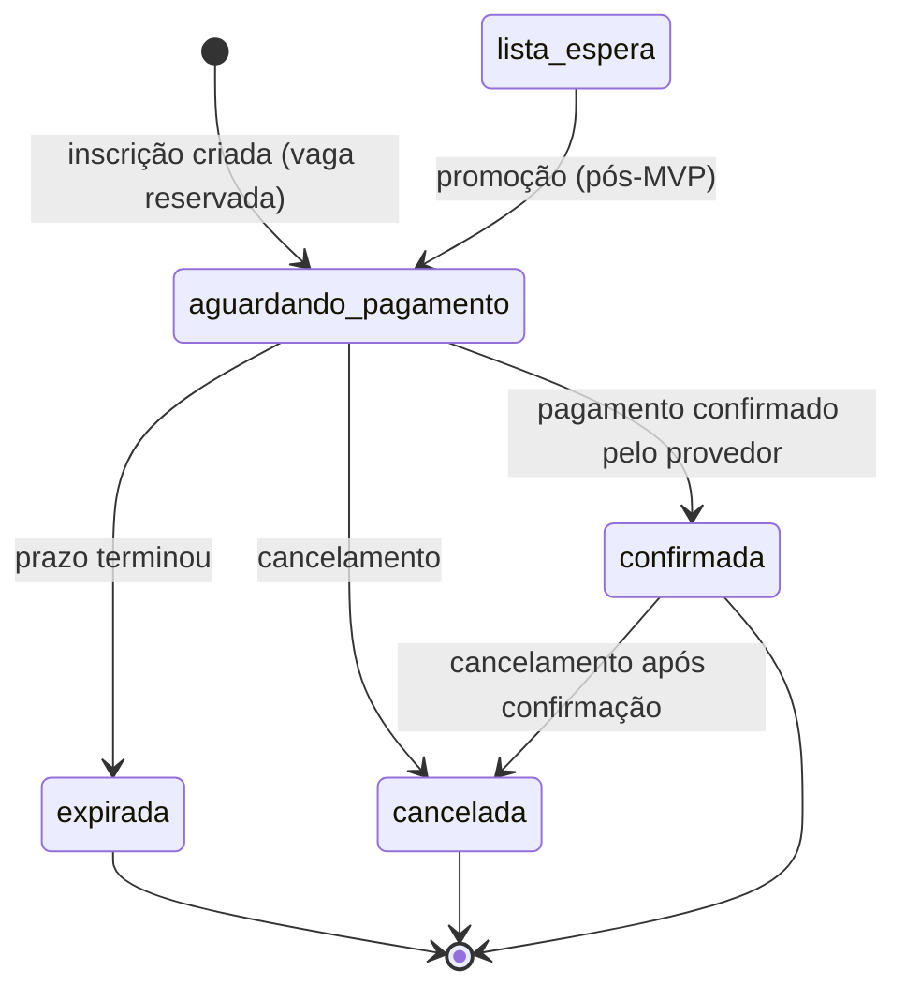
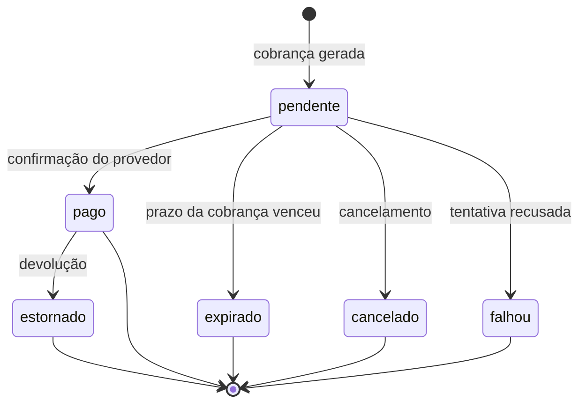

# PRD — Plataforma de Inscrições e Gestão de Eventos

> **Documento:** Product Requirements Document (PRD) — o documento que descreve **o que** o produto precisa fazer e **por quê**.
> **Versão:** 1.0
> **Data:** 2026-08-20
> **Público deste documento:** qualquer pessoa da equipe, inclusive quem não programa.

**Como ler este documento:** ele foi escrito em frases curtas e sem jargão desnecessário. Sempre que um termo técnico aparece pela primeira vez, ele vem explicado ao lado. Todos os termos também estão reunidos no final, na seção **25. Glossário**.

---

## 1. Visão geral

Este projeto é uma **plataforma de inscrições e gestão de eventos**.

Ela permite que uma organização crie um evento, descreva o que vai acontecer em cada dia, defina quantas vagas existem, receba as inscrições dos participantes pela internet e cobre o valor da inscrição por Pix.

O primeiro evento a usar a plataforma tem **dois dias**:

- **Dia 1 — Modalidades esportivas.** O participante escolhe entre 1 e 2 modalidades (por exemplo: futebol, vôlei, handebol).
- **Dia 2 — Trilha.** O participante escolhe se vai participar ou não.

Apesar disso, **o sistema não é feito só para esse evento**. Nomes de dias, grupos de atividades, atividades, horários, limites de vagas e regras de escolha são todos cadastrados pelo administrador. Criar um evento diferente no ano que vem não exige mudar o código.

Em uma frase: **é uma pequena plataforma de gestão de eventos, não um formulário de inscrição**.

---

## 2. Problema

Hoje a inscrição em eventos como esse costuma ser feita com planilhas, formulários genéricos e conferência manual de comprovantes de pagamento. Isso gera cinco problemas concretos:

1. **Vagas vendidas a mais (overbooking).** Duas pessoas se inscrevem no mesmo segundo na última vaga e as duas conseguem. Alguém vai ser desapontado no dia do evento.
2. **Conferência manual de pagamento.** Alguém precisa olhar o extrato bancário e marcar na planilha quem pagou. Dá erro e consome tempo.
3. **Escolhas inválidas.** O participante se inscreve em duas atividades que acontecem no mesmo horário, ou não escolhe nenhuma modalidade quando era obrigatório escolher.
4. **Inscrição fantasma.** A pessoa se inscreve, nunca paga, e a vaga fica presa para sempre — impedindo que outro participante entre.
5. **Falta de visão.** A organização não sabe, em tempo real, quantas vagas restam, quanto já entrou de dinheiro e quantos ainda estão pendentes.

---

## 3. Objetivos

**Objetivos de negócio**

| # | Objetivo | Como saberemos que deu certo |
|---|----------|------------------------------|
| O1 | Eliminar overbooking | Nunca existir mais inscrições ativas do que a capacidade cadastrada, nem no evento, nem em uma atividade |
| O2 | Automatizar a cobrança | Nenhuma conferência manual de comprovante no fluxo normal |
| O3 | Liberar vagas não pagas automaticamente | Vaga de quem não pagou no prazo volta a ficar disponível sem intervenção humana |
| O4 | Garantir escolhas válidas | Nenhuma inscrição gravada viola as regras de escolha de atividades |
| O5 | Não depender de um fornecedor de pagamento | Trocar o meio de pagamento é mudança de configuração, não reescrita do sistema |
| O6 | Reaproveitar a plataforma em eventos futuros | Novo evento é cadastro, não desenvolvimento |

**Objetivos técnicos**

- Todas as regras críticas validadas no servidor. O que o navegador valida serve apenas para conforto do usuário.
- Reserva de vaga segura mesmo com muitas pessoas se inscrevendo ao mesmo tempo.
- Confirmação de pagamento vinda apenas de fonte confiável (o próprio provedor de pagamento), nunca do navegador do participante.
- Nenhum registro de inscrição ou pagamento apagado: o histórico é preservado sempre.

---

## 4. Público-alvo

| Grupo | Quem é | O que espera da plataforma |
|-------|--------|----------------------------|
| **Participante** | Pessoa que vai ao evento. Usa principalmente o celular. Nem sempre tem familiaridade com tecnologia | Se inscrever em poucos minutos, entender o que escolheu e pagar por Pix |
| **Organização do evento** | Equipe que planeja o evento e responde pelos números | Cadastrar o evento, acompanhar vagas e dinheiro em tempo real |
| **Coordenador de cidade/grupo** | Responsável por acompanhar quem se inscreveu do seu grupo | Ver a lista do seu grupo (previsto para fase futura) |
| **Equipe técnica** | Quem mantém o sistema | Código claro, testado e fácil de estender |

---

## 5. Escopo

### 5.1 Dentro do escopo do produto (visão completa)

- Cadastro de eventos, dias do evento, grupos de atividades e atividades.
- Cadastro de cidades e de grupos de participantes ligados a cada cidade.
- Inscrição pública com escolha de atividades e validação completa das regras.
- Reserva de vaga no momento da inscrição, com prazo para pagar.
- Cobrança por Pix, com confirmação automática.
- Expiração automática de inscrições não pagas, devolvendo as vagas.
- Painel administrativo com números do evento.
- Comunicação por e-mail com o participante.

### 5.2 Fora do escopo (definitivamente, por decisão do dono do produto)

- Pagamento parcelado, cupom de desconto e reembolso automático por autoatendimento.
- Emissão de nota fiscal.
- Aplicativo móvel nativo.
- Integração com sistema contábil.
- Área de participante com senha própria (o acesso será por link seguro enviado por e-mail).

### 5.3 Fora do escopo **desta entrega** (mas planejado)

Esta entrega cobre as fases 0 a 4 do plano de implementação: documentação, base do sistema, domínio do evento, inscrição e pagamento. **Não** entram aqui: telas públicas de inscrição, painel administrativo, envio de e-mails, credenciamento (check-in), lista de espera e registro de auditoria. Cada um desses tem fase própria e está descrito na seção 7.

---

## 6. MVP

**MVP** significa *Minimum Viable Product* — a menor versão do produto que já resolve o problema de verdade.

O MVP estará pronto quando este caminho funcionar de ponta a ponta:

```text
ADMINISTRAÇÃO
  cria o evento
  cadastra os 2 dias
  cadastra as modalidades e a trilha
  define capacidade e limites de escolha
  cadastra cidades e grupos
  publica e abre as inscrições

PARTICIPANTE
  acessa a página do evento
  preenche os dados pessoais
  escolhe as modalidades
  o sistema valida todas as regras
  a vaga é reservada
  a inscrição é criada com prazo para pagar
  o sistema gera a cobrança Pix
  o participante paga
  o provedor de pagamento avisa o sistema
  a inscrição é confirmada
  o participante recebe o e-mail de confirmação
```

E também este caminho alternativo:

```text
  o participante não paga
  o prazo termina
  o sistema expira a inscrição automaticamente
  a vaga geral volta a ficar disponível
  as vagas de cada modalidade escolhida também voltam
```

### 6.1 O que esta entrega (fases 0 a 4) já garante

Os dois caminhos acima funcionam **de verdade**, mas ainda sem interface visual e sem e-mail: são acionados por testes automatizados e por comandos de terminal. A cobrança Pix é gerada por um **provedor simulado** (explicado na seção 21), que permite testar tudo sem contratar um banco.

---

## 7. Funcionalidades futuras

| Fase | Funcionalidade | Descrição |
|------|----------------|-----------|
| 5 | Site público | Página do evento, formulário de inscrição em etapas, tela de pagamento com QR Code |
| 6 | Painel administrativo | Números do evento, cadastros, busca e filtros de inscrições |
| 7 | Comunicação | E-mail de inscrição criada, lembrete antes do prazo, confirmação de pagamento, aviso de expiração |
| 8 | Provedor de pagamento real | Substituir o provedor simulado por um banco ou empresa de pagamento de verdade |
| 9 | Endurecimento | Auditoria de ações administrativas, desempenho, revisão de segurança e LGPD |
| Pós-MVP | Credenciamento (check-in) | Leitura de QR Code na entrada, um check-in por dia do evento |
| Pós-MVP | Lista de espera | Entrar em uma fila quando o evento lotar e ser promovido quando uma vaga sobrar |
| Pós-MVP | Exportação | Baixar a lista de inscritos em CSV respeitando os filtros aplicados |

---

## 8. Personas

**Ana — Participante (32 anos)**
Vai ao evento com amigos do grupo da cidade dela. Faz tudo pelo celular, no intervalo do trabalho. Quer escolher futebol e vôlei, pagar no Pix na hora e receber a confirmação. Se a inscrição levar mais que cinco minutos ou der um erro que ela não entende, ela desiste e reclama no grupo de mensagens.

**Marcos — Organizador (45 anos)**
Responde pelo evento diante da diretoria. Precisa saber, a qualquer momento, quantas vagas restam e quanto dinheiro já entrou. O maior medo dele é chegar no dia com mais gente do que cabe no ginásio.

**Júlia — Coordenadora de cidade (28 anos)**
Acompanha os inscritos do grupo dela e cobra quem ainda não pagou. Hoje faz isso por planilha compartilhada.

**Rafael — Desenvolvedor**
Mantém o sistema. Precisa que as regras estejam em um lugar só, testadas, e que trocar o provedor de pagamento não obrigue a mexer nas regras de inscrição.

---

## 9. Jornadas

### 9.1 Jornada da Ana (participante — caminho feliz)

1. Recebe o link do evento no grupo de mensagens.
2. Abre a página do evento e vê datas, valor, programação e vagas restantes.
3. Clica em "Quero me inscrever".
4. Informa nome, e-mail, telefone, data de nascimento, CPF, cidade e grupo.
5. Escolhe futebol e vôlei no Dia 1 e marca a trilha no Dia 2.
6. Revisa o resumo, lê o regulamento e aceita.
7. O sistema reserva as vagas e mostra a cobrança Pix com QR Code, valor e um contador regressivo do prazo.
8. Ana paga pelo aplicativo do banco.
9. Em segundos a tela muda para "Inscrição confirmada" e ela recebe o e-mail de confirmação.

### 9.2 Jornada da Ana (caminho de erro)

- Ela escolhe futebol (08:00–10:00) e vôlei (09:00–11:00). O sistema recusa e explica: *"Futebol e Vôlei acontecem no mesmo horário. Escolha apenas uma das duas."*
- Ela tenta escolher uma modalidade que acabou de lotar. O sistema recusa e explica: *"As vagas de Futebol acabaram. Escolha outra modalidade."*
- Ela não escolhe nenhuma modalidade. O sistema recusa e explica: *"Você precisa escolher pelo menos 1 modalidade esportiva."*

### 9.3 Jornada da Ana (não pagou)

1. Ana se inscreve mas fecha o navegador antes de pagar.
2. Recebe um e-mail de lembrete antes do prazo terminar (fase 7).
3. O prazo termina. O sistema muda a inscrição para "expirada" e devolve a vaga geral e as vagas das modalidades.
4. Ana recebe o aviso de que o prazo terminou e pode se inscrever de novo, se ainda houver vaga.

### 9.4 Jornada do Marcos (organizador)

1. Cria o evento, define capacidade total, valor e prazo de pagamento.
2. Cadastra os dois dias, os grupos de atividades e as atividades com horário e vagas.
3. Publica o evento e abre as inscrições.
4. Acompanha os números durante o período de inscrição.
5. Encerra as inscrições na data configurada.

---

## 10. Histórias de usuário

Formato: *como [quem], quero [o quê], para [para quê]*.

**Participante**

- HU-01 — Como participante, quero ver as datas, o valor e as vagas restantes do evento, para decidir se vou me inscrever.
- HU-02 — Como participante, quero escolher minhas modalidades vendo horário e vagas de cada uma, para montar minha participação.
- HU-03 — Como participante, quero ser avisado quando duas escolhas se chocam, para corrigir antes de pagar.
- HU-04 — Como participante, quero pagar por Pix e ver a confirmação automaticamente, para não precisar enviar comprovante.
- HU-05 — Como participante, quero saber até quando preciso pagar, para não perder a vaga.
- HU-06 — Como participante, quero consultar minha inscrição depois, para ver o que escolhi e a situação do pagamento.

**Organização**

- HU-07 — Como organizador, quero cadastrar eventos, dias, grupos e atividades, para reaproveitar a plataforma em outros eventos.
- HU-08 — Como organizador, quero definir capacidade do evento e de cada atividade, para não estourar o espaço físico.
- HU-09 — Como organizador, quero definir o mínimo e o máximo de escolhas por grupo, para orientar a participação.
- HU-10 — Como organizador, quero marcar que duas atividades não podem ser feitas juntas, mesmo sem choque de horário, para respeitar decisões operacionais.
- HU-11 — Como organizador, quero que vagas não pagas sejam liberadas automaticamente, para não perder inscrições por vaga presa.
- HU-12 — Como organizador, quero acompanhar inscritos, confirmados, pendentes e valores, para tomar decisões durante o período de inscrição.

**Equipe técnica**

- HU-13 — Como desenvolvedor, quero que o meio de pagamento seja escolhido por configuração, para trocar de fornecedor sem reescrever as regras de inscrição.
- HU-14 — Como desenvolvedor, quero testes automatizados das regras críticas, para alterar o sistema com segurança.

---

## 11. Requisitos funcionais

**Evento**

- RF-01 — O sistema deve permitir cadastrar um evento com identificador público não sequencial, nome, endereço curto na URL (*slug*), descrição, banner, data inicial, data final, abertura e encerramento das inscrições, capacidade, valor, moeda, prazo de pagamento, situação, regulamento, versão dos termos, contato e configurações adicionais.
- RF-02 — A capacidade do evento pode ficar em branco, e nesse caso significa **sem limite**.
- RF-03 — O sistema deve permitir cadastrar dias do evento, com nome, descrição, data, ordem de exibição e ativação.
- RF-04 — O sistema deve permitir cadastrar grupos de atividades dentro de um dia, com nome, descrição, obrigatoriedade, mínimo e máximo de escolhas, ordem e ativação.
- RF-05 — O sistema deve permitir cadastrar atividades dentro de um grupo, com nome, descrição, início, término, capacidade, idade mínima, idade máxima, ordem, ativação e configurações adicionais.
- RF-06 — O sistema deve permitir registrar que duas atividades são incompatíveis entre si, mesmo sem choque de horário, com um motivo opcional.

**Cidades e grupos**

- RF-07 — O sistema deve manter um cadastro de cidades (nome e estado) e de grupos de participantes vinculados a uma cidade.
- RF-08 — Ao escolher a cidade, o participante deve ver apenas os grupos daquela cidade. O servidor confere essa relação novamente.

**Inscrição**

- RF-09 — O sistema deve receber uma inscrição com nome completo, e-mail, telefone, data de nascimento, CPF, cidade, grupo, atividades escolhidas e aceite dos termos.
- RF-10 — Toda inscrição recebe um identificador público não sequencial.
- RF-11 — O sistema deve validar, no servidor, todas as regras descritas na seção 13, dentro de uma única operação indivisível.
- RF-12 — Ao criar a inscrição, o sistema deve reservar uma vaga no evento e uma vaga em cada atividade escolhida.
- RF-13 — Ao criar a inscrição, o sistema deve congelar o valor cobrado e a versão dos termos aceitos. Uma mudança posterior de preço não afeta inscrições já feitas.
- RF-14 — O sistema deve calcular o prazo de pagamento como o momento da criação mais o prazo configurado no evento.
- RF-15 — O envio duplicado do mesmo formulário (mesma chave de idempotência) deve resultar em **uma única** inscrição e **uma única** reserva.
- RF-16 — O sistema deve impedir uma segunda inscrição ativa com o mesmo e-mail no mesmo evento. A mesma regra vale para o CPF.

**Pagamento**

- RF-17 — O sistema deve gerar uma cobrança Pix para a inscrição, com valor, código copia e cola e data de expiração.
- RF-18 — O sistema deve receber avisos automáticos do provedor de pagamento (*webhook*), verificar a autenticidade, guardar o aviso recebido e processá-lo em segundo plano.
- RF-19 — Receber duas vezes o mesmo aviso deve confirmar a inscrição **uma única vez**.
- RF-20 — O sistema deve consultar o provedor por iniciativa própria (reconciliação) para os pagamentos pendentes, cobrindo a falha de um aviso que nunca chegou.
- RF-21 — O sistema deve expirar automaticamente as inscrições cujo prazo terminou, devolver as vagas e cancelar a cobrança correspondente.
- RF-22 — O sistema nunca apaga inscrições nem pagamentos: apenas muda a situação deles.
- RF-23 — A escolha do provedor de pagamento deve vir de configuração, nunca escrita dentro das regras de negócio.

---

## 12. Requisitos não funcionais

| # | Requisito | Detalhe |
|---|-----------|---------|
| RNF-01 | Consistência sob concorrência | Mesmo com muitas inscrições simultâneas, nunca existir mais reservas do que a capacidade. O banco de dados tem regras de proteção próprias como última barreira |
| RNF-02 | Desempenho | A criação da inscrição deve responder em menos de 1 segundo em condições normais |
| RNF-03 | Disponibilidade do recebimento | O endereço que recebe os avisos do provedor responde "recebido" imediatamente e processa depois, para nunca perder um aviso por lentidão |
| RNF-04 | Segurança | Dados pessoais sensíveis guardados de forma cifrada; nenhuma senha, chave ou segredo em registro de log |
| RNF-05 | Rastreabilidade | Toda mudança de situação guarda o momento em que aconteceu |
| RNF-06 | Fuso horário | A aplicação opera em `America/Sao_Paulo`; o banco guarda tudo em UTC com o fuso embutido, evitando erro no horário de verão e em servidores de outro fuso |
| RNF-07 | Dinheiro | Valores monetários são sempre números inteiros em centavos. Nunca número decimal aproximado |
| RNF-08 | Manutenibilidade | Regras de negócio concentradas em classes de ação de propósito único; controladores enxutos |
| RNF-09 | Testabilidade | Regras críticas cobertas por testes automatizados, incluindo teste de concorrência |
| RNF-10 | Portabilidade de fornecedor | Nenhuma citação a um provedor de pagamento específico dentro das regras de negócio |
| RNF-11 | Idioma | Banco de dados e regras de negócio em português, sem acento nem cedilha nos nomes técnicos; a estrutura do framework permanece em inglês |
| RNF-12 | Acessibilidade e mobile | Telas futuras priorizam celular e acessibilidade |

---

## 13. Regras de negócio

Resumo em linguagem simples. A descrição completa, com identificador, mensagem exibida e teste correspondente, está em `BUSINESS_RULES.md`.

| ID | Regra em uma frase |
|----|--------------------|
| RN-01 | Só é possível se inscrever com as inscrições abertas e dentro do período configurado |
| RN-02 | O grupo escolhido precisa pertencer à cidade escolhida, e ambos precisam estar ativos |
| RN-03 | Grupo de atividades marcado como obrigatório exige a quantidade mínima de escolhas |
| RN-04 | A quantidade escolhida em cada grupo respeita o mínimo e o máximo configurados |
| RN-05 | Toda atividade escolhida pertence ao evento da inscrição e está ativa |
| RN-06 | Duas atividades que se sobrepõem no horário não podem ser escolhidas juntas |
| RN-07 | Duas atividades marcadas como incompatíveis não podem ser escolhidas juntas |
| RN-08 | A idade do participante na data da atividade respeita a idade mínima e a máxima da atividade |
| RN-09 | Não é possível reservar vaga em atividade lotada |
| RN-10 | Não é possível reservar vaga em evento lotado |
| RN-11 | Um e-mail e um CPF só podem ter uma inscrição ativa por evento |
| RN-12 | Enviar o mesmo formulário duas vezes gera uma única inscrição |
| RN-13 | O aceite dos termos é obrigatório e fica registrado com a versão e o momento |

**Sobre menores de idade:** não existe idade mínima geral para se inscrever. A restrição, quando existe, é **por atividade** (RN-08). Uma trilha pode exigir 16 anos enquanto o futebol aceita qualquer idade. A idade é calculada na data em que a atividade acontece, não na data da inscrição.

---

## 14. Critérios de aceite

- CA-01 — Com capacidade 1 e duas pessoas se inscrevendo ao mesmo tempo, exatamente uma consegue; a outra recebe a mensagem de vagas esgotadas.
- CA-02 — A soma de vagas reservadas e confirmadas nunca ultrapassa a capacidade, nem no evento nem em uma atividade.
- CA-03 — Escolher menos que o mínimo, mais que o máximo, ou deixar um grupo obrigatório vazio bloqueia a inscrição com mensagem clara.
- CA-04 — Duas atividades com horários sobrepostos são recusadas. Duas atividades que apenas se encostam (uma termina exatamente quando a outra começa) são **aceitas**.
- CA-05 — Um par de atividades marcado como incompatível é recusado nos dois sentidos (A com B e B com A).
- CA-06 — Participante fora da faixa etária da atividade, na data da atividade, é recusado.
- CA-07 — A segunda inscrição com o mesmo e-mail no mesmo evento é bloqueada enquanto a primeira estiver ativa; depois que a primeira expira, uma nova é permitida.
- CA-08 — Dois envios do mesmo formulário produzem uma inscrição e uma reserva.
- CA-09 — O mesmo aviso do provedor recebido duas vezes confirma a inscrição uma vez e não altera os contadores na segunda.
- CA-10 — Passado o prazo, a rotina automática expira a inscrição, devolve a vaga do evento e a vaga de cada atividade escolhida. Rodar a rotina de novo não muda mais nada.
- CA-11 — Um evento cujas vagas estão todas presas por reservas já vencidas concede a vaga imediatamente ao próximo participante, sem esperar a próxima execução da rotina automática.
- CA-12 — Um pagamento que foi pago no provedor mas cujo aviso nunca chegou é confirmado pela rotina de reconciliação.
- CA-13 — Os endereços de simulação do provedor falso respondem "não encontrado" fora dos ambientes de desenvolvimento e teste.
- CA-14 — Nenhuma inscrição nem pagamento é apagado em qualquer fluxo.

---

## 15. Fluxos principais

### 15.1 Criação da inscrição

```text
participante envia o formulário
        ↓
o servidor confere formato dos dados
        ↓
mesma chave de idempotência já usada?  ── sim ──▶ devolve a inscrição já criada
        ↓ não
abre uma operação indivisível (transação)
        ↓
confere janela de inscrição, cidade/grupo, regras de escolha e faixa etária
        ↓
reserva 1 vaga no evento
        ↓
reserva 1 vaga em cada atividade escolhida (sempre na mesma ordem)
        ↓
alguma reserva falhou?  ── sim ──▶ expira inscrições vencidas deste evento
        ↓ não                        e tenta a operação inteira mais uma vez
grava a inscrição, as atividades e o prazo de pagamento
        ↓
fecha a operação e anuncia "inscrição criada"
```

### 15.2 Pagamento e confirmação

```text
inscrição criada
    ↓
o sistema pede a cobrança ao provedor de pagamento
    ↓
recebe o código Pix copia e cola e a data de expiração
    ↓
o participante paga no aplicativo do banco
    ↓
o provedor envia um aviso automático ao sistema
    ↓
o sistema confere a autenticidade e guarda o aviso
    ↓
responde "recebido" imediatamente
    ↓
processa em segundo plano: marca o pagamento como pago
    ↓
confirma a inscrição e ajusta os contadores de vagas
    ↓
anuncia "inscrição confirmada" (o e-mail entra na fase 7)
```

### 15.3 Expiração

```text
a cada minuto, uma rotina automática procura
inscrições aguardando pagamento com prazo vencido
    ↓
muda a situação para expirada
    ↓
devolve 1 vaga no evento e 1 em cada atividade escolhida
    ↓
cancela a cobrança correspondente
    ↓
anuncia "inscrição expirada"
```

---

## 16. Estados das inscrições

| Estado | Significado para o participante |
|--------|--------------------------------|
| `aguardando_pagamento` | A vaga está reservada e há um prazo para pagar |
| `confirmada` | O pagamento foi confirmado e a vaga é definitiva |
| `expirada` | O prazo terminou sem pagamento e a vaga foi liberada |
| `cancelada` | A inscrição foi cancelada, por pedido do participante ou pela organização |
| `lista_espera` | Reservado para a lista de espera. **Planejado, não implementado nesta entrega** — nenhum caminho do sistema leva a este estado hoje |



### 16.1 Decisão registrada: a inscrição **não** tem estado "pago"

O rascunho inicial sugeria os estados `pending_payment`, `paid` e `confirmed`. Decidimos que **"pago" não é um estado da inscrição**.

Motivo, em linguagem simples: "pago" é um fato do **dinheiro**, e o dinheiro é assunto do registro de pagamento. A inscrição responde outra pergunta — "esta pessoa tem lugar garantido no evento?". A resposta é `confirmada` ou não é.

Se guardássemos "pago" nos dois lugares, teríamos duas versões da verdade que podem discordar: um pagamento estornado deixaria a inscrição marcada como paga. Com a decisão atual, para saber se houve dinheiro basta olhar o pagamento; para saber se a pessoa tem vaga, basta olhar a inscrição.

---

## 17. Estados dos pagamentos

| Estado | Significado |
|--------|-------------|
| `pendente` | A cobrança foi gerada e aguarda o pagamento |
| `pago` | O provedor confirmou o recebimento |
| `falhou` | A tentativa de pagamento foi recusada |
| `expirado` | A cobrança venceu sem pagamento |
| `cancelado` | A cobrança foi cancelada (por exemplo, quando a inscrição expirou) |
| `estornado` | O dinheiro foi devolvido, total ou parcialmente |



Uma inscrição pode ter mais de um pagamento ao longo do tempo — por exemplo, uma cobrança cancelada e outra gerada depois. Vale sempre o pagamento mais recente com situação `pago`.

---

## 18. Tratamento de concorrência

**Concorrência** é a situação em que várias pessoas fazem a mesma coisa ao mesmo tempo. Aqui é o requisito mais crítico do sistema.

**O problema.** Resta 1 vaga. Ana e Bruno abrem a tela no mesmo instante. Os dois veem "1 vaga disponível". Os dois clicam em "inscrever". Se o sistema apenas "consultar e depois gravar", os dois passam e o evento fica com uma pessoa a mais do que cabe.

**A solução adotada.** Cada evento e cada atividade guardam dois contadores: **vagas reservadas** e **vagas confirmadas**. Para pegar uma vaga, o sistema executa **um único comando** que, na mesma operação, verifica se ainda cabe e já soma a reserva. O banco de dados garante que dois comandos desses nunca aconteçam de fato ao mesmo tempo na mesma linha: um espera o outro. Quem chegar depois recebe do banco a resposta "nenhuma linha foi alterada", e é assim que o sistema sabe que esgotou.

Isso se chama *compare-and-swap* — "compare e troque em uma tacada só".

**Por que não a alternativa mais óbvia.** A alternativa comum seria travar a linha do evento enquanto se decide (*lock*). Funciona, mas cria uma fila: em um evento com muita procura, todo mundo espera na mesma porta. O contador atômico resolve o mesmo problema sem essa fila.

**Ordem sempre igual.** As vagas são sempre pegas na mesma ordem: primeiro a do evento, depois a de cada atividade em ordem crescente de identificador. Se duas inscrições pegassem as mesmas vagas em ordens diferentes, poderiam travar uma esperando a outra para sempre (*deadlock*, ou "abraço mortal"). Ordem fixa elimina essa possibilidade.

**Vaga presa por reserva vencida.** Pode acontecer de o evento parecer lotado só porque várias reservas venceram e a rotina automática ainda não rodou. Quando uma reserva falha, o sistema executa **na hora** a expiração das inscrições vencidas daquele evento e tenta a operação inteira **mais uma vez**. Se falhar de novo, aí sim está realmente esgotado.

**Última barreira.** O banco de dados guarda regras próprias: a soma de reservadas e confirmadas nunca pode passar da capacidade, e nenhum contador pode ficar negativo. Se algum dia um erro de programação errar a conta, o banco recusa a gravação em vez de permitir venda a mais silenciosa.

O detalhamento técnico está em `ARCHITECTURE.md`.

---

## 19. Segurança

- Todas as regras críticas são validadas no servidor. Nada que venha do navegador é considerado confiável.
- Um pagamento **nunca** é dado como concluído porque o navegador voltou para uma página de sucesso. A confirmação vem do aviso autenticado do provedor ou de consulta feita pelo próprio servidor.
- Os avisos do provedor têm a autenticidade verificada antes de qualquer efeito; avisos repetidos são bloqueados por uma regra de unicidade no banco.
- Nunca são guardados dados completos de cartão nem código de segurança do cartão.
- Chaves e segredos ficam em configuração de ambiente, nunca no código e nunca em registro de log.
- Identificadores públicos de inscrição e pagamento não são sequenciais, para que ninguém consiga adivinhar o próximo.
- Um identificador público sozinho **não** dá acesso à área do participante: o acesso futuro será por link assinado com validade.
- Os endereços de simulação de pagamento só existem em desenvolvimento e teste. Em qualquer outro ambiente respondem "não encontrado", e existe um teste automatizado que prova isso.

---

## 20. LGPD

A **LGPD** (Lei Geral de Proteção de Dados) exige que dados pessoais sejam coletados com finalidade clara, no menor volume possível, guardados com segurança e informados de forma transparente.

### 20.1 Dados coletados e por quê

| Dado | Finalidade | Base legal |
|------|-----------|------------|
| Nome completo | Identificar o participante no evento e na lista de presença | Execução de contrato |
| E-mail | Enviar cobrança, lembrete e confirmação; identificar inscrição duplicada | Execução de contrato |
| Telefone | Contato operacional no dia do evento | Execução de contrato |
| Cidade e grupo | Organizar a participação por grupo, que é como o evento funciona | Execução de contrato |
| Data de nascimento | Verificar se o participante atende à idade mínima ou máxima de cada atividade, na data em que a atividade acontece | Execução de contrato |
| CPF | (a) O provedor de pagamento Pix exige o CPF do pagador para emitir a cobrança; (b) impedir que a mesma pessoa ocupe duas vagas com e-mails diferentes | (a) Execução de contrato; (b) Legítimo interesse |
| Versão dos termos e momento do aceite | Comprovar que o participante conheceu e aceitou o regulamento | Cumprimento de obrigação e execução de contrato |

**Sobre o CPF — justificativa explícita.** O rascunho inicial pedia para não coletar CPF sem necessidade clara. A necessidade existe e é dupla:

1. **Exigência do meio de pagamento.** Para emitir uma cobrança Pix identificada, os provedores brasileiros pedem o CPF do devedor. Sem ele, não há cobrança. Isso é *execução de contrato*: o participante pediu para se inscrever e a inscrição depende do pagamento.
2. **Impedir duplicidade real.** Bloquear só por e-mail é frágil: a mesma pessoa cria um segundo e-mail e ocupa duas vagas em um evento com vagas limitadas. O CPF identifica a pessoa. Isso é *legítimo interesse* da organização em distribuir as vagas de forma justa.

**Sobre a data de nascimento — justificativa explícita.** Algumas atividades têm restrição de idade por segurança (uma trilha longa, por exemplo). Guardar apenas "é maior de idade" não resolve, porque a faixa pode ser qualquer uma e a idade precisa ser calculada **na data da atividade**, que pode ser meses depois da inscrição. A data de nascimento é o dado mínimo que atende a essa finalidade.

### 20.2 Medidas aplicadas

- **Minimização:** nenhum dado é coletado "por precaução". Contato de emergência e dados de responsável legal ficaram fora do MVP porque nenhuma regra atual os usa.
- **Segurança:** o CPF é guardado **cifrado** no banco. Para conseguir bloquear duplicidade sem manter o número legível, guardamos também uma **impressão digital** do CPF (um código irreversível gerado a partir dele, com um segredo do servidor). A comparação de duplicidade usa essa impressão digital, nunca o número em claro.
- **Transparência:** o regulamento e a versão dos termos aceitos ficam registrados na inscrição.
- **Retenção:** política de descarte a ser definida na fase 9. Recomendação inicial: manter os dados de participação até 12 meses após o evento e depois anonimizar.
- **Endereço de IP:** não é coletado no MVP, porque nenhuma finalidade atual justifica.

---

## 21. Estratégia de pagamentos

**Método inicial:** Pix. Cartão de crédito fica previsto na estrutura, mas não é implementado agora.

**Independência de fornecedor.** O sistema conversa com o meio de pagamento por meio de um **contrato** — uma lista fixa de operações ("criar cobrança", "consultar", "cancelar", "estornar", "verificar aviso", "traduzir aviso"). Quem cumpre esse contrato é escolhido por configuração. Trocar de fornecedor é mudar uma linha de configuração e escrever uma nova implementação; as regras de inscrição não mudam nem uma linha.

**Provedor simulado.** Nesta entrega, quem cumpre o contrato é um provedor falso, feito para desenvolvimento e teste. Ele gera um código Pix fictício e permite simular pagamento, expiração, falha, estorno e o envio do aviso automático. Assim a plataforma inteira pode ser desenvolvida e testada sem contratar banco nenhum.

**Confirmação em duas frentes.** A confirmação chega normalmente pelo aviso automático do provedor. Como avisos podem se perder, existe também uma rotina que consulta o provedor por iniciativa própria para pagamentos pendentes. As duas frentes levam ao mesmo caminho de confirmação, e confirmar duas vezes não causa efeito duplicado.

**Escolha do fornecedor real** é decisão de negócio, apoiada pela comparação em `PAYMENTS.md`. Taxas comerciais mudam com frequência: elas nunca aparecem no código e no documento aparecem sempre com a data da consulta.

---

## 22. Estratégia de notificações

Nesta entrega **nenhum e-mail é enviado**. O que existe é a base para isso: sempre que algo relevante acontece, o sistema **anuncia** internamente o fato — "inscrição criada", "inscrição confirmada", "inscrição expirada".

A vantagem é que, na fase 7, basta escrever quem ouve esses anúncios e envia o e-mail. Nenhuma regra de inscrição precisa ser tocada. E quando um dia entrar WhatsApp, o caminho é o mesmo: mais um ouvinte, zero mudança no domínio.

E-mails previstos para a fase 7: inscrição criada (com o link de pagamento), lembrete antes do prazo, pagamento confirmado, inscrição expirada, cancelamento.

Todo envio será processado em segundo plano, para que uma lentidão do servidor de e-mail nunca atrase a inscrição do participante.

---

## 23. Riscos

| # | Risco | Impacto | Como mitigamos |
|---|-------|---------|----------------|
| R1 | Venda de vagas a mais em um pico de acessos | Alto | Contador atômico, ordem fixa de reserva e regras de proteção no banco como última barreira; teste automatizado com processos paralelos |
| R2 | Aviso do provedor nunca chega | Alto | Rotina de reconciliação que consulta o provedor por conta própria |
| R3 | Aviso do provedor chega duas vezes | Médio | Regra de unicidade no banco pelo identificador do aviso e processamento idempotente |
| R4 | Vaga presa por reserva vencida | Médio | Expiração automática a cada minuto **mais** varredura imediata quando uma reserva falha |
| R5 | Vazamento de dados pessoais | Alto | CPF cifrado, impressão digital para duplicidade, sem segredo em log, identificadores públicos não sequenciais |
| R6 | Taxa de gateway desatualizada no documento | Médio | Toda taxa registrada com data da consulta; o que não é confirmável fica "a validar" |
| R7 | Mudança de escopo durante a execução | Médio | Fases fechadas; o que sai do escopo vira decisão do dono do produto |
| R8 | Erro de fuso horário no horário de verão | Médio | Datas com fuso embutido, banco em UTC, aplicação em `America/Sao_Paulo` |
| R9 | Dependência de um único fornecedor de pagamento | Médio | Contrato de pagamento e escolha por configuração |
| R10 | Participante paga depois do prazo | Médio | Reconciliação identifica o pagamento; a decisão de reativar ou estornar é da organização (ver seção 24) |

---

## 24. Decisões em aberto

| # | Questão | Situação |
|---|---------|----------|
| DA-01 | Qual provedor de pagamento real será contratado | Em aberto. Depende da comparação em `PAYMENTS.md` e de negociação comercial |
| DA-02 | Política de reembolso (prazo, percentual, quem autoriza) | Em aberto. Impacto financeiro e jurídico: decisão do dono do produto |
| DA-03 | O que fazer com pagamento recebido após o prazo | Em aberto. Alternativas: reativar se houver vaga, ou estornar |
| DA-04 | Prazo de retenção e descarte dos dados pessoais | Em aberto. Recomendação inicial de 12 meses após o evento |
| DA-05 | Como o participante acessa a inscrição depois (link assinado, código por e-mail, senha temporária) | Em aberto. Entra na fase 5 |
| DA-06 | Se cidades e grupos passam a ser por evento em vez de catálogo global | Em aberto. Hoje são catálogo global. Mudança é decisão de negócio |
| DA-07 | Se haverá cobrança diferenciada por atividade | Em aberto. Hoje o valor é único por evento |
| DA-08 | Momento exato do e-mail de lembrete antes do prazo | Em aberto. Fase 7. Será configurável |

---

## 25. Glossário

Termos do negócio e termos técnicos usados neste projeto, explicados em linguagem simples.

### 25.1 Termos do negócio

| Termo | O que é |
|-------|---------|
| **Evento** | O acontecimento que recebe inscrições. Tem datas, valor, capacidade e regulamento |
| **Dia do evento** | Cada dia de um evento. O primeiro evento tem dois: esportes e trilha |
| **Grupo de atividades** | Conjunto de atividades de um dia que compartilham a mesma regra de escolha. Exemplo: "Modalidades esportivas — escolha de 1 a 2" |
| **Atividade** | O que o participante faz de fato: futebol, vôlei, trilha. Tem horário e pode ter vagas e faixa etária |
| **Grupo de participantes** | Grupo ao qual a pessoa pertence dentro da cidade dela. Não confundir com grupo de atividades |
| **Inscrição** | O pedido de participação de uma pessoa em um evento, com as atividades escolhidas |
| **Pagamento** | O registro da cobrança gerada para uma inscrição e da situação dessa cobrança |
| **Capacidade** | Quantas pessoas cabem. Pode ser do evento inteiro ou de uma atividade. Em branco significa sem limite |
| **Vaga reservada** | Vaga presa temporariamente por quem se inscreveu e ainda não pagou |
| **Vaga confirmada** | Vaga definitiva de quem já pagou |
| **Prazo de pagamento** | Momento limite para pagar. Passou disso, a inscrição expira e a vaga volta |
| **Regulamento** | Texto com as regras do evento que o participante precisa aceitar |
| **Versão dos termos** | Identificação da versão do regulamento que estava valendo quando a pessoa aceitou |

### 25.2 Termos técnicos

| Termo | O que é |
|-------|---------|
| **Transação** | Um conjunto de operações no banco de dados que acontece por inteiro ou não acontece. Impede meia-inscrição gravada |
| **Contador atômico (*compare-and-swap*)** | Um único comando que confere se ainda há vaga e já soma a reserva. Evita que duas pessoas peguem a mesma vaga |
| **Lock (trava)** | Mecanismo que segura uma informação para um usuário por vez. Não é a estratégia principal aqui, pelo motivo explicado na seção 18 |
| **Deadlock (abraço mortal)** | Duas operações travadas esperando uma pela outra para sempre. Evitado com ordem fixa de reserva |
| **Idempotência** | Propriedade de uma operação que pode ser repetida sem mudar o resultado. Enviar o formulário duas vezes gera uma inscrição só |
| **Chave de idempotência** | Código único gerado pelo formulário para identificar o envio. Se o mesmo código chegar de novo, o sistema devolve o resultado anterior |
| **Webhook (aviso automático)** | Chamada que o provedor de pagamento faz ao nosso sistema para avisar que algo aconteceu, como "esta cobrança foi paga" |
| **Reconciliação** | Rotina que consulta o provedor por iniciativa própria para descobrir pagamentos cujo aviso não chegou |
| **Fila (*queue*)** | Lista de trabalhos que o sistema executa em segundo plano, sem fazer o usuário esperar |
| **Agendador (*scheduler*)** | Mecanismo que executa rotinas em horários definidos, como a expiração a cada minuto |
| **Migration (migração)** | Arquivo que descreve uma mudança na estrutura do banco de dados, permitindo recriar o banco do zero |
| **Constraint (restrição)** | Regra que o próprio banco de dados garante, como "este contador nunca pode ser negativo" |
| **Enum** | Lista fechada de valores possíveis. Evita erro de digitação em situações como `confirmada` |
| **DTO** | Pacote simples de dados usado para levar informação de um lado para o outro, sem regras dentro |
| **Action (ação)** | Classe que faz uma coisa só e faz bem, como "criar inscrição" |
| **ULID** | Identificador único, não sequencial, usado nos códigos públicos. Ninguém consegue adivinhar o próximo |
| **Cifrado** | Guardado de forma embaralhada, legível apenas por quem tem a chave |
| **Impressão digital (*hash*)** | Código gerado a partir de um dado, que não permite voltar ao dado original, mas é sempre igual para o mesmo dado. Usado para comparar CPFs sem guardá-los legíveis |
| **Centavos** | Forma de guardar dinheiro como número inteiro. R$ 120,00 vira 12000. Evita erro de arredondamento |
| **Timestamptz** | Data e hora com o fuso horário embutido. Evita confusão entre servidores de fusos diferentes |
| **Slug** | Pedaço legível de endereço na internet, como `copa-ccc-2026` |
| **Pix copia e cola** | Texto longo gerado pelo banco que o participante cola no aplicativo para pagar |

---

## Anexo — Convenção de idioma

Decisão do dono do produto: **o domínio do sistema é escrito em português**. Isso vale para as tabelas do banco, colunas, modelos, situações e regras. Motivo: quem discute as regras do evento fala português, e a distância entre a conversa e o código é fonte de erro.

A estrutura do framework permanece em inglês, porque é assim que a ferramenta funciona e mudar isso quebraria convenções automáticas. Nomes técnicos do banco nunca usam acento nem cedilha: `descricao`, nunca `descrição`.

A tabela completa de onde vale português e onde vale inglês está em `ARCHITECTURE.md`.
